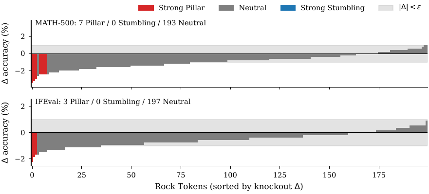

# Cornerstones or Stumbling Blocks? Deciphering the Rock Tokens in On-Policy Distillation

- **arXiv:** [2605.09253](https://arxiv.org/abs/2605.09253) (NeurIPS 2026 preprint)
- **Authors:** Yuxuan Jiang, Runchao Li, Shubhashis Roy Dipta (equal contribution), Dawei Li, Zhao Yang (UMBC / Case Western / Arizona State / VU Amsterdam)
- **Code:** [YuxuanJiang1/Rock-Token](https://github.com/YuxuanJiang1/Rock-Token)
- **Why it matters to us:** This is a **token-level autopsy of on-policy distillation (OPD)** — the family our `SDPOTrainer` belongs to. It asks *which tokens the per-token KL loss actually spends its budget on*, and shows that ~18% of the loss is poured into **"Rock Tokens"** — structural/formatting scaffolding the student never moves on and that contributes almost nothing to downstream accuracy. We distill the **top-100 logits per token** (`src/sdpo_train.py:131-132`: `distillation_mode="topk_logits"`, `distillation_topk=100`), so per-token distillation dynamics are *exactly* our optimization surface. The paper says you can **freeze the gradients on those rock tokens and get a ~1.4-1.7x wall-clock speedup with negligible accuracy loss** — a directly portable efficiency win, plus a caution about which tokens our loss is and isn't teaching.

---

## TL;DR

Conventional wisdom: in OPD the **high-loss tokens are the "critical correction points"** — the places the student diverges from the teacher — and they should vanish as training converges. This paper shows they **don't vanish**. Even after the aggregate OPD loss saturates, a stubborn ~6% of the vocabulary (~18% of generated tokens, median per-sequence density) stays high-loss forever. The authors name these **Rock Tokens** and decode them: they are almost entirely **structural/discourse scaffolding** — LaTeX/math delimiters (`$`, `\`, `=`, `^`, `{}`, `frac`), markdown/whitespace (`\n`, `\n\n`, `###`, `**`), sentence-opening discourse markers (`So`, `Wait`, `We`, `But`, `Now`, `Then`, `Since`), and bare digits. Two paradoxes follow: (1) rocks **dominate the total gradient norm purely through frequency**, yet are **individually stagnant** — their gradients are *well-aligned* with global descent but mathematically inseparable from it, so they never get a token-specific correction; and (2) via inference-time **knockout**, almost none are causally important — only **1.5-3.5%** are true "Pillars" (removing them hurts accuracy), and there are **zero** "Stumbling Blocks" (tokens whose removal *helps*). Conclusion: **uniform per-token weighting wastes most of OPD's optimization bandwidth on residual style the student can't or needn't internalize.** Freezing rock-token gradients from step 0 recovers nearly all performance ~1.4-1.7x faster.

## Setup (so we know how far it transfers)

- **Task: competitive math** — AIME24/25, HMMT25 (90 problems), plus MATH-500 and IFEval for token statistics. Pass@1 averaged over 5 runs. **No code benchmarks** (acknowledged limitation — see caveats).
- **Models:** teacher **Qwen3-30B-A3B-Instruct** (MoE, 3B active) -> student **Qwen3-4B-Instruct**, thinking mode **off**, via the **KDFlow** framework.
- **Two-stage distillation:** Stage 1 off-policy KD (forward KL + CE, `kd_ratio=0.5`, 20k teacher solutions); **Stage 2 on-policy KD** (pure **reverse KL**, `kd_ratio=1.0`, 4 rollouts/prompt on a fresh 10k-prompt slice). The OPD loss is the per-token reverse KL on student-sampled trajectories.

## How Rock Tokens are identified (the method)

1. **Decompose the OPD loss by token type.** `R(v) = mean_token_loss(v) * Freq(v)` is the total "distillation burden" a vocabulary item carries. Frequency-weighting deliberately suppresses rare-but-noisy tokens.
2. **Require persistence, not a one-off spike.** Keep occurrences that are high-loss **both before and after** OPD training (`O_PH`).
3. **Require context-consistency.** An occurrence only counts as a rock if its **local context window** (radius `w`) recurs — i.e., the same token is high-loss in *similar* surroundings, not in isolated positions. This yields `CCR(v)` and a context-aware score `R_ctx(v) = R(v)*CCR(v)`. This filtering is what stops "whitespace is just frequent" from trivially dominating.
4. **Cutoff K=100.** Sweeping K against (a) Jaccard stability across resamples and (b) cumulative KL coverage: **K=100 ~= 2.5% of vocab, ~60% of corpus KL, Jaccard > 0.70** — the stable/high-coverage knee. (Note: this K=100 is the *rock-token vocabulary cutoff*; it is a numerical coincidence with our `distillation_topk=100`, which is a *per-token logit* cutoff — different axis, same number.)

## Key results

- **Persistence (RQ1, gradient geometry).** Rocks have tiny per-occurrence gradient magnitude (median ||g|| ~= 0.016 vs ~= 0.54 for rare high-KL tokens, p<10^-30) but dominate aggregate gradient via sheer frequency. Their direction is **positively aligned** with the balanced global descent (cos ~= 0.040 vs 0.025 high-KL, 0.006 random). Across checkpoints, rare high-KL tokens' KL drops ~58% (2.02->0.85) while rocks barely move (0.21->0.19, dKL~=0). **They generate "correct" but inseparable gradients, so they never get an isolable correction** — hypothesized to be Adam's second-moment suppression of ubiquitous tokens under heavy-tailed class imbalance.

- **Causal necessity (RQ2, knockout).** Force a token's logit to -inf at decode and measure accuracy delta. Only **3.5% (MATH-500) / 1.5% (IFEval)** of rocks are **Strong Pillars** (removal degrades). **No Strong Stumbling Blocks** exist (no token's removal helps). Pillarhood is **orthogonal** to every distributional predictor tried — entropy, log-frequency, residual KL all show |r|<0.07. *You cannot find the load-bearing tokens by looking at the loss or entropy.*

  
  *Figure 4 — Knockout effect on the 200 screened Rock-Token candidates, sorted by delta. Each bar is a candidate; height is the accuracy change when its logit is masked at decode. Grey band marks the |delta| < 0.01 threshold; bars passing the paired-bootstrap test are coloured (Strong Pillar red, Strong Stumbling blue). The vast majority are Neutral; Pillars occupy a short tail and the symmetric Strong-Stumbling side is empty.*

- **Functional contribution (RQ3, freeze experiment).** Three regimes on the OPD objective with weight `w=lambda` on rock tokens + their high-divergence windows: baseline (lambda=1), **Rock-Freeze (lambda=0 on rocks)**, and **freq-matched random window freeze** (control). Findings: (a) rocks are *not* pure noise — fully removing their signal does cost something (baseline > Rock-Freeze by a small gap); (b) **freezing rocks is dramatically safer than freezing a random matched set** — the random control degrades severely while Rock-Freeze holds a high accuracy ceiling; (c) **~1.4-1.7x training wall-clock speedup** for minimal reasoning loss. (The paper is internally inconsistent on the exact multiplier — 1.7x in the body, 1.4x in the conclusion/takeaway — and the "30% / 18% of tokens" figures wobble too; treat as "roughly one-fifth of tokens, ~1.5x faster.")

**One-sentence thesis:** *non-uniform, token-selective gradient allocation* beats uniform per-token KL weighting — most of OPD's loss is spent on structural residuals the student protects but doesn't need corrected.

---

## How this maps onto SparkyCoder (the important part)

Our pipeline is OPD with a per-token logit-distillation objective, so the mechanism is on-surface for us — but we are in a **different domain (code, not math CoT)** and at a **different scale (Gemma-4-E2B, LoRA, EMA teacher)**, so the transfer is "instrument first, then exploit."

- **Directly relevant because we distill top-100 logits per token.** `src/sdpo_train.py:131-132` (`distillation_mode="topk_logits"`, `distillation_topk=100`) means our loss *is* a dense per-token KL — exactly the object this paper dissects. If a large fraction of our gradient is spent on C++/Python structural scaffolding the LoRA adapter never moves, that's wasted Modal budget and, worse, a place where the loss *looks busy while teaching nothing* — which dovetails with our standing lesson that **"the SDPO loss is not a quality signal"** (`CLAUDE.md`). Rock tokens are a concrete reason *why* the loss can stay high/flat while quality doesn't track it.
- **Our rocks are probably code structure, not `\frac`/`Wait`.** The paper's rock clusters are math/markdown delimiters and CoT discourse markers. For OJBench completions the analogues are likely: `#include`, `int`, `{`, `}`, `(`, `)`, `;`, indentation/newlines, `def`, `return`, `for`, `:`, and our own **fenced-code / answer-format tokens** (` ```python `, ` ```cpp `). The *mechanism* (structural scaffolding resists distillation, contributes little causally) should transfer; the literal token list will not. The judge cares about **stdout/compile correctness** (`src/ojbench_eval.py`), not formatting style — so structural rocks are even more plausibly inert for our reward than they are for math accuracy.
- **It reframes iteration-01's collapse from a second angle.** Our other lit note (`summary_selfdistill_degrades_reasoning.md`) explains the easy-only-100-step regression as *epistemic-token suppression*. This paper adds: the OPD loss is **dominated by stagnant structural tokens**, so a falling/flat loss told us nothing about the held-out collapse. The two are complementary — epistemic-token monitoring is the *quality* canary; rock-token share is the *budget/diagnostic* lens.

### Concrete things to try / instrument

1. **Build a rock-token diagnostic for our runs (cheap, high-value).** During a Modal train step we already have student and EMA-teacher top-100 logits per position. Compute per-token mean KL `R(v) = mean_KL(v)*Freq(v)` over a held set of rollouts and dump the top-100 tokens decoded with the Gemma tokenizer. This is a one-pass offline script over a checkpoint — no extra GPU training. Confirm empirically whether our high-burden tokens really are structure (braces, includes, newlines, fence markers) before assuming the paper transfers. Put it next to `src/sdpo_eval_vllm.py` as an analysis pass.
2. **Try a Rock-Freeze mask in the trainer subclass.** Once we have the rock set, zero the per-token loss weight on those token *ids* (and optionally a small context window) in the SDPO loss. The paper's headline is **~1.5x faster with negligible quality loss** — for us that's a real Modal-$ saving (cf. our budget-discipline rules in `CLAUDE.md`). Gate it behind a smoke + a representative pre-flight (it touches the loss path — exactly the "train/eval integration change" tier that the escalation ladder says must smoke before a long run).
3. **Watch the rock-token *share* as a budget signal, not a quality signal.** A rising fraction of loss concentrated in structural tokens = optimization bandwidth leaking into residuals. Cheap to log per checkpoint alongside completion length and the epistemic-token count.
4. **Don't use loss/entropy to pick "important" tokens.** The orthogonality result (|r|<0.07 between causal Pillarhood and entropy/frequency/KL) is a direct warning: if we ever add token-weighting heuristics keyed on loss or entropy, we risk **down-weighting the rare Pillars and up-weighting inert rocks**. For us the only ground truth of importance is the **judge verdict** (`src/sdpo_ojbench.py`, `src/ojbench_eval.py`) — token-level importance for code should be validated against pass@k, not against the KL distribution.
5. **Knockout as a sanity probe.** For a handful of suspected structural tokens, force-mask the logit at decode on a small held set and check pass@k delta — a code-domain version of their Strong-Pillar test. Confirms whether our structural rocks are inert before we freeze them in training.

### Caveats / where we differ

- **Math-only evidence; the authors explicitly flag code as out of scope.** Their Limitations section says "the functional role of Rock Tokens may differ in open-ended generation or **coding tasks where structural boundaries are less rigid**." In code, structure (`{}`, `;`, indentation) is *load-bearing for compilation* in a way math whitespace is not — a rock that's inert for an AIME score could be a Pillar for "does it compile." So **knockout-validate before freezing**; do not blind-port the freeze.
- **Different distillation objects.** They distill *full token distributions* (KDFlow, reverse KL, full-vocab); we distill **top-100 logits** with an **EMA teacher** (`teacher_model_kind="ema"`, `src/sdpo_train.py:133`) and **LoRA** on the text tower only. Their Adam-suppression hypothesis for rock persistence may interact with LoRA's low-rank update differently — our adapter may not even *have* the capacity to move structural tokens, making the freeze almost free for us.
- **They use a fixed two-stage off->on-policy recipe with a much larger teacher gap (30B->4B).** Our teacher is an EMA of the student itself (self-distillation), so the "student resists the teacher's *style*" framing is weaker — the teacher *is* the student's own moving average. Rocks-as-style-mismatch may be **smaller** for us, but rocks-as-wasted-bandwidth still applies.
- **Internal inconsistency in the headline numbers** (1.4x vs 1.7x, 18% vs 30%). Treat the speedup as "order ~1.5x" and re-measure on our own runs with `src/modal_cost.py` rather than quoting their figure.

## One-line lesson

Most of OPD's per-token loss is spent on **persistent structural scaffolding the student never moves and barely needs** — so for SparkyCoder the cheap wins are (a) a **rock-token diagnostic** over our top-100-logit distillation to see where our loss budget actually goes, and (b) a **knockout-validated Rock-Freeze mask** for a ~1.5x Modal speedup — while remembering that in *code* a "rock" may be a compilation-critical Pillar, so validate against the judge, never against the loss.
