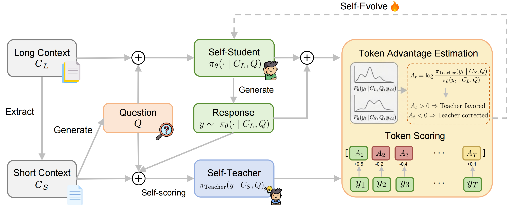

# OPSDL: On-Policy Self-Distillation for Long-Context Language Models

- **arXiv:** [2604.17535](https://arxiv.org/abs/2604.17535) (COLM 2026 preprint)
- **Authors:** Xinsen Zhang, Zhenkai Ding, Tianjun Pan, Run Yang, Chun Kang, Xue Xiong, Jingnan Gu (Baidu Inc.)
- **Why it matters to us:** Another **on-policy self-distillation** method using the **same token-level reverse-KL mechanism as our `SDPOTrainer`**, but it makes the *opposite* choice about the teacher's context. Instead of giving the teacher **more** information (the gold solution, as our `use_successful_as_teacher` path does), OPSDL gives the teacher **less but cleaner** information — a short, relevant slice of the input — and distills that into the long-context student. That reframes the single most dangerous knob in our pipeline (teacher-context richness, the lever that drove iteration-01's collapse) and suggests a concrete, lower-risk teacher design for our long OJBench prompts.

---

## TL;DR

LLMs accept long inputs but *use* them poorly — there's a gap between the **maximum** and **effective** context window. OPSDL closes it with self-distillation that needs **no labels, no reward model, no preference pairs**. Construction: from a long document $C_L$, extract a contiguous **short slice** $C_S \subset C_L$ that holds the core evidence, then have the model write a question $Q$ answerable from both. Training: the policy generates a response **on-policy conditioned on the full long context** $\pi_\theta(\cdot\mid C_L,Q)$; the **same model conditioned on the short slice** $\pi_\theta(\cdot\mid C_S,Q)$ acts as a **self-teacher**; a **point-wise reverse-KL** token-level advantage $A_t=\log\frac{\pi_\text{teacher}(y_t\mid C_S,Q,y_{<t})}{\pi_\theta(y_t\mid C_L,Q,y_{<t})}$ pulls the long-context distribution toward the cleaner short-context one. The teacher is **co-evolving** (it's the current policy, just under a different prompt). On Qwen2.5-Instruct 7B/14B/32B it beats Long-SFT and LongPO on RULER + LongBench V2, with the **biggest gains at long context** (e.g. +48.7 points at 128K for 7B), **closes most of the gap to the dedicated Qwen2.5-1M models**, trains **stably where LongPO diverged** (14B/32B), and **barely dents short-context/general benchmarks** (~1.3 pts vs ~3–4 for Long-SFT).

## The method, step by step

*Figure 1 — Overview of the OPSDL framework. Given a long context $C_L$ and its extracted short context $C_S$, the model generates responses on-policy conditioned on $C_L$. The same model under $C_S$ serves as a self-teacher, providing token-level supervision via point-wise reverse KL divergence to align the long-context generation with the short-context behavior.*

1. **The asymmetry being exploited.** Same weights $\theta$, two prompts: under the **short** slice $C_S$ the model is calibrated and accurate (the evidence fits comfortably in its well-trained window, no distractors); under the **full** long context $C_L$ the same model gets distracted and hallucinates. So the short-context behavior is a free, high-quality teacher for the long-context student. No privileged *answer* is injected — only a **denoised subset of the same input**.

2. **Data construction (reverse / self-instruct).** Sample long doc $C_L$ → randomly pick a short chunk $C_S$ → prompt the model to generate an instruction pool from $C_S$, sample $Q$ from it. Yields $(C_L, C_S, Q)$ triplets answerable from *both* contexts. No human annotation, no preference labels. (Follows LongPO's pipeline but keeps only the triplets — no preferred/dispreferred responses.)

3. **Token-level reverse-KL advantage** (Eq. 2). For each on-policy token: positive $A_t$ ⇒ teacher (short) is more confident than student (long) ⇒ student **under-uses present evidence**; negative $A_t$ ⇒ student more confident ⇒ **hallucinating from long-context noise**; ~zero ⇒ token unaffected, negligible gradient. So gradient concentrates **only on tokens where long-context behavior deviates from the short-context anchor** — dense but targeted, vs LongPO's one sparse sequence-level preference signal.

4. **Policy-gradient objective** (Eq. 4): $\mathcal{L}_{PG}=-\mathbb{E}_{y\sim\pi_\theta(\cdot\mid C_L,Q)}\sum_t A_t\,\log\pi_\theta(y_t\mid C_L,Q,y_{<t})$. Equivalent to minimizing per-token reverse KL from the short-context distribution to the long-context one. The teacher **co-evolves** with the student (same $\theta$), so the anchor stays calibrated as training proceeds.

## Key results

| Model (7B) | RULER avg | RULER@128K | LongBench V2 overall | Total avg |
|---|---|---|---|---|
| Qwen2.5-7B-Instruct (base) | 77.16 | 25.14 | 26.2 | 51.68 |
| + Long-SFT | 81.88 | 63.78 | 26.1 | 53.99 |
| + LongPO | 83.34 | 61.28 | 27.5 | 55.42 |
| **+ OPSDL (Ours)** | **86.32** | **73.84** | **32.6** | **56.61** |
| Qwen2.5-7B-Instruct-**1M** (dedicated) | 90.26 | 81.84 | 30.6 | 60.43 |

- **Gains scale with context length.** Base models collapse past 64K; OPSDL holds up. 128K improvement over base: **+48.70 / +34.25 / +30.29** at 7B/14B/32B.
- **Closes the gap to the 1M models** without their multi-stage long-context pretraining: RULER-avg gap shrinks 13.10→3.94 (7B) and 10.57→3.28 (14B).
- **Stability:** LongPO **failed to converge at 14B and 32B**; OPSDL trained cleanly at all three scales. This is a recurring theme — token-level dense signal is more stable than sparse sequence-level preference.
- **Short-context preserved:** avg drop ~1.3 pts across MMLU/ARC-C/Hellaswag/Winogrande, MT-Bench essentially flat (7.70→7.71); Long-SFT loses 3–4 pts.

---

## How this maps onto SparkyCoder (this is the important part)

The two self-distillation papers in our `knowledge/` now bracket the **teacher-context-richness** axis, and OPSDL sits on the *safe* end:

- **`summary_selfdistill_degrades_reasoning.md`:** richer teacher context (the gold solution) → epistemic collapse → OOD regression. This is exactly our `use_successful_as_teacher=True` + solution-as-`privileged_context` path, and it's the mechanism behind **iteration-01's collapse**.
- **OPSDL (this paper):** teacher context is **less but cleaner** (a relevant slice, *not* the answer). Same reverse-KL machinery, but the teacher never sees information the student is forbidden — so there's nothing to "leak" and over-compress. The paper explicitly *preserves* general capability while improving the target axis.

That's the actionable bridge: OPSDL is a recipe for **choosing a teacher context that is more-calibrated without being more-omniscient**, which is precisely the failure mode the other paper warns us about.

### Concrete things to try / instrument

1. **A "relevant-evidence" teacher instead of a full-solution teacher.** Our richest teacher hands over the entire gold solution (`sdpo_train.py:133-141`). OPSDL's insight: a teacher conditioned on a **denoised, relevant subset of the *prompt*** is calibrated *without* being a confident oracle. For OJBench, the analogue of $C_S$ is a **distilled problem view** — e.g. just the I/O spec + constraints + one worked example, stripped of flavor text/story — fed to the teacher while the student sees the full statement. This is a middle rung on the richness ladder between "full solution" (collapses) and "feedback-only" (our iteration-02 `environment_feedback_only_without_solution`). Cheap to prototype as a new `privileged_context` builder in `src/sdpo_ojbench.py`.

2. **We may already have a latent long-context problem worth measuring.** Our completions cap at **8k** (`--max-completion-length 8192`, `sdpo_train.py:35`) and eval at **32k** (`--max-tokens 32768`), and `max_reprompt_len=8192` (`sdpo_train.py:142`) bounds the teacher prompt. OPSDL's whole thesis is that **effective ≪ maximum** context, with degradation appearing *past* the comfortable window. Worth instrumenting in `sdpo_passk.py`: **bucket held-out pass@k by total prompt+completion token length.** If long-statement OJBench problems pass@k worse at matched difficulty, the "long-context isn't used well" failure is real for us and an OPSDL-style short-context anchor is directly motivated.

3. **Reverse-KL direction sanity check.** OPSDL's advantage is $\log(\pi_\text{teacher}/\pi_\text{student})$ — pull the student *toward* the teacher token-by-token, gradient only where they diverge. This is mechanically what `SDPOTrainer` already does; the novelty is **what the teacher is conditioned on**, not the loss. So adopting the idea is a **data/context change, not a trainer change** — low integration risk, mostly unit-testable in `sdpo_ojbench.py` (the "pure-logic / prompt-assembly" rung of the budget ladder — unit tests likely suffice before any Modal smoke).

4. **Note the teacher-staleness tension and pick deliberately.** OPSDL uses a **co-evolving** teacher (current policy under a different prompt) and reports stability. The reasoning-degradation paper found a **fixed (EMA=0)** teacher strictly better and that EMA *amplifies* collapse. These don't actually contradict: OPSDL's co-evolving teacher is safe **because its context isn't omniscient** (no answer to runaway-collapse toward), whereas the EMA-amplified collapse in the other paper rode on a *gold-solution* teacher. Takeaway: if we move to a **non-omniscient** short-context teacher, the EMA setting (`teacher_model_kind="ema"`, `sdpo_train.py:133`) is far less dangerous — but still worth A/B'ing fixed vs EMA once the teacher context is de-risked.

5. **Watch GSM8K + short-context exactly as OPSDL watches MMLU/MT-Bench.** Their headline safety claim is "long-context gains without short-context regression." Our `eval_runner.py` GSM8K probe is the same guardrail. If a short-context-anchor teacher both lifts held-out OJBench pass@k *and* holds GSM8K, that's the OPSDL result reproduced in our domain — the clean win iteration-01 failed to get.

### Memory / cost caveats (H100 80GB / H200 ≥141GB)

- **OPSDL needs two forward passes per step over potentially long sequences** — the long-context *student* generation/scoring **and** the short-context *teacher* scoring. We already pay this in `SDPOTrainer`, but if we lengthen the student context to chase the long-context regime, the LM-head logits tensor (the thing that **silently OOM-kills the GB10**, per `CLAUDE.md`) grows with it. Keep `per_device_train_batch_size=1` + grad checkpointing; on H100 (80GB) expect tighter `--vllm-gpu-util` (0.25) headroom. The **short** teacher context is the cheap side — that's a feature: our `max_reprompt_len=8192` cap already keeps the teacher pass bounded, which aligns with OPSDL by construction.
- **Their gains grow with model scale and context length** on 7B–32B Qwen. We run **Gemma-4-E2B** (much smaller) on **code, not document QA**. The "effective < maximum context" pathology and the "denoised teacher context" remedy should transfer in spirit, but the magnitude is unproven at our scale — treat any long-context bucketing result as the *decision gate* before investing Modal hours.

### Caveats / where we differ

- **Domain:** RULER/LongBench V2 are retrieval + long-document reasoning; ours is competitive programming with verifiable judge rewards. OPSDL deliberately uses **no reward signal** (pure self-distillation), whereas our pipeline *has* a ground-truth judge (`sdpo_ojbench.py:judge_completion`). We are not obligated to throw that away — the OPSDL idea to borrow is the **teacher-context construction**, layered on top of our existing reward/success-group logic, not a wholesale switch to label-free training.
- **Their $C_S$ is a contiguous slice of the same input; our analogue (a distilled spec) is a *rewrite*, not a substring** — so the "answerable from both contexts" guarantee is softer for us. Validate that the distilled-spec teacher is actually still *correct and calibrated* on a few problems before trusting it as a training anchor (judge-fidelity = reward-fidelity discipline applies).
- **pass@k remains the metric.** OPSDL reports accuracy/EM-style scores; our standing rule (greedy wobbles, SDPO loss is not a quality signal — `CLAUDE.md`, `sdpo_passk.py`) is unchanged. Any OPSDL-flavored run is judged on **held-out pass@k + GSM8K**, with early-stop, exactly like iteration-02.

## One-line lesson

OPSDL keeps SDPO's reverse-KL distillation but makes the teacher **cleaner, not smarter** — anchoring the long-context student to the model's own behavior on a *denoised relevant slice* of the input rather than on a privileged solution; for us that means prototyping a **distilled-problem-spec teacher** in `sdpo_ojbench.py` (low-risk, unit-testable) and **bucketing held-out pass@k by prompt length** to check whether our long OJBench statements are an effective-context problem worth solving this way.
