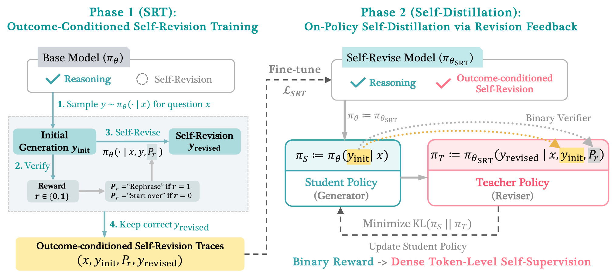

# Self-Distillation Zero: Self-Revision Turns Binary Rewards into Dense Supervision

- **arXiv:** [2604.12002](https://arxiv.org/abs/2604.12002) (COLM 2026 preprint)
- **Authors:** Yinghui He, Simran Kaur, Adithya Bhaskar, Yongjin Yang, Jiarui Liu, Narutatsu Ri, Liam Fowl, Abhishek Panigrahi, Danqi Chen, Sanjeev Arora (Princeton University / University of Toronto / Carnegie Mellon)
- **Code:** [princeton-pli/Self-Distillation-Zero](https://github.com/princeton-pli/Self-Distillation-Zero)
- **Why it matters to us:** This paper attacks **the exact weak point that broke iteration-01.** Our SDPO recipe (`SDPOTrainer`, Hübotter et al.) builds its teacher by **filtering for already-correct rollouts** (`use_successful_as_teacher=True`) — which collapses to nothing exactly when the model can't solve anything (our "easy+medium → 0 successful rollouts → no signal" gotcha). SD-Zero's whole pitch is that the teacher should **condition on the WRONG attempt and its binary reward** and *revise* it — turning the same AC/WA verdict our judge already emits into dense token-level supervision, **without** needing a successful rollout or a gold solution. It directly names SDPO, SDFT, and OPSD as the methods it improves on (`Table 1`), and our judge's AC/WA-plus-feedback output is precisely the binary signal it densifies.

---

## TL;DR

A single model is trained to play two roles. As **Generator** it answers a problem; as **Reviser** it conditions on its *own* response **and that response's binary reward** ($r\in\{0,1\}$) and emits an improved response — *correcting* if wrong, *rephrasing* if right. **Phase 1 (SRT, Self-Revision Training)** is plain SFT that teaches both roles from ~6K self-generated, correctness-filtered revision traces (no gold CoT, no external teacher). **Phase 2 (OPSD, On-Policy Self-Distillation)** runs on-policy distillation where the **frozen Phase-1 reviser is the teacher** (it sees the response + reward) and the live generator is the student, trained by token-level KL to match the reviser's next-token distribution. Net effect: **"transform binary rewards into dense token-level self-supervision."** On Qwen3-4B-Instruct and Olmo-3-7B-Instruct across 8 math+code benchmarks, SD-Zero beats the base model by **≥10%** and beats SFT/RFT/GRPO/SDFT by **≥4.8%** under a matched generation budget — while making responses **~2× shorter** than Phase 1, and **raising pass@8** (not just sharpening pass@1).

## The method, step by step

*Figure 2 — Overview of SD-Zero. Phase 1 (SRT) collects 6K outcome-conditioned self-revision traces by sampling an initial response, prompting the model to self-revise an incorrect response, and keeping the correct revision. Phase 2 (OPSD) runs on-policy self-distillation with the SRT model as both student and teacher: the student generates an on-policy response and the teacher generates a revised version conditioned on that response and its outcome reward — bootstrapping performance by internalizing self-revision.*

1. **Setup / assumptions.** Dataset is just `{(problem x, ground-truth final answer a)}` — **no gold reasoning traces**. The only feedback is a binary verifier $r(y,a)\in\{0,1\}$. The training set is split into two disjoint subsets ($N_1$ for Phase 1, $N_2$ for Phase 2).

2. **Phase 1 — Self-Revision Training (SRT), the warm-start.** Base models are *good generators but weak revisers*, so this phase installs the reviser skill. For each problem, sample initial responses $y_\text{init}$, score them, then build a revision prompt with a control phrase keyed on the reward:
   - $r=1$ → `"Let me rephrase the above solution."` (rephrase a correct answer — tends to come out **shorter**)
   - $r=0$ → `"Wait, this response is not correct, let me start over."` (critique + restart)

   Sample $y_\text{revised}$, **keep only traces where the revision is correct**, and SFT on two losses summed: $\mathcal{L}_\text{revision}$ (produce the revision given $x, y_\text{init}, P_r$) **+** $\mathcal{L}_\text{generation}$ (reproduce the whole $[y_\text{init}, P_r, y_\text{revised}]$ from $x$ alone). Ablation (`Table phase1`): each term alone underperforms — revision-loss elicits the skill, generation-loss transfers it into first-attempt quality. Correctness filtering of the revision traces is important.

3. **Phase 2 — OPSD, the distillation.** Initialize student $\theta \leftarrow \theta_\text{SRT}$. The **teacher is the frozen Phase-1 model** acting as reviser: it conditions on the student's on-policy response $y$ and its reward $P_r$, i.e. $\pi_{\theta_\text{SRT}}(\cdot \mid x, y, P_r)$. The student, seeing only $x, y_{<t}$, is trained by per-token KL to match the teacher:
   $$\mathcal{L}_\text{OPSD} = \mathbb{E}_{x}\,\mathbb{E}_{y\sim\pi_\theta(\cdot\mid x)}\sum_t \mathrm{KL}\big(\pi_\theta(\cdot\mid x,y_{<t})\,\|\,\pi_{\theta_\text{SRT}}(\cdot\mid x,y,P_r,y_{<t})\big)$$
   **Only one rollout per question** (vs GRPO's group), and **no gold solution** (vs SDFT). This compresses Phase 1's verbose two-attempt "Wait… let me start over" behavior into a single, proactive first attempt: **~2× fewer tokens at higher accuracy.**

4. **Token-level self-localization (why a *binary* reward becomes *dense*).** Decompose the KL into a per-token "Token KL Reward" $= \log\pi_\theta(y_t\mid x,y_{<t}) - \log\pi_{\theta_\text{SRT}}(y_t\mid x,y,P_r,y_{<t})$. For **incorrect** generations the KL mass concentrates on a *small subset* of tokens (the faulty step gets large **positive** KL → pushed away; the better alternative gets large **negative** KL → pulled toward). For **correct** generations it's nearly uniform (mostly preserve the response). So the reviser doesn't just say "wrong" — it **localizes the error and points at the fix**, converting a scalar outcome into a two-sided token-level signal. This is the conceptual heart of the paper.

5. **Iterative self-evolution (teacher sync).** With a fixed Phase-1 teacher, Phase 2 plateaus (~step 400 on OpenR1-Math) because the teacher is stale. But OPSD *also* improves the model's revision skill (the SD-Zero model gets a +5.3% Generate-then-Revise gain, ≈ SRT's +5.0%). So **synchronize the teacher to the improved student** and continue: a second OPSD phase yields **≥3 more points** with no fresh saturation. Self-improvement loop, no external supervision.

## Key results

- **Phase 1 (SRT) alone beats every baseline** on the same data budget: **+7.8%** (Qwen) / **+9.2%** (Olmo) avg accuracy from just 6K self-revision traces, beating SFT-on-DeepSeek-R1 and RFT trained on 15K. SFT on expert traces actually *degrades* Qwen on AMOBench/LiveCodeBench; RFT barely moves the hard benchmarks. The win comes from **keeping the failed attempt as context** (RFT throws it away).
- **Phase 2 (OPSD) adds +2.7% (Qwen) / +1.2% (Olmo)** on top → total **+10.5% / +10.4%** over base, **and halves response length.** Largest Phase-2 gains land on **code** (Codeforces, LiveCodeBench) and HMMT25 for Qwen.
- **vs strong baselines, matched generation budget: ≥4.8% better** than GRPO/DAPO and SDFT. SDFT collapses when given only the final answer (no gold solution) — SD-Zero needs only the scalar reward.
- **pass@8 rises too**, so SD-Zero is *not* merely sharpening an existing distribution (the failure mode RL/GRPO is criticized for) — it's adding capability.
- **Comparison table (`Table 1`):** SD-Zero is the **only** self-distillation method (vs OPSD/SDFT/SDPO) whose teacher can **condition on an incorrect attempt** — that's the structural difference that lets it densify binary rewards without gold demos.
- Models: Qwen3-4B-Instruct, Olmo-3-7B-Instruct. Temp 0.7, 16K train / 32K eval token cap, avg@8. Train data: 15K OpenR1-Math + 15K Codeforces (cpp + Python subsets).

---

## How this maps onto SparkyCoder (this is the important part)

We run SDPO on **competitive programming with a binary-ish verifier** — which is *exactly* SD-Zero's home turf (their code domain is Codeforces cpp+Python, very close to OJBench). And the one structural assumption SD-Zero removes — *the teacher needs a successful/gold response* — is **the precise assumption that gives us our worst gotcha** (`easy+medium → 0 successful rollouts → no distillation signal`). This paper is the most directly actionable one in our knowledge base for breaking that constraint.

- **It offers a way out of the "easy-only" trap.** Our `src/sdpo_train.py:134` runs `use_successful_as_teacher=True`: the teacher is built from rollouts that **already passed**. That is why easy+medium dies cold (no passes → no teacher) and why we're *forced* into the low-coverage easy-only regime that overfit in iteration-01. SD-Zero's reviser teacher conditions on the **wrong** attempt + its WA verdict, so it produces a learning signal **even when zero rollouts pass**. This could let us finally train the "learnability frontier" (easy + sometimes-solvable medium) the iteration-02 plan calls for — the coverage breadth our companion paper (`summary_selfdistill_degrades_reasoning.md`) says is the main lever against OOD collapse.
- **Our judge already emits everything Phase 2 needs.** `sdpo_ojbench.py:judge_completion()` returns `(reward, verdict, feedback_text)` with verdicts in `AC/WA/RE/TLE/CE/NO_CODE` (`src/sdpo_ojbench.py:149-179`). That's the binary reward AND a control-phrase source. SD-Zero's $P_r$ is literally just "this is wrong, start over" vs "rephrase" — we can make ours **verdict-specific** ("WA on test 3, fix it" / "TLE, make it faster" / "CE, fix the compile error"), which is *richer self-localization* than their single binary phrase.
- **iteration-02's feedback wiring is half of SD-Zero already.** Our `--feedback` path (`sdpo_train.py:140-141`, `include_environment_feedback` + `environment_feedback_only_without_solution`) pipes live judge feedback into the teacher's context — conceptually the same "teacher conditions on the attempt + outcome" move. SD-Zero says: don't stop at feeding feedback into a *correct*-rollout teacher; build an explicit **reviser** that's been *trained* (Phase 1) to turn a WA verdict into a corrected continuation, then distill it. Our current setup skips the Phase-1 warm-start, which the ablation (`Table phase2`) shows is **necessary** — OPSD-without-SRT barely beats base.
- **Their teacher is FIXED (frozen Phase-1) — and that matters for us.** Our companion summary flags that our `teacher_model_kind="ema"` (`sdpo_train.py:133`) amplifies collapse, and SD-Zero independently uses a **frozen** teacher in Phase 2, only re-syncing it deliberately between epochs (their "iterative self-evolution"). Both papers point the same way: **drop EMA, use a fixed teacher, sync explicitly.**
- **The length signature is the same canary, opposite sign.** iteration-01 collapsed via a *fast length drop* into terse mode. SD-Zero *also* shortens (~2×) — but **while pass@8 rises**. The distinguishing telemetry is therefore **length-vs-pass@k together**: shorter + held-out pass@k up = good internalization; shorter + pass@k down = our collapse. We already log length per step; the discriminator is held-out pass@k, which `sdpo_passk.py` already provides.

### Concrete things to try / instrument

1. **Prototype an OJBench "reviser" warm-start (Phase 1).** Generate K rollouts per problem with the current pipeline, judge them, and build a correctness-filtered revision dataset: `(prompt, wrong_attempt, verdict-keyed P_r, corrected_solution)`. This is a *pure-data* job reusing `judge_completion()` + the existing rollout path — climbs only the cheap rungs of the budget ladder (unit-test the dataset builder, GB10 smoke), no long Modal run to validate the idea. The payoff is a teacher that **works on hard problems with zero passing rollouts** — the thing blocking frontier training.
2. **Make $P_r$ verdict-specific.** Replace SD-Zero's single binary phrase with our judge's verdict + feedback text ("WA, 3/10 cases, smallest failing: …" — we already order smallest-first per `docs/design/JUDGE.md`). This is strictly more informative self-localization and costs nothing extra at judge time.
3. **Add a token-KL self-localization probe to eval.** SD-Zero's diagnostic — per-token $\log\pi_\text{student} - \log\pi_\text{teacher}$, bucketed, correct vs incorrect — directly tests whether *our* reviser concentrates KL on the buggy tokens (e.g. the off-by-one, the wrong complexity) vs smearing it. If our code reviser shows the concentrated-on-wrong / uniform-on-correct split, the densification is real; if not, the warm-start isn't teaching localization. Cheap, and it's a *quality* signal where (per CLAUDE.md) the SDPO loss is not.
4. **Switch the teacher to fixed, sync deliberately.** Single-knob change from `teacher_model_kind="ema"` to a frozen reference, then add a manual teacher-sync between epochs to reproduce their "iterative self-evolution." Compare held-out pass@k of EMA vs fixed vs fixed+sync.
5. **Re-balance the data split toward Phase 2.** Their ablation (`Table data-split`) found more data in OPSD (not SRT) gives the best final model. If we adopt the two-phase structure, budget accordingly rather than over-investing in the warm-start.
6. **Use pass@8, not greedy, as the verdict — they did too.** SD-Zero reports pass@8 specifically to prove they aren't just sharpening. This is identical to our standing rule (`sdpo_passk.py` is the metric, greedy wobbles). Reassuring cross-check.

### Caveats / where we differ

- **Their reward is a single deterministic final-answer match; ours is a multi-test judge** (public/private split, fraction vs binary `reward_mode`, `sdpo_ojbench.py:264`). Our verdict is *richer* than their binary $r$ — an opportunity (better $P_r$) but also a fidelity risk: a false-AC trains the reviser to "correct" toward a wrong solution. **Judge fidelity = reviser fidelity** now, doubly so (it shapes both the reward and the revision target).
- **Model scale gap.** They use 4B–7B *instruct* models with long CoT; we use **Gemma-4-E2B** (smaller, multimodal text-tower-only LoRA). The reviser skill in Phase 1 may be harder to elicit at our scale — the warm-start could need more traces, or may simply be weaker. Smoke this on a few real problems before trusting it.
- **Two phases = more moving parts = more budget surface.** Phase 1 needs multi-sample generation (the expensive part they admit), Phase 2 is the cheap single-rollout part. The de-risk ladder in CLAUDE.md applies: the Phase-1 dataset builder is pure logic (unit-test it); only the Phase-2 trainer integration warrants a Modal smoke before a long run.
- **They never hit our exact failure (held-out OOD collapse) because their code eval overlaps training distribution more.** Our OJBench held-out hard set is a harder generalization test — so treat SD-Zero's gains as an *upper bound* to expect, and keep early-stop on held-out pass@k regardless.

## One-line lesson
SD-Zero is the missing piece for our biggest gotcha: by building a **reviser teacher that conditions on the *wrong* attempt and its binary verdict** (which our judge already produces), it turns a binary AC/WA into dense, error-localized token supervision **without needing a passing rollout or gold solution** — so the move for us is a **verdict-keyed self-revision warm-start (Phase 1) + frozen-teacher on-policy distillation (Phase 2)**, instrumented with a token-KL localization probe and judged on held-out pass@k, to finally train the learnability frontier that easy-only could not.
