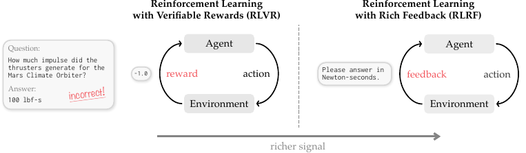
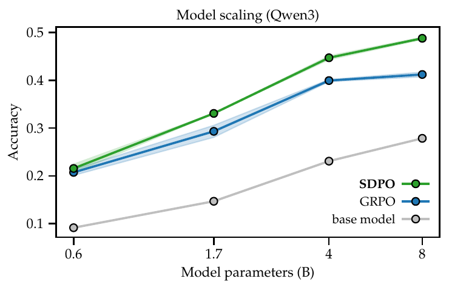

# Reinforcement Learning via Self-Distillation (the original SDPO paper)

- **arXiv:** [2601.20802](https://arxiv.org/abs/2601.20802)
- **Authors:** Jonas Hübotter, Frederike Lübeck, Lejs Behric, Anton Baumann, Marco Bagatella, Daniel Marta, Ido Hakimi, Idan Shenfeld, Thomas Kleine Buening, Carlos Guestrin, Andreas Krause (ETH Zurich / MPI-IS / MIT / Stanford)
- **Code:** [lasgroup/SDPO](https://github.com/lasgroup/SDPO)
- **Why it matters to us:** This is **the method our whole repo runs** — TRL's `SDPOTrainer` is this algorithm. Everything in `src/sdpo_train.py` (EMA teacher, `use_successful_as_teacher`, environment-feedback reprompting, top-K logit distillation) is a knob defined here. It is also the paper whose **LiveCodeBench v6 result is the closest analog to OJBench** — a contest-coding RLRF environment with public/private tests and LeetCode-style feedback. Reading it tells us what SDPO is *supposed* to do well, the regimes where it wins, and the exact configuration choices the authors found best — which we should treat as the reference point against which iteration-01's collapse is the anomaly.

---

## TL;DR

Standard RLVR (e.g. GRPO) learns from a single **scalar** reward per attempt — a credit-assignment bottleneck, and worse, when every rollout in a group gets the same (usually 0) reward the GRPO advantage is exactly zero and learning stalls. But verifiable environments actually emit **rich tokenized feedback** (runtime errors, failing tests, judge output) that says *why* an attempt failed. SDPO turns that feedback into a **dense, logit-level** learning signal **without any external teacher**: take the *current* policy, re-prompt it with the question **plus the feedback** (and a correct sibling solution if one exists in the group) to form a **self-teacher** $q_\theta(\cdot\mid x,f)$, then minimize the per-token KL between the student $\pi_\theta(\cdot\mid x)$ and the (stop-gradient) self-teacher on the student's **own** rollout. No extra sampling — just a second forward pass for log-probs. This is literally a policy gradient with the GRPO advantage swapped for a logit-level one: $A^{\text{SDPO}}_{i,t}(\hat y) = \log\frac{q_\theta(\hat y\mid x,f,y_{<t})}{\pi_\theta(\hat y\mid x,y_{<t})}$ — zero only where student and teacher agree, positive/negative per token elsewhere. Result on contest code (LCBv6, Qwen3-8B): **48.8% vs GRPO 41.2%**, matching GRPO's final accuracy in **4× fewer generations**, beating Claude Sonnet 4 / Opus 4 on that subset.


*Figure 2 — From scalar rewards (RLVR) to rich, tokenized environment feedback (RLRF): the same loop, but the environment returns *why* an attempt failed instead of a single number — the "richer signal" SDPO learns to exploit.*

## The method, clearly

**The self-teacher (the whole idea).** The same weights play two roles: *student* generates the attempt blind; *teacher* re-reads that attempt **with feedback in context** and, via in-context learning, retroactively "disagrees" with the tokens that led the attempt astray. The teacher is strictly more informed than the student, so its next-token distribution is a free, dense supervision target. The reprompt template (their Table, = our reprompt path) is:

```
User:  <prompt>
       Correct solution:
       <successful_previous_rollout>          # only if the group already solved x
       The following is feedback from your unsuccessful earlier attempt:
       <environment_output>                    # only if attempt failed AND no solution given
       Correctly solve the original question.
Assistant: <original_response>                 # re-scored under the teacher's log-probs
```

**Objective.** `L_SDPO = Σ_t KL( π_θ(·|x,y_<t) ‖ stopgrad q_θ(·|x,f,y_<t) )`. The `stopgrad` on the teacher is load-bearing — without it the teacher regresses toward the student and ignores the feedback. They actually use the **symmetric Jensen–Shannon** divergence in practice (more stable than raw KL), and a **top-K** approximation (K≈100 student tokens + one tail term) so they never hold two full vocab-logit tensors in memory — "virtually no memory overhead."

**Three feedback sources, and which matter (their Table on feedback types):**
- **Sample solution** from a successful sibling rollout — mirrors GRPO's group-relative signal, but the teacher can pinpoint *specific* fixes instead of one flat negative advantage. This is our `use_successful_as_teacher=True`.
- **Environment output** (runtime error / failing test / judge text) — **complementary** to solutions because it gives signal **even when the group never solved x**. This is our `include_environment_feedback`.
- **The student's own attempt `y` in the teacher prompt** — they find **including it HURTS**: it biases the teacher toward the student's tokens, collapses entropy (avg entropy 0.41 → 0.23), kills exploration. Best config is **`output + own solution`, WITHOUT re-injecting `y`** as text (48.3% vs 44.5% when `y` is added). Output-only and solution-only each work; combined is best.

**Teacher regularization (stability).** A raw bootstrapping teacher `q_θ` eventually **diverges**. They regularize it two ways: **EMA** of student params (`θ' ← (1-α)θ' + αθ`) or an explicit **trust-region** interpolation toward the initial teacher. Key empirical findings (their teacher table):
- A **non-regularized** teacher is much worse and can diverge.
- **Trust-region (α=0.01) ≈ EMA (α=0.01)** are the two best, ~50.6 / 49.3 best accuracy.
- Both **beat a frozen-at-init teacher** — because parameter sharing lets the teacher *improve with the student*. They explicitly show the **self-teacher's generative accuracy rises during training** and the **student eventually surpasses the initial teacher** (true weak→strong bootstrapping).
- But "SDPO performs well even with a frozen teacher" — frozen is a safe fallback, not a disaster.

**Dense credit assignment is real and additive to rich feedback.** Ablating logit-level (top-100) vs token-level (top-1) vs sequence-level (one averaged scalar, GRPO-style) advantages: logit > token > sequence, **but even sequence-level SDPO beats GRPO** — so the win is *both* (a) using rich feedback at all and (b) spreading it densely over the logits.

## Key results

- **Rich-feedback code (LCBv6, the OJBench analog):** SDPO 48.8% vs GRPO 41.2%, 4× sample-efficiency, > Claude Sonnet 4 (40.5%). Gains concentrate on **medium and hard** problems.

- **Scaling — the most important caveat for us.** SDPO's edge over GRPO **grows with model size** and **vanishes or reverses on small/weak models**: big wins on Qwen3-8B, only slight on small Qwen3, and SDPO **underperforms GRPO on Qwen2.5-1.5B**. Self-teaching is an **emergent in-context-learning ability** — "the marginal improvement of SDPO over GRPO is tightly coupled with the strength of the base model." For weak models they recommend the **hybrid `SDPO+GRPO`** advantage `A = λ·A_GRPO + (1-λ)·A_SDPO` (λ=0.9), which is more robust on Qwen3-0.6B (and slightly worse than pure SDPO on strong models — i.e. the scalar GRPO signal can be *harmful* once the model is strong).


*Figure 8 — SDPO's margin over GRPO at LCBv6 step 80 grows with model size across Qwen3 0.6B→8B; at the smallest scale the two converge. This scaling curve is the single most important caveat for SparkyCoder's ~2B-class Gemma-E2B.*
- **No rich feedback (science Q&A, tool use):** even here SDPO beats an *improved* GRPO (70.2% vs 66.6% aggregate) by using successful siblings as implicit feedback, learning ~5–6× faster, with **3–11× shorter generations** at higher accuracy — "effective reasoning need not be verbose."

- **Anti-forgetting:** on-policy SDPO keeps held-out IFEval / ArenaHard / MMLU-Pro roughly flat while learning the task — a **better capability/regression tradeoff than GRPO**, and far better than **SFT-on-self-teacher** (off-policy imitation), which both underperforms on-task and forgets more.
- **Test-Time Self-Distillation (TTT):** on *very hard* LCBv6 problems (base pass@64 < 0.03), run SDPO with batch size 16 on a **single** question — distilling the running feedback history into weights. It discovers solutions with **~3× fewer attempts** than best-of-k / multi-turn, solves problems neither baseline can, and works **even though the initial self-teacher solves <1%** of these (0% on 78% of them). Pure RLVR can't even start here (no signal until first success).


## How this maps onto SparkyCoder (the important part)

Our setup *is* their LCBv6 setup, minus two things that the paper says are decisive: **model strength** and **broad/repeated coverage**. That reframes our results: iteration-01's collapse is not "SDPO is broken," it's "we're running SDPO outside the regime where the paper got its wins."

- **Model scale is our biggest structural risk.** Their headline gains are **Qwen3-8B**; the effect **weakens on small models and reverses on weak ones**. We run **Gemma-4-E2B** (a ~2B-class effective model). The paper's own scaling curve predicts SDPO's margin over GRPO could be small or negative for us purely from size. **Actionable:** (1) sanity-check that Gemma-E2B can even do the *retrospection* the method depends on — take a handful of failed OJBench rollouts, hand the model the judge feedback in the reprompt template, and measure the **teacher's one-shot accuracy vs the student's** (their Table: teacher should be meaningfully higher; on TTT it can be ~0 and still work, but on train-time tasks the teacher edge is what drives learning). If the teacher is *not* better-informed than the student, SDPO has nothing to distill. (2) Strongly consider the **`SDPO+GRPO` hybrid (λ≈0.9)** as our default given our small model — the paper introduces it *specifically* because pure SDPO is unreliable below Qwen3-8B. We currently run pure SDPO.

- **iteration-01 collapse, read through this paper.** We saw mode-collapse to terse outputs. The paper *celebrates* SDPO's 3–11× length reduction as a feature — **but always paired with equal-or-higher accuracy**. Our terse outputs came with **dropping** held-out pass@k and GSM8K. So the diagnostic is not "did length drop" (it's supposed to) but "**did accuracy track length down**." That matches our existing rule that **the SDPO loss is not a quality signal** — the paper never uses loss as a quality metric either; it watches **accuracy / pass@k**. Keep `sdpo_passk.py` as the arbiter.

- **Our teacher config vs their best.** `src/sdpo_train.py:133` uses `teacher_model_kind="ema"`. The paper says **EMA(α=0.01) and trust-region(α=0.01) are the two best**, both **better than frozen**, and EMA *amplifies* a feedback loop only when under-regularized — so EMA is a *defensible* choice **provided α is small**. **Actionable:** confirm what EMA decay TRL's `SDPOTrainer` actually uses and pin it near **0.01** (their value); if TRL exposes the trust-region/interpolated teacher, it's an equally-good, memory-cheaper alternative worth an A/B. (Note this nuances the companion summary `summary_selfdistill_degrades_reasoning.md`, which argues for a *frozen* teacher on **math/OOD** — that paper studies a different failure mode; on **code (LCBv6)** the original authors found the **moving** teacher strictly better. Our domain is code, so the original paper's "moving teacher, small α" is the more directly applicable guidance, with "frozen as safe fallback" available if we see runaway collapse.)

- **Feedback design — iteration-02 is exactly the right move and the paper tells us how to tune it.** iteration-02 wires live judge feedback into the teacher; the paper's ablation is the recipe:
  - Use **environment output + successful-sibling solution together** (most informative, 48.3%). We already set both `include_environment_feedback` and `use_successful_as_teacher=True`.
  - **`environment_feedback_only_without_solution`** (our flag at `sdpo_train.py:141`) maps to their "use env output when no solution exists" — which is the *complementary* path that gives signal on problems the group never solved. Keep it on; it's the only signal source on hard/unsolved OJBench problems.
  - **Do NOT put the student's raw attempt text into the teacher prompt** — their clearest negative result (entropy 0.41→0.23, accuracy 44.5 vs 48.3). Verify our reprompt path (and TRL's template) re-scores the attempt as the *assistant turn* but does not also paste it into the *user* turn as "your attempt was: …". This is a concrete, checkable bug surface.

- **Coverage / "easy-only" tension.** Our gotcha forces easy-only for any cold-start signal, but easy-only is the lowest-coverage regime. The paper's wins are on the **full** LCBv6 mix and it reports the **biggest gains on medium+hard**. This supports the **iteration-02 learnability-frontier plan** (easy + sometimes-solvable medium) over easy-only-for-100-steps. The paper also shows SDPO *can* make progress on problems with **zero prior successes** via environment feedback alone — so feeding in medium problems isn't wasted even when `use_successful_as_teacher` finds no sibling solution, *as long as* env-feedback is on.

- **Judge fidelity is now reward fidelity twice over.** In RLVR a bad judge gives a wrong scalar. In SDPO the judge **text** is fed verbatim into the teacher prompt and becomes the dense target. A misleading or truncated judge message doesn't just mislabel — it actively teaches the wrong fix at the logit level. Our `docs/design/JUDGE.md` feedback strings are now part of the *learning signal*, not just the reward; their quality matters more than under GRPO. Worth a pass to make the OJBench judge feedback resemble the LeetCode-style messages the paper uses (runtime error + line + last-executed-input), which is the format the model has the best in-context priors for.

- **TTT is a cheap, high-signal thing we could borrow.** Their discovery@k / Test-Time Self-Distillation result says: on an OJBench **hard** problem our base model rarely solves, running SDPO **on that single problem** (batch ~16, env feedback only, no sibling solution) can discover a solution in ~3× fewer attempts than best-of-k — and it's a tidy, self-contained experiment that sidesteps the train-set-coverage question entirely. Their **discovery@k** metric is a natural companion to our pass@k for the hard held-out split.

### Concrete checklist
1. **Measure teacher-vs-student accuracy** on Gemma-E2B with our judge feedback before trusting train-time SDPO — if the teacher isn't better, the method has no signal at our scale.
2. **Try the `SDPO+GRPO` hybrid (λ≈0.9)** as default given our small model; the paper added it precisely for sub-8B robustness.
3. **Pin EMA α≈0.01** (their value) and/or A/B against the trust-region teacher; don't run an under-regularized moving teacher.
4. **Audit the reprompt template**: env-output + sibling-solution in, **raw student attempt text out** of the user turn.
5. **Judge as it's read by the model**: make OJBench feedback LeetCode-shaped (error type + location + failing input).
6. **Add discovery@k / a single-problem TTT probe** on the hard split as a coverage-independent way to show SDPO helping.
7. **Judge accuracy by pass@k at fixed-or-better length**, never by loss, and treat "length down + accuracy down" (not "length down" alone) as the collapse signal.

### Caveats / where we differ
- Their infra is **verl, 4× GH200, full fine-tune, micro-batch 2**; we're **LoRA on a GB10/H100/H200, micro-batch 1**. The *algorithm* transfers; their absolute sample-efficiency and stability numbers may not.
- They never test a model as small as Gemma-E2B on code — the closest data point (Qwen2.5-1.5B) is exactly where **SDPO loses to GRPO**. This is the single most important reason to expect our results to differ from the paper's optimism.
- Their LCBv6 is contest problems with public/private tests like OJBench, but **train/eval are the same 131-problem pool** (in-domain). Our eval is **held-out** (the harder generalization axis), so we should not expect their in-domain accuracy gains to appear unchanged on our held-out pass@k.

## One-line lesson
SDPO's documented wins require (a) a **strong in-context learner** — our Gemma-E2B is below the scale where the paper's gains hold, so prefer the **`SDPO+GRPO` hybrid** and *verify the self-teacher is actually more accurate than the student* before any long run — and (b) **rich, faithful, LeetCode-shaped feedback with the sibling solution but NOT the raw attempt** in the teacher prompt, with a small-α moving (not frozen) teacher and **pass@k-at-equal-length**, never loss, as the judge of success.
