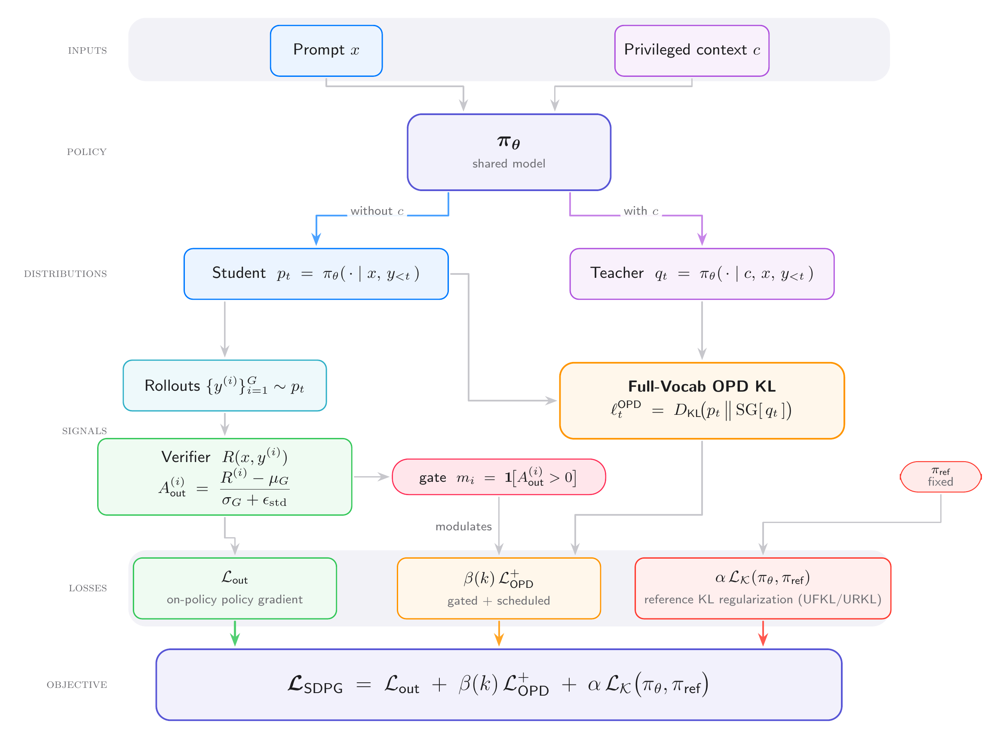
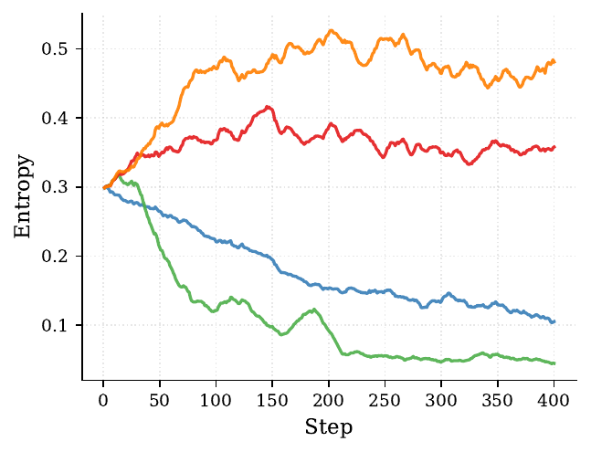

# Self-Distilled Policy Gradient (SDPG)

- **arXiv:** [2606.04036](https://arxiv.org/abs/2606.04036)
- **Authors:** Yifeng Liu, Shiyuan Zhang, Yifan Zhang, Quanquan Gu (UCLA / Princeton AI Lab)
- **Code:** [lauyikfung/SDPG](https://github.com/lauyikfung/SDPG)
- **Why it matters to us:** This is the **"self-distillation done right"** counterpart to our pipeline. It diagnoses the exact failure that bit us in iteration-01 — *pure* on-policy self-distillation mode-collapses — and gives a concrete recipe to fix it: keep the verifier outcome reward as the **primary** signal, demote distillation to a **small, gated, scheduled** auxiliary term, and anchor to a **fixed** reference. Our `SDPOTrainer` config (`src/sdpo_train.py`) sits at the opposite extreme: `distillation_weight=1.0` ("pure self-distillation"), an **EMA** teacher, fixed (un-scheduled) distillation strength, and no reference anchor — i.e. precisely the regime SDPG argues collapses.

---

## TL;DR

Pure on-policy self-distillation (a single model conditioned on privileged context $c$ — the answer/solution/feedback — supervising its own rollouts via full-vocabulary KL) gives dense per-token signal but **mode-collapses**: without a verifier, a privileged-but-imperfect teacher reinforces *locally plausible* tokens on *globally wrong* trajectories, and entropy crashes to zero. SDPG fixes this by **combining** three terms into one loss: (1) a GRPO-style **verifier outcome** advantage, (2) a **gated, scheduled** full-vocabulary on-policy-distillation (OPD) reverse-KL term, and (3) a **fixed-reference** KL anchor. Two stabilizers carry the result: **positive-advantage gating** (distill only on rollouts the verifier endorses) and a **β warmup-then-decay schedule** (let outcome reward find correct trajectories first, then phase distillation out so the student can still explore). On Qwen3-4B math, SDPG beats GRPO and RLSD on AIME24/25 + AMC23 while **avoiding the entropy collapse** that pure self-distillation (RLSD) suffers by step 250.

## The method

*Figure 1 — the full SDPG objective: a verifier **outcome** term + a **gated, scheduled** full-vocab OPD distillation term + a **fixed-reference KL anchor**, combined into one loss (from the paper).*

**Loss (Eq. 5):**

$$\mathcal{L}_{\mathrm{SDPG}} = \mathcal{L}_{\mathrm{out}} + \beta(k)\,\mathcal{L}^{+}_{\mathrm{OPD}} + \alpha\,\mathcal{L}_K(\pi_\theta, \pi_{\mathrm{ref}})$$

1. **Outcome term $\mathcal{L}_{\mathrm{out}}$** — REINFORCE/GRPO-style. Same group-relative advantage $A_{\mathrm{out}} = (R - \mu_G)/(\sigma_G + \varepsilon)$ from a binary verifier. This is the *grounding* signal; everything else is shaping.

2. **Full-vocabulary OPD term $\mathcal{L}_{\mathrm{OPD}}$** — the self-distillation. Same model $\pi_\theta$ is the **student** $p_t = \pi_\theta(\cdot \mid x, y_{<t})$ and, conditioned on privileged context, the **teacher** $q_t = \pi_\theta(\cdot \mid c, x, y_{<t})$. The per-token loss is the exact full-vocab **reverse KL** $\mathrm{KL}(p_t \,\|\, \mathrm{SG}[q_t])$ (teacher branch stop-gradient'd) on prefixes sampled from the student's own rollouts.
   - **Key derivation (Prop. 1):** on a fixed sampled prefix with the teacher detached, the student-side gradient of this KL is *identical* to a policy gradient with a **centered log-ratio token advantage** $A^{\mathrm{dist}} = \mathrm{SG}[\bar D_t - \log(\bar p_t/\bar q_t)]$, where $\bar D_t = \mathrm{KL}(\bar p_t \,\|\, \bar q_t)$. So "self-distillation" *is* a policy gradient — it just supplies a dense, full-vocabulary, per-token advantage instead of one sparse sequence reward. This is an interpretation of the gradient, not an implementation swap (they still optimize the explicit full-vocab KL for lower-variance gradient estimation).
   - **The failure mode they name:** *without* the verifier, this privileged-but-imperfect signal "can reinforce locally plausible tokens on globally wrong trajectories" → mode collapse, limited exploration. The verifier is the antidote.

3. **Fixed-reference KL anchor $\mathcal{L}_K$** — regularizes $\pi_\theta$ to a **frozen** $\pi_{\mathrm{ref}}$ (not the teacher, not an EMA). Derived in **unnormalized** forward/reverse forms (UFKL / URKL, the low-variance `k3`-style estimator) because naive rollout-based KL surrogates are *biased* (gradient-of-expectation ≠ expectation-of-gradient).

**Two stabilizers (this is the actionable core):**
- **Positive-advantage gating:** $m_i = \mathbb{1}[A_{\mathrm{out}}^{(i)} > 0]$; OPD is applied **only** on verifier-endorsed rollouts. On a wrong rollout the privileged teacher still loves locally-plausible tokens, which *fights* the outcome objective — so gate it off. If a whole group has identical rewards, both $A_{\mathrm{out}}$ and the gate vanish (no distillation on uninformative groups). They note the gate is often **inactive early** (binary reward dominates) and that "**a training dataset with moderate difficulty or curriculum learning is therefore useful for activating the distillation signal**."
- **$\beta$ warmup-decay schedule:** $\beta(k) = \beta_{\mathrm{base}} \cdot \min(1, k/T_{\mathrm{warm}}) \cdot \min(1, (T-k)/T_{\mathrm{decay}})$. Warm up so noisy early OPD targets don't wreck exploration; **decay to zero at the end** to release the student (a privileged teacher carries an irreducible conditional-mutual-information bias $I(Y_t; C \mid X, Y_{<t}) > 0$ from info the deployed student never sees, so you must phase it out).

**Relative weighting worth internalizing:** $\beta_{\mathrm{base}} = \alpha = 10^{-3}$ while the outcome advantage is $O(1)$. Distillation is a **small dense shaping nudge on top of** verifier RL — not the main objective.

## Key results

- Qwen3-4B, DAPO-Math-17k (privileged solutions from Gemini 2.5 Pro), 400 steps, 8×H100, lr 1e-6, G=8, temp 1.0, `T_warm=50, T_decay=350`. Eval AIME24/25 + AMC23 (pass@1, mean@32).

| Method | AIME24 (Best) | AIME25 (Best) | AMC23 (Best) |
|---|---|---|---|
| GRPO | 0.316 | 0.279 | 0.739 |
| RLSD (self-distill reweight) | 0.395 | 0.304 | 0.813 |
| **SDPG-URKL** | 0.401 | 0.308 | **0.863** |
| **SDPG-UFKL** | **0.408** | **0.335** | 0.870 |

- Accuracy gap over GRPO **opens in the first ~50 steps** and persists; SDPG hits the reward plateau hundreds of steps earlier.
- **Entropy is the collapse tell:** RLSD's actor entropy **collapses toward zero by step 250** (mode collapse); SDPG-UFKL keeps entropy high throughout — credited to gating + the β schedule.

*Figure 3e — RLSD's actor entropy collapses toward zero by ~step 250 (mode collapse); SDPG-UFKL keeps it high throughout (from the paper).*

- Response lengths stabilize at **intermediate** values (enough for multi-step reasoning, shorter than GRPO's verbosity) — they don't run away *or* collapse to terse.
- **RLSD vs SDPG distinction:** RLSD only *reweights* the GRPO token advantage by the privileged likelihood ratio $(q/p)^{\mathrm{sign}(A)}$; it has **no** separate distribution-matching loss. SDPG keeps the explicit full-vocab OPD objective *and* the verifier reward — and is more stable for it.

---

## How this maps onto SparkyCoder (the important part)

Our trainer is near the **"pure self-distillation"** end SDPG warns against, on the **lowest-coverage** data regime (easy-only). The paper is a direct prescription for iteration-02+.

- **iteration-01 was the predicted collapse.** Easy-only, 100 steps, `distillation_weight=1.0` → mode-collapse to terse outputs, held-out pass@k *and* GSM8K dropped. SDPG names this exact mechanism (pure OPSD/self-distill → entropy collapse, limited exploration) and the cause (privileged teacher reinforcing plausible-but-wrong tokens). The fix is structural, not a hyperparameter tweak.

- **Our distillation is ~1000× too strong, relative to SDPG.** `src/sdpo_train.py:130` sets `distillation_weight=1.0` ("pure self-distillation"); SDPG runs $\beta_{\mathrm{base}}=10^{-3}$ with the **outcome advantage as the primary $O(1)$ term**. Even accounting for our `topk_logits` (top-100) approximation vs their full-vocab KL, the lesson is the relative balance: **the verifier judge reward (`make_reward_func` in `sdpo_ojbench.py`) should dominate; distillation is a faint dense nudge.** This is probably the single highest-leverage change.

- **We have gating-in-spirit but should make it a hard gate.** `use_successful_as_teacher=True` (`sdpo_train.py:134`) matches SDPG's intent (only trust verifier-endorsed rollouts). SDPG formalizes it as $m_i = \mathbb{1}[A_{\mathrm{out}} > 0]$ — confirm our trainer applies the distillation **only** to positive-advantage members, and contributes **zero** distillation on all-fail / all-pass groups (where advantage is identically zero at both ends of the learnability frontier — exactly our standing observation).

- **The gate explains why "easy-only" both *bootstraps* and *over-collapses*.** SDPG: the gate is "often inactive in the initial stage" and "moderate difficulty or curriculum learning is useful for **activating the distillation signal**." Easy-only fires the gate constantly (everything passes) → maximal, un-throttled distillation → collapse. The **learnability frontier** (easy + sometimes-solvable medium) is precisely the "moderate difficulty" regime SDPG recommends to activate distillation *without* saturating it. Strong independent support for the iteration-02 plan.

- **We have neither of SDPG's two stabilizers.** Our `distillation_weight` is a fixed `1.0` (no warmup, no decay), and there is **no fixed-reference KL anchor** (`teacher_model_kind="ema"` is a *weight-EMA teacher*, conceptually different from SDPG's setup: SDPG's teacher is the *same current model conditioned on context* $c$, recomputed each step, and the anchor is a *separate, frozen* $\pi_{\mathrm{ref}}$). The companion "Why does self-distillation degrade reasoning" paper independently found a **fixed teacher beats EMA** and that EMA amplifies the collapse loop — SDPG goes further and adds the frozen reference anchor on top.

### Concrete things to try / instrument

1. **Schedule the distillation weight (β warmup-decay).** Add `T_warm` / `T_decay` to `sdpo_train.py` and ramp `distillation_weight` from 0 → small → 0. Let the judge reward find passing trajectories first (~first 10-15% of steps), then phase distillation out near the end. If `SDPOTrainer` lacks a scheduler hook, a `TrainerCallback` that mutates the weight per step is enough. *This is the stabilizer most likely to have prevented iteration-01.*
2. **Drop `distillation_weight` by 1–3 orders of magnitude** (try 0.1, 0.01) and keep the verifier reward dominant. Cheap to sweep; pair with #1.
3. **Add a fixed-reference KL anchor** ($\alpha \approx 10^{-3}$) to the base model. CLAUDE.md's iteration-02 plan already lists "KL anchor" — SDPG supplies the exact unnormalized URKL/UFKL surrogate and validates it as the term that keeps entropy up. Anchor to **base Gemma-4-E2B-it**, frozen.
4. **Log actor entropy per step** in training and treat a sharp entropy drop as a **kill signal** (it preceded RLSD's mode collapse by ~100s of steps). This complements the epistemic-token / length monitors from the companion paper — entropy is the cleaner, domain-agnostic canary for *code* (where math-style hedging tokens may not appear). Fits our "watch the first few steps" budget rule.
5. **Verify the positive-advantage gate is hard, not soft.** Audit that all-fail and all-pass groups contribute exactly zero distillation gradient (advantage = 0 at both frontier ends), and that distillation rides only on $A_{\mathrm{out}} > 0$ members.
6. **Use the learnability frontier to *activate* the gate at moderate difficulty** (easy + sometimes-solvable medium), per SDPG's curriculum note — not easy-only (saturates the gate → collapse).

### Caveats / where we differ

- **Domain & scale:** SDPG is Qwen3-1.7B/4B **math** (AIME/AMC), full-finetune FSDP on 8×H100, **full-vocabulary** KL. We are **Gemma-4-E2B + LoRA** on **competitive programming**, single GB10/H100, with a **top-100-logits** distillation approximation. Their absolute $\beta$/$\alpha$ won't transfer; the *structure* (gate + schedule + frozen anchor + outcome-dominant weighting) is what transfers.
- **Teacher construction differs:** SDPG's teacher is a hint prompt with the **answer + a Gemini-generated solution**, instructed to derive an *alternative* path without referencing the answer. Our teacher path uses solution-as-context for success groups and **environment feedback** for all-fail groups (`include_environment_feedback`, `environment_feedback_only_without_solution`, `sdpo_train.py:140-141`) — arguably *less* privileged (lower context richness), which the companion paper says is *good* for preserving generalization. Keep that.
- **EMA vs fixed:** SDPG does **not** use an EMA teacher at all; revisiting `teacher_model_kind="ema"` (toward fixed/initial) is consistent with both this paper and the companion analysis.
- SDPG reports **in-distribution math** gains; our eval is **held-out** OJBench + GSM8K regression. SDPG's anti-collapse machinery (entropy preservation, intermediate lengths, exploration via β-decay) is exactly what should protect *held-out* pass@k — but that's an extrapolation worth measuring, not a guarantee.

## One-line lesson

Self-distillation should be a **small, gated, scheduled, reference-anchored** auxiliary term riding on a **dominant verifier reward** — so for us: cut `distillation_weight` way down, add a warmup-decay schedule and a frozen-base KL anchor, hard-gate distillation to verifier-endorsed rollouts, train the moderate-difficulty frontier to *activate* (not saturate) the gate, and watch **actor entropy** as the collapse canary.
