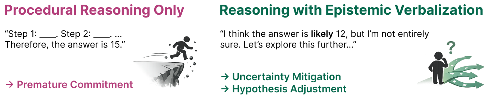

# Why Does Self-Distillation (Sometimes) Degrade the Reasoning Capability of LLMs?

- **arXiv:** [2603.24472](https://arxiv.org/abs/2603.24472) (COLM 2026 preprint)
- **Authors:** Jeonghye Kim, Xufang Luo, Minbeom Kim, Sangmook Lee, Dohyung Kim, Jiwon Jeon, Dongsheng Li, Yuqing Yang (Microsoft Research / KAIST / SNU)
- **Code/blog:** [beanie00/self-distillation-analysis](https://github.com/beanie00/self-distillation-analysis) · [blog](https://beanie00.notion.site/why-does-self-distillation-degrade-reasoning)
- **Why it matters to us:** This paper is a direct post-mortem of **the exact method we run** (it builds on the **SDPO** codebase by Hübotter et al., which is the `SDPOTrainer` in our pipeline) and it explains, mechanistically, **iteration-01's collapse** — easy-only SDPO for 100 steps mode-collapsing to terse outputs while held-out pass@k *and* GSM8K dropped.

---

## TL;DR

Self-distillation (a self-teacher conditioned on **privileged context** $c$ — the correct solution or environment feedback — supplies a dense KL target for the student's own rollouts) usually **shortens reasoning and improves accuracy**. But on **math reasoning** the same recipe **shortens responses while degrading accuracy by up to 40%**. The cause: the rich teacher context suppresses **epistemic verbalization** — the model's expressed uncertainty (`wait`, `hmm`, `perhaps`, `maybe`, …). Those tokens look like filler but carry the signal "this path may be wrong." Suppressing them yields confident, concise reasoning that wins **in-domain when task coverage is small**, but cripples **OOD** generalization where the model must hedge and self-correct. Two knobs govern the effect: **(1) conditioning-context richness** and **(2) task coverage**.

## The mechanism, step by step

1. **Richer teacher context → more confident, shorter, fewer epistemic tokens.** They formalize context richness as conditional mutual information $I(y^*; c \mid x)$ and sweep four conditionings. Length and epistemic-token count fall **monotonically** as $I$ rises (Table below). Full-solution guidance ($c=s$) gives near-perfect score but 7× shorter outputs with ~20× fewer epistemic tokens than unguided.

   
   *Figure 2a — Reasoning with epistemic verbalization: hedging tokens (`wait`, `hmm`, `perhaps`, …) mark uncertain paths the model can revisit and self-correct.*

   | Setting | Avg score | Avg length | Epistemic tokens |
   |---|---|---|---|
   | (1) Unguided ($c=\emptyset$) | 0.30 | 13,054 | 182.5 |
   | (2) Solution-guided ($c=s$) | 0.98 | 1,873 | 8.8 |
   | (3) Solution minus `<think>` | 0.78 | 12,036 | 159.8 |
   | (4) Regeneration-conditioned ($c=y_r$) | 0.95 | 2,808 | 24.1 |

2. **The suppression is causal, not stylistic.** Pure SFT on 800 *correct* solution-guided traces ($\mathcal{D}_{\mathrm{sg}}$) **tanks** math benchmarks (AIME24 54.8→20.2, MATH500 92.2→65.5), while SFT on 800 *correct* unguided traces ($\mathcal{D}_{\mathrm{ug}}$) is roughly neutral. Same correctness, different epistemic density → opposite outcome.

3. **On-policy (SDPO vs GRPO).** Across DeepSeek-R1-Distill-7B, Qwen3-8B (think on/off), Olmo3-7B: **GRPO grows length + epistemic tokens and gains modestly OOD; SDPO shrinks both and falls below the base model** on AIME24/AMC23, worst with full-solution context $c=s$. Reducing richness to $c = s_{\setminus\text{think}}$ (solution without chain-of-thought) **attenuates but doesn't eliminate** the drop.

4. **Moving teacher makes it worse.** A fixed teacher (EMA rate **0.0**, = initial policy) beats even a slow EMA (0.05). EMA creates a **feedback loop**: confident outputs → used as teacher → even more confident → runaway epistemic collapse.

5. **Task coverage is the reconciler.** Why does SDPO *help* on Chemistry / LiveCodeBench but *hurt* on DAPO-Math? Coverage. Chemistry = 6 templated problem types; LiveCodeBench v6 = 131 problems with **train==eval split**; DAPO-Math = ~14k distinct problems, eval on unseen types. Sweeping $|\mathcal{D}| \in \{1,8,64,128,512\}$: SDPO wins for $|\mathcal{D}|\le128$ (small coverage, confident-and-terse is fine) but at 512 its length compression starts hurting, and on OOD eval **smaller $|\mathcal{D}|$ → more severe SDPO degradation**. Epistemic verbalization is redundant on repetitive tasks, essential as diversity grows.

**Four takeaways (verbatim intent):** (1) richer context → less epistemic verbalization; (2) suppressing it degrades reasoning even on correct data; (3) on-policy SD reduces epistemic tokens proportional to context richness and base-model verbosity; (4) epistemic verbalization's value scales with generalization demand.

---

## How this maps onto SparkyCoder (this is the important part)

Our setup sits **right in the danger zone the paper identifies**, and also in the zone where SDPO is *supposed* to win — so the lesson is nuanced, not "SDPO is bad."

- **It explains iteration-01 directly.** Easy-only, 100 steps → "mode-collapse to terse outputs," held-out pass@k **and** GSM8K dropped (`docs/FINDINGS.md`, `CLAUDE.md`). That is textbook **epistemic-verbalization collapse**: a rich teacher (correct solution as `privileged_context`) on **low task coverage** (easy-only, tiny problem set) drives confident-terse outputs that win nothing held-out. Our held-out hard + GSM8K *are* the OOD axis the paper says gets hurt.
- **Why "easy-only" is doubly dangerous.** Our own gotcha forces easy-only for any SDPO signal (easy+medium → 0 successful rollouts). But easy-only is *also* the **lowest-coverage** regime, exactly where the paper shows SDPO over-compresses and destroys OOD reasoning. The two constraints compound. This is strong support for the **iteration-02 "learnability frontier"** plan (easy + sometimes-solvable medium = broader coverage) and for **early-stopping on held-out pass@k**.
- **Our teacher is EMA — the paper says use fixed.** `src/sdpo_train.py:133` sets `teacher_model_kind="ema"`. The paper's ablation found a **fixed teacher (EMA=0) is strictly better** and that EMA *amplifies* the collapse feedback loop. **Cheap, high-value experiment:** try `teacher_model_kind` fixed-to-initial (or EMA rate 0) next iteration.
- **Richness knob = our feedback design.** Our `include_environment_feedback` / `environment_feedback_only_without_solution` (`sdpo_train.py:140-141`) and the solution-as-teacher path are precisely the "context richness" lever. The paper's "$c=s_{\setminus\text{think}}$ hurts less than $c=s$" suggests **dialing teacher richness down** (feedback-only, or solution-without-CoT) may preserve more epistemic behavior than handing over the full worked solution. Our iteration-02 feedback-ON run already *stopped* iter-01's collapse (medium pass@8 held 40→40, GSM8K held 90.5%) — consistent with "less-privileged context = less suppression."

### Concrete things to try / instrument

1. **Add an epistemic-token diagnostic to eval (cheap early-warning).** Count the 10 markers `{wait, hmm, perhaps, maybe, actually, alternatively, seems, might, likely, check}` per response in `sdpo_eval_vllm.py` / `sdpo_passk.py`. A falling $E(y)$ trend would flag collapse **steps before** pass@k confirms it — and the paper showed the SDPO *loss* is blind to this (matches our "loss is not a quality signal"). Caveat: our domain is **code**, not math CoT — verify these markers actually appear in Gemma's reasoning before trusting the metric (build a code-relevant marker set if not).
2. **Switch the teacher to fixed/initial** for an iteration and compare held-out pass@k vs the EMA run. Single-knob, well-motivated.
3. **Lower teacher richness** on success groups too (e.g. feedback-only or solution-without-rationale) and see if epistemic behavior + OOD pass@k hold up.
4. **Broaden coverage deliberately** (the frontier set) — the paper predicts this is the main lever that lets SDPO keep helping without OOD collapse.
5. **Watch length as a leading indicator.** A sharp early **drop** in completion length is the paper's canonical collapse signature; we already log length per step — treat a fast collapse as a kill signal in the "watch the first few steps" budget rule.

### Caveats / where we differ
- All their evidence is **math reasoning with long `<think>` CoT** on 7–8B models. Our model is **Gemma-4-E2B** on **competitive programming** (C++/Python), where "epistemic verbalization" may manifest differently (or barely) — the *coverage* mechanism likely transfers more cleanly than the literal token list.
- The paper actually lists **LiveCodeBench v6 (code, low coverage, train==eval) as a domain where SDPO WON.** Our OJBench eval is held-out, so we're closer to the math/OOD failure mode than to the LiveCodeBench success mode — which is *why* we see regression where the original SDPO paper saw gains.

## One-line lesson
Self-distillation buys concision by **deleting the model's hedging**; that's free in-domain on narrow task sets but a tax on out-of-distribution reasoning — so for us the levers are **fixed (not EMA) teacher, lower teacher-context richness, broader task coverage, and early-stop on held-out pass@k**, with an **epistemic-token / length collapse monitor** as the cheap canary.
