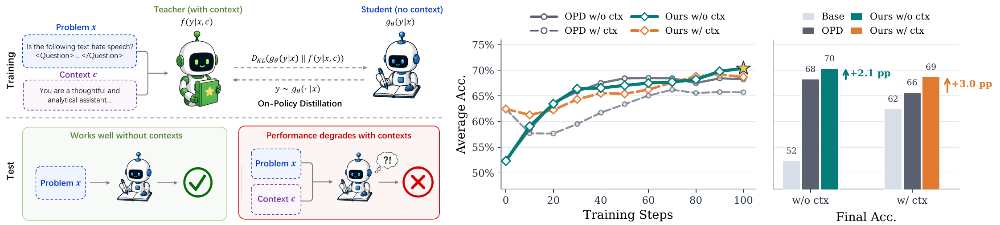

# When Context Returns: Toward Robust Internalization in On-Policy Distillation

- **arXiv:** [2606.11627](https://arxiv.org/abs/2606.11627)
- **Authors:** Xun Wang, Ruishuo Chen, Zhuoran Li, Yu Chen, Longbo Huang (IIIS, Tsinghua University)
- **Why it matters to us:** This is a paper *about the exact structural move SDPO makes* — train a student to match a teacher conditioned on **privileged context** (a hint / the solution / environment feedback) so the student can run **without** that context at inference. The paper finds that this standard objective (which they call OPD, on-policy distillation) only constrains the *no-context* pathway and silently leaves the *with-context* pathway free to drift. The consequence (verbose, lower-accuracy outputs when context is reintroduced; instability; length inflation) is a precise, instrumentable lens on what our SDPO teacher-vs-student gap is doing internally — and it ships a **one-extra-forward-pass fix** we could bolt onto `SDPOTrainer`.

---

## TL;DR

On-policy context distillation trains the student's **no-context** view $q_x = g_\theta(y\mid x)$ to match a teacher's **context-conditioned** view $f(y\mid x,c)$. The objective $\mathcal{L}_{\mathrm{OPD}}=\mathrm{KL}(q_x\,\|\,f(y\mid x,c))$ **only constrains $q_x$** — the student's own with-context view $q_c=g_\theta(y\mid x,c)$ gets **no learning signal at all**. The authors show that after "successful" distillation, **re-presenting the very context the model supposedly internalized often makes it *worse*** — lower accuracy even on instances it solves correctly without context, plus 20-40% response-length inflation. They name this **context-induced degradation** and argue the missing property is **context removability**: if the info is truly in the weights, the two views should agree ($q_x\approx q_c$). The fix is **No-Context Anchoring (NCA)**: add $\beta\cdot\mathrm{KL}(\mathrm{sg}[q_x]\,\|\,q_c)$ — forward KL anchoring the (stop-gradient) no-context output and pulling the context-conditioned output back to it. One extra forward pass per step. Across 12 (model, task) settings it cuts harm in 11/12, kills length inflation, and **often improves the primary no-context metric too** (+2.1pp avg no-context, +3.0pp avg with-context).

*Figure 1 — **Left**: OPD trains the student to match the teacher's context-conditioned output without access to $c$; at test time the student does well without context, but performance can drop when $c$ is reintroduced. **Middle**: training curves averaged across 12 settings — OPD's w/ ctx accuracy (gray dashed) lags w/o ctx (gray solid), while NCA (colored) closes the gap. **Right**: final accuracy — NCA improves both no-context (+2.1\,pp) and context-conditioned (+3.0\,pp).*

## The phenomenon, step by step

1. **OPD only constrains one of two views.** $\mathcal{L}_{\mathrm{OPD}}$ pushes $q_x\to f(\cdot\mid x,c)$. Nothing pins $q_c$. People *assume* an expressive model that internalized $c$ will naturally have $q_x\approx q_c$. It usually doesn't.

2. **Reintroducing context degrades a distilled student.** They define $\mathrm{Harm}=P(q_c\text{ wrong}\mid q_x\text{ correct})$ — how often adding the context flips a *correct* no-context answer to wrong. Under plain OPD every one of 8 system-prompt-QA settings shows non-trivial harm; worst case Llama-3.2-3B on MedMCQA hits **Harm = 15.7%** and with-context accuracy drops 9.5pp *below* no-context. Text games are worse: Sokoban/FrozenLake self-distillation reach **Harm 22-41%**.

3. **Three regimes of context interaction** (plotting accuracy-drop vs. harm across the 12 settings):
   - **Regime A (7/12):** context is now a *perturbation* — student is good without it, reintroducing it drops accuracy and spikes harm. This is the failure mode.
   - **Regime B:** context still a useful *scaffold* ($\mathrm{Acc}_{x,c}>\mathrm{Acc}_x$) -> internalization incomplete.
   - **Regime C:** views already agree, harm minimal -> nothing to fix.
   The prevalence of Regime A is the motivation.

4. **Length inflation is a co-symptom.** Under OPD, reintroducing context inflates response length by up to **+39.5%** (7/8 QA settings) — the with-context view becomes verbose and worse, not crisp and better.

## The method: No-Context Anchoring (NCA)

$$\mathcal{L} = \mathcal{L}_{\mathrm{OPD}} + \beta\,\mathrm{KL}\!\big(\mathrm{sg}[\,g_\theta(\cdot\mid x)\,]\;\big\|\;g_\theta(\cdot\mid x,c)\big)$$

Design choices that matter:
- **Forward KL, anchor = no-context view, stop-gradient on it.** $q_x$ receives gradients *only* from OPD; $q_c$ receives gradients *only* from NCA. No gradient competition. The no-context pathway (the thing we actually deploy) is the immovable target; the with-context pathway is dragged to it.
- **Forward KL is mode-covering** -> prevents $q_c$ from collapsing modes of $q_x$.
- **Nearly free.** The $\mathrm{sg}[q_x]$ logits are reused from the forward pass OPD already does; the on-policy rollouts are reused; cost is **one extra forward pass** for $q_c$ per step. No extra rollout.
- **Ablated alternatives lose:** *DualOPD* (align $q_c$ directly to the teacher) crashes $\mathrm{Acc}_{x,c}$ early because the multi-modal teacher lets the two views land in different modes; *SymKL* (symmetric) pulls $q_x$ off the teacher and underperforms on the primary metric. Forward-KL-with-stop-gradient is the sweet spot. $\beta=0.5$ best across $\{0.1,0.5,1.0\}$ (0.1 too weak to stop early drift, 1.0 slightly taxes $\mathrm{Acc}_x$); the benefit is robust to $\beta$.

## Key results

- **Harm reduced in 11/12 settings; length inflation eliminated** (5/8 QA settings reach $\Delta_{\mathrm{len}}\le 3\%$; biggest cut -37.4pp on Llama-3.2-3B MedMCQA).
- **NCA often improves the *primary* no-context metric** even though it only regularizes the with-context view — +0.6 to +3.6pp $\mathrm{Acc}_x$ in 7/8 QA settings, +5.7pp WR on FrozenLake self-distill. Interpretation: keeping $q_c$ from drifting frees parameter updates to focus on genuine task learning rather than reconciling two divergent behaviors. Averages across all 12: **+2.1pp no-context, +3.0pp with-context.**
- **Mechanistic confirmation (Sokoban / Qwen3-4B).** Per-layer cosine similarity of hidden states between the two views: base model dips to ~0.953 in mid/late layers; OPD only partially closes it (~0.985); **NCA holds >=0.997 across all 36 layers** — context removability is real at the representation level, not just the output. Gradient analysis: at an OPD-converged checkpoint the OPD and NCA gradients are ~orthogonal — i.e. **OPD provides zero signal along the direction NCA fixes** (it fills a genuine gap rather than fighting OPD). Updates concentrate in shallow layers (knowledge/retrieval) + k_proj/q_proj.
- **Boundary cases (honest):** in true Regime-B settings (Qwen2.5-7B MedMCQA; Qwen3-4B->1.7B FrozenLake) where context still carries un-internalized value, NCA can shave a couple points off $\mathrm{Acc}_{x,c}$ or even raise harm — because it forces removability the model hasn't earned yet. Future direction they flag: *dynamically* choose the anchor based on degree of internalization instead of always anchoring to the no-context view.

---

## How this maps onto SparkyCoder (the important part)

SDPO is structurally an OPD method: the EMA self-teacher is conditioned on **privileged context** — the correct solution (`use_successful_as_teacher=True`) and/or live judge feedback (`include_environment_feedback`) — and we distill its predictions into the policy that must solve OJBench **with no solution and no feedback at inference**. So the paper's central object, **the gap between the teacher's rich context and the student's bare inference context**, is *exactly* our teacher-vs-inference mismatch. Three concrete connections:

- **Our trainer optimizes only the no-context pathway too.** `src/sdpo_train.py` builds the teacher prompt as prompt+solution (success groups) or prompt+feedback (all-fail groups, via `environment_feedback_only_without_solution`), and distills into the context-free policy — the same one-sided constraint the paper warns about. We have **never measured** what happens if we feed the solution/feedback *back* to our trained adapter. That measurement is cheap and could be diagnostic.

- **Our failure modes rhyme with theirs.** Iteration-01 easy-only/100-steps collapsed to **terse outputs** with held-out pass@k and GSM8K dropping. The paper's OPD symptom set is **length distortion + a with-context/no-context divergence the loss can't see**. Note our standing rule "the SDPO loss is not a quality signal" is the same blind spot they describe: OPD/SDPO loss measures privileged fidelity, not removability or generalization — which is *why* it stays flat while the model degrades. (Their length symptom is *inflation* with context; our collapse is *deflation* without it — same coin, the two views have diverged and the objective never looked at the gap.)

- **Companion to `summary_selfdistill_degrades_reasoning.md`.** That paper (2603.24472) explains *why* rich context hurts OOD reasoning (epistemic-token suppression x low task coverage); **this** paper gives a complementary, cheaper diagnosis (the two views diverge) and an actually-bolt-on **fix** (NCA / context removability). They agree on the disease; this one hands us a one-line patch and two metrics. Read together.

### Concrete things to instrument / try

1. **Measure context-induced degradation on our own adapters first (almost free, do this before any new training).** For the iteration-01 and iteration-02 adapters, run held-out problems **twice**: once as we deploy (no solution/feedback in prompt) and once with the privileged context reintroduced (solution or judge feedback appended, as the teacher saw it). Compute the paper's metrics on our pass@k harness (`src/sdpo_passk.py` / `src/sdpo_eval_vllm.py`): $\mathrm{Acc}_x$ vs $\mathrm{Acc}_{x,c}$, **Harm = P(fail-with-context | pass-without-context)**, BothCorrect, and $\Delta_{\mathrm{len}}$. If iter-01 sits in **Regime A** (high harm), that is independent confirmation our collapse is context-induced degradation and motivates NCA. This needs no retraining — just an eval variant that injects the teacher context.

2. **Add NCA to our trainer (one extra forward pass).** Inside the live-feedback / SDPO step in `src/sdpo_train.py` (the `FeedbackSDPOTrainer` path, `src/sdpo_feedback.py`), add $\beta\,\mathrm{KL}(\mathrm{sg}[q_x]\,\|\,q_c)$ where $q_c$ is the policy conditioned on the same solution/feedback the teacher got, reusing the existing on-policy rollouts. Start at **$\beta=0.5$**, top-$k=256$ logits with renormalization (their reward-hacking guard). This directly targets our teacher-context-vs-inference-context gap and, per the paper, *can also lift the no-context pass@k we actually care about*. This touches the train/eval integration -> per CLAUDE.md budget rules, gate it behind `sdpo_train.py --smoke` then a Modal smoke before any long run.

3. **Track the two-view gap as a leading indicator during training.** The paper shows the gap (and harm spike) emerges in the **first ~10-30 steps** — well within our "watch the first few steps and kill early" budget window. Logging $\mathrm{Acc}_x-\mathrm{Acc}_{x,c}$ / harm / $\Delta_{\mathrm{len}}$ per eval checkpoint gives a kill signal the SDPO loss cannot.

4. **Use removability to inform the EMA-vs-fixed-teacher question.** The companion paper says fix the teacher (EMA=0); this paper says even with a moving teacher, NCA stabilizes the views. If we keep `teacher_model_kind="ema"` (`src/sdpo_train.py:133`), NCA is the cheaper stabilizer; if we go fixed-teacher, measure whether the harm gap shrinks on its own. Either way, **harm rate becomes the shared yardstick** for the teacher-design sweep.

5. **Watch for Regime B on the learnability frontier.** The iteration-02 plan trains easy + sometimes-solvable medium. On problems the policy has not truly internalized, the privileged context is still a *useful scaffold* (Regime B) — exactly where the paper shows NCA can cost a little with-context accuracy. So apply NCA where harm is high (collapsed easy problems), and do not force removability on genuinely-hard medium problems the model cannot yet solve unaided. Their "dynamic anchor based on degree of internalization" idea maps cleanly onto our easy-vs-frontier split.

### Caveats / where we differ

- **Their tasks are short-horizon** (512-token QA, 1024-token games; greedy or single stochastic rollout), evaluated on **train==eval-style** in-domain sets. Our OJBench eval is **held-out, long-generation, pass@k** competitive programming — closer to the OOD regime where the companion paper says privileged-context distillation is most dangerous, so the *disease* likely transfers but the *cure's magnitude* may not.
- **NCA's "privileged context" $c$ is a fixed system prompt / hint.** Our $c$ is **per-problem** (the specific solution or judge feedback for that rollout), and for all-fail groups there *is no* successful trace — `environment_feedback_only_without_solution` already routes those to feedback-only. The $q_c$ forward pass must use the *same* per-rollout context the teacher used; this is a wiring detail, not a conceptual gap.
- **Single seed, single mechanistic case study, full-parameter FT** in the paper; we run **LoRA on the text tower only** on a multimodal Gemma-4-E2B. The representation-level result (>=0.997 cosine) may differ under LoRA — treat the output-level harm metric as the trustworthy signal, the representation story as suggestive.
- **Code judge fidelity bounds everything.** Harm/accuracy here are only as honest as our judge (`src/sdpo_ojbench.py`, `src/ojbench_eval.py`) — a false AC poisons both $\mathrm{Acc}_x$ and $\mathrm{Acc}_{x,c}$ equally, but the *gap* should still be informative.

## One-line lesson

Standard SDPO/OPD only pins the no-context view to the teacher and never checks that the with-context view agrees — so the privileged context the model "internalized" can come back and *hurt* it; the cheap fix is **No-Context Anchoring** ($+\beta\,\mathrm{KL}(\mathrm{sg}[q_x]\,\|\,q_c)$, one extra forward pass), and the cheaper first step for us is to **measure our own context-induced harm** (re-feed the solution/feedback to our iter-01/02 adapters) before retraining.
