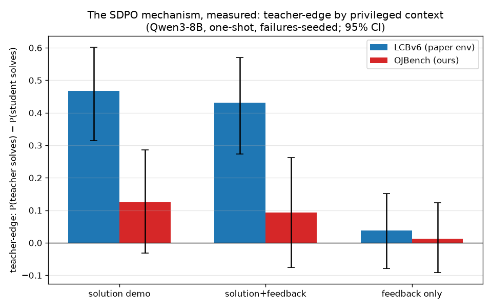

# ENV-DIFF — why SDPO learns on LCBv6 and stalls on OJBench

**Question.** Same model (Qwen3-8B), same algorithm, working trainer — SDPO climbs on the
paper's LCBv6 (repl-02) yet showed parity on OJBench (repl-01). What, *measurably*, differs
between the environments? All probes are **pure inference on the frozen base model** on the
GB10 (no training, ~$0); every prompt+completion recorded under `runs/env-diff/*.jsonl`.

## The central measurement: teacher-edge by privileged context (P2)

The SDPO gradient exists only insofar as the *teacher* (the same model re-prompted with a
sibling solution and/or judge feedback) outperforms the blind student on the same problem.
Measured one-shot, failures-seeded, per-problem paired (95% bootstrap CI):

| env | privileged context | teacher solves | student base | **edge** |
|---|---|---|---|---|
| **LCBv6** | sibling solution | **0.926** | 0.458 | **+0.468 [+0.32,+0.60] ✓** |
| **LCBv6** | solution + feedback | 0.889 | 0.458 | **+0.431 [+0.27,+0.57] ✓** |
| LCBv6 | feedback only | 0.326 | 0.288 | +0.038 [−0.08,+0.15] |
| OJBench | sibling solution | 0.613 | 0.488 | +0.125 [−0.03,+0.28] |
| OJBench | solution + feedback | 0.581 | 0.488 | +0.093 [−0.07,+0.26] |
| OJBench | feedback only (either format) | 0.327 | 0.314 | +0.013 [−0.09,+0.12] |
| **All-fail problems (base=0)** | feedback only | **0/16 in BOTH envs** | 0 | 0 |

Three facts fall out:

1. **SDPO's engine is solution-imitation, and its horsepower is the conversion rate.** Given
   a correct sibling solution, the LCB teacher converts **93%** of failures; the OJBench
   teacher only **61%** — even with the answer in hand it deliberates ~17k tokens and still
   fails 2 in 5 (you can't *copy* an OJBench solution; you must re-derive it around stdin
   formats, edge cases, and complexity constraints). That 93-vs-61 gap, compounded each
   step, is the plausible core of "learns there, stalls here."
2. **Feedback-only is worth ~nothing one-shot in EITHER env at 8B** — including the paper's
   own env, and exactly 0/16 on the all-fail problems where it's the only channel SDPO has.
   The paper's env-feedback value must accrue through many-attempt accumulation (their TTT
   result), not single-shot conversion. For env design, feedback is a *seasoning*, not a
   *signal source*.
3. **Feedback FORMAT is a red herring** — our native format vs their LeetCode shape:
   byte-identical outcomes (0.327 both, n=49 pairs). The JUDGE.md format conjecture is
   answered: content, not shape.

## Signal availability (P1)

| | OJBench (63 curated e+m) | LCBv6 (60-problem subset, their prompt/judge) |
|---|---|---|
| frontier (0<p<1 at n=8) — SDPO's usable fraction | **31.7%** | 25% |
| all-fail / all-pass | 43% / 25% | 65% / 10% |
| verdict mix | AC 41 / WA 32 / TLE 12 / RE 8 / NO_CODE 7 (%) | AC 22 / WA 48 / TLE 15 / RE 15 (%) |
| completion tokens p50 | ~16k (thinking-ON) | **783 (thinking-OFF)** |

Signal *availability* is comparable — availability was never the differentiator; per-problem
signal *strength* (the conversion rate above) is.

## The accidental discovery: their env is short-form by construction

Our first LCB generation ran Qwen3's default **thinking-ON** and produced **67% cap-clipped
NO_CODE** at their 8192 cap (preserved: `env_diff_lcb_base_thinkon.jsonl`). The paper's
verl pipeline runs the model effectively **non-thinking** (~700-token responses — confirmed
in repl-02's training too). So the published SDPO results live in a regime of short,
cheap, easily-imitated completions; OJBench-with-thinking is ~20× more tokens per rollout
with a far larger, mostly-reasoning distillation surface. (Caveat: our GB10 chat-endpoint
absolute solve rates differ from the verl harness — within-probe comparisons are paired and
unaffected.)

## Implications for iteration-11 (the design this buys)

1. **Train where the engine works**: frontier-band problems (sibling AC exists) — 32% of the
   curated pool; probe-select it as before.
2. **The lever to search: raise OJBench's solution-conversion above 61%.** The "right
   privileged context" candidates, cheapest first — all testable as P2 extension arms on
   this exact harness before any training: (a) **demo WITH its reasoning** (the paper strips
   `<think>`; on LCB that's free — the code IS the solution — but on OJBench the reasoning
   may be the transferable part); (b) solution + a critic-written explanation (iter-05
   infra); (c) editorial/reference-solution context where available.
3. **Stop expecting the feedback channel to rescue all-fail problems** at this scale —
   0/16 in both envs. Hard-problem progress needs either TTT-style accumulation or a
   fundamentally richer context, not judge text.
4. **Length regime is a choice**: their results are short-form. A thinking-OFF OJBench arm
   would be ~20× cheaper per rollout and more LCB-like in imitability — worth one probe
   (the descoped P3) before committing iter-11's geometry.

## Provenance

Scripts: `src/env_diff_{gen,analyze,lcb_judge}.py` (GB10, vLLM :8001, concurrency 8×n=1 —
measured ~8× throughput vs serial, revising the old "no batching on GB10" gotcha).
Corpus: `runs/env-diff/` — P2 teacher 257 records (160 OJB @32k cap / 97 LCB), P1b 480,
thinking-ON preserve 386; all with full messages+completions for human reading.
Reused: repl-01 base eval (504 judged samples; 4.8% cap-casualties excluded from P2 seeds).
Incidents (all pre-wasted-night): serial-judging stall, unterminated-`<think>` demo
poisoning, 600s client-timeout silent abort, thinking-ON cap-flood — each logged in
`runs/env-diff/PROGRESS.md`.
