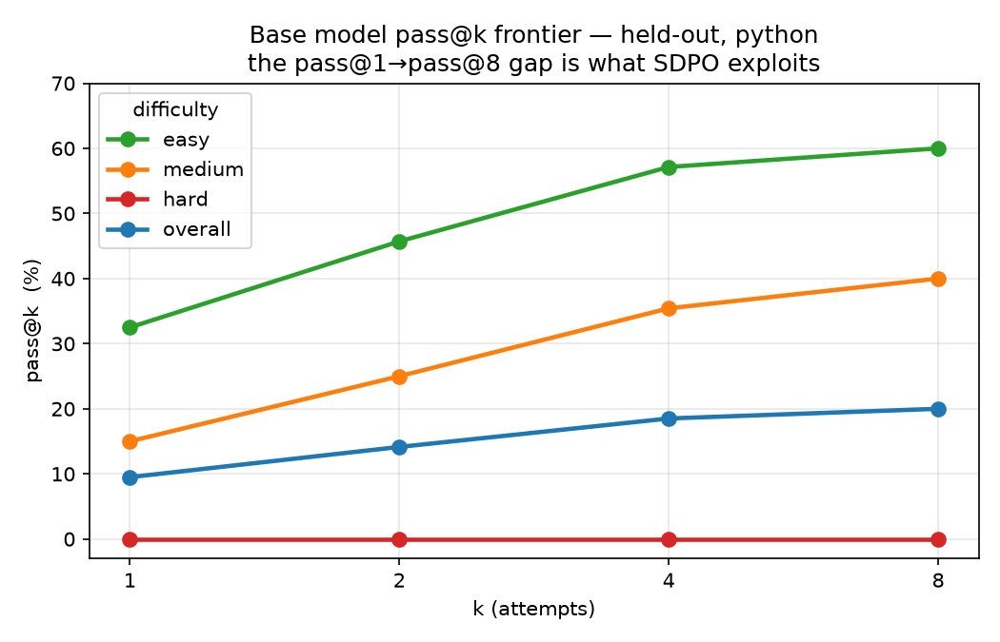
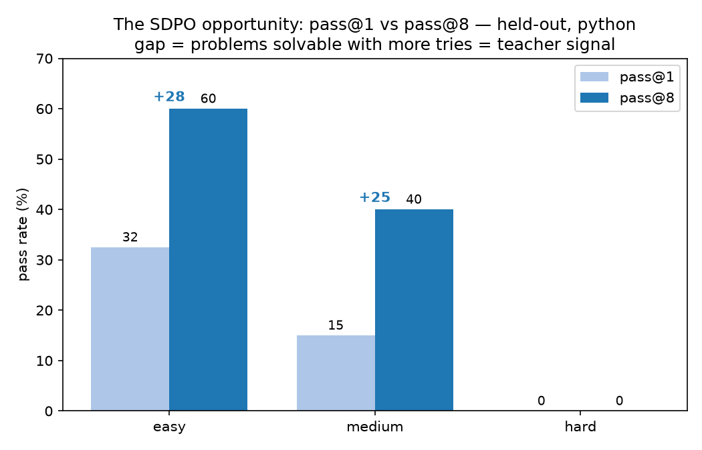
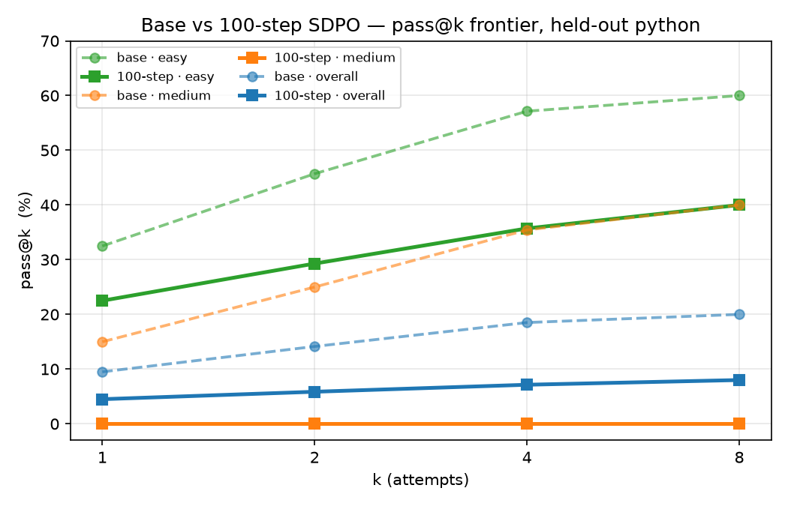
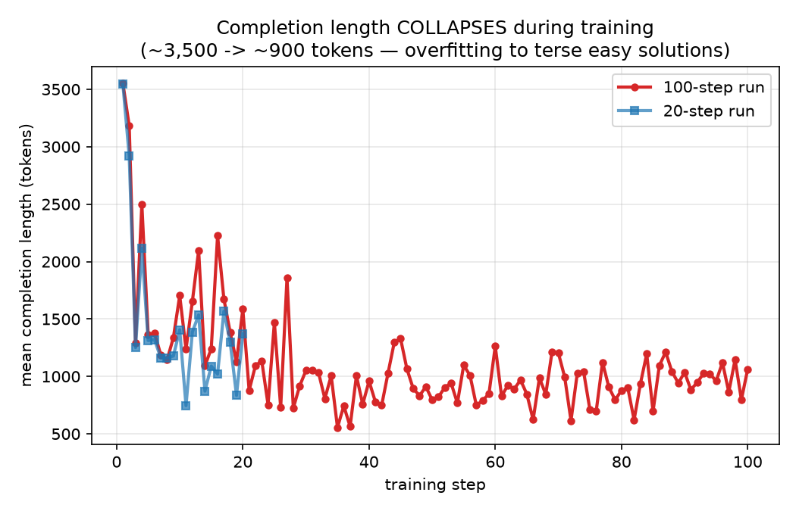
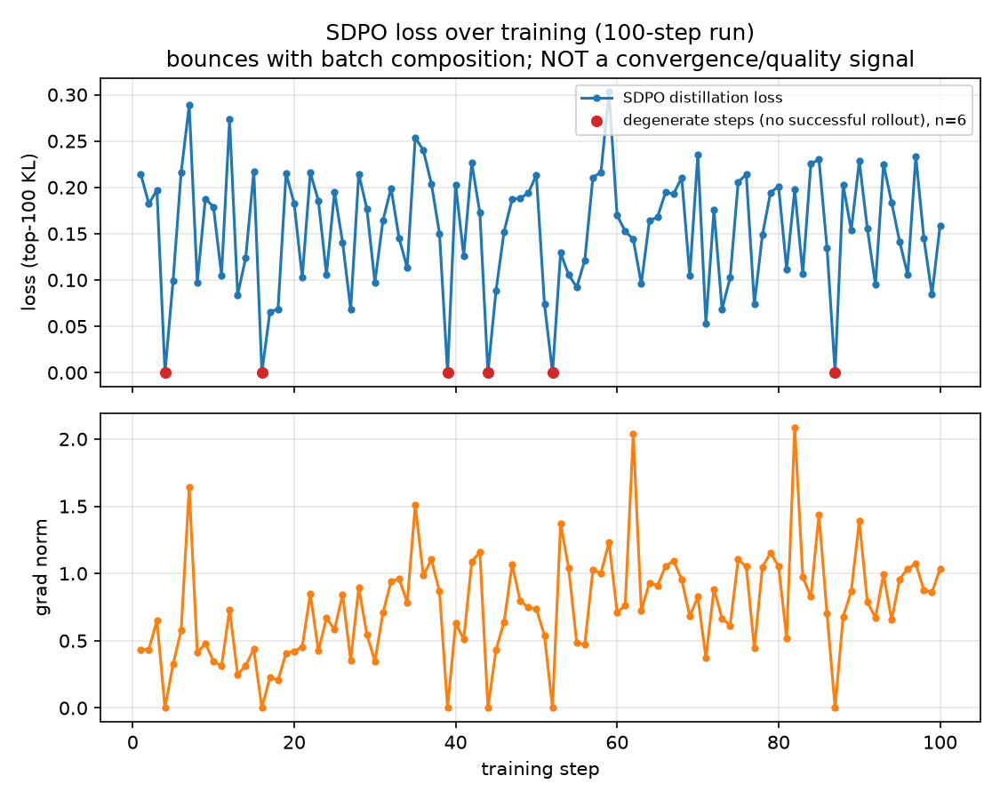

# Iteration 01 — Easy-only SDPO on Gemma-4-E2B-it / OJBench

**Date:** 2026-06-26 · **Compute:** prototype on GB10 (128 GB unified); scaled + evaluated on Modal H100/H200 · **W&B:** project `sdpo-gemma-ojbench`

A self-contained report for this iteration. Figures are in [`figures/`](./figures/).

---

## TL;DR — a three-act story
1. **The opportunity is real.** Base `gemma-4-E2B-it` has a large **pass@k frontier** on held-out: Python pass@1 9.5% → **pass@8 20%** (easy 32.5→60, medium 15→40, hard 0). That pass@1→pass@8 gap is exactly what SDPO targets.
2. **20 steps = null.** Held-out greedy pass@1 base **3/25 → 3/25**; GSM8K **90.8% → 90.1%** (preserved). Within the ±2/25 noise floor — expected for a smoke-scale run.
3. **100 steps = regression (global).** Scaling to 100 easy-only steps **hurt** the model: pass@k easy 60→40, **medium 40→0 (collapsed)**, overall pass@8 **20→8**, and **GSM8K 90.8→87.3% (−3.6 pt)**. Mechanism: **mode-collapse toward terse outputs** (training completion length fell ~3,500→~900 tokens). *More training on a too-narrow set is worse, not better.*

**Headline lesson:** what SDPO does on the **learnability frontier** is *capability elicitation/sharpening* (pass@k → pass@1), not new-capability learning — and over-training a narrow easy-only set collapses the distribution. **pass@k surfaced both the opportunity and the regression that greedy pass@1 and the loss curve both hid.**

---

## Setup
- **Model:** `google/gemma-4-E2B-it` (~2.3B, multimodal; LoRA r=32/α=64 on the **text tower only**).
- **Task:** OJBench competitive programming, **Python + C++**, lightweight judge (stdout diff / `g++ -O2`); public tests = training reward, private tests = held-out eval.
- **Method:** TRL experimental **SDPO** — `use_successful_as_teacher` (successful rollouts distilled into failing ones), EMA teacher, top-100-logit KL.
- **Data:** train **easy-only** (15 problems × py+cpp = 30 rows; easy+medium yields 0 successful rollouts cold). Held-out = 15 hard + 5 easy + 5 medium × 2 langs.

---

## 1 · The opportunity — base pass@k frontier
Base model, held-out, n=8, temp 0.8 (Modal H100):

| pass@k | easy | medium | hard | overall |
|---|---|---|---|---|
| python pass@1 | 32.5% | 15% | 0% | 9.5% |
| python pass@8 | **60%** | **40%** | 0% | **20%** |
| cpp pass@1 | 30% | 20% | 0% | 10% |
| cpp pass@8 | **60%** | **40%** | 0% | **20%** |

The pass@1→pass@8 gap is the SDPO opportunity. **Medium has a real frontier (15→40%)** even though greedy pass@1 showed it at 0/5 — the metric was hiding the signal. (cpp variants: [`frontier_cpp.png`](./figures/frontier_cpp.png), [`opportunity_gap_cpp.png`](./figures/opportunity_gap_cpp.png).)

---

## 2 · 20-step prototype — works, no regression, expected null
| Metric | base | 20-step SDPO |
|---|---|---|
| Held-out pass@1 (32k, greedy) | 3/25 | 3/25 |
| GSM8K (full 1319) | 90.8% | 90.1% |

- Pipeline validated end-to-end; self-distillation **active** (`success_group_fraction` 0.5–1.0, nonzero loss).
- No held-out change — but *within the noise floor*: the same base model scored 4/25 vs 2/25 across two greedy-pass@1 sessions (±2/25). No regression on math.

---

## 3 · 100-step scaling — it OVERFIT (the key result)
| pass@k (held-out, python) | base | 100-step |
|---|---|---|
| easy pass@1 | 32.5% | 22.5% |
| easy pass@8 | 60% | 40% |
| medium pass@8 | 40% | **0%** |
| overall pass@8 | 20% | **8%** |
| GSM8K (full 1319) | 90.8% | **87.3% (−3.6 pt)** |

Regressed on every cell (n=8; medium = 0/40 attempts — not noise). **The damage is global** (GSM8K too, not just coding). Training infra was healthy: 100 steps, ~45 s/step on H100 (~4× the GB10), `success_group_fraction` 0.5–1.0. **The recipe, not the pipeline, is the problem.**

---

## 4 · Mechanism — distribution collapse toward terse outputs

Training completion length **fell ~3–4×** (mean ~3,500 → ~900 tokens) and stayed there. The model converged to short, narrow solutions that fit the easy training set but don't generalize. Eval-time confirms it: even on GSM8K the 100-step model is terser (mean completion 433 → 373 tokens, truncations 29 → 1). *Not* "verbose drift — the opposite.*

---

## 5 · The loss is NOT a quality signal

SDPO loss = top-100-logit KL between the policy on its own attempt and a feedback-conditioned EMA teacher, over the model's own tokens (`distillation_weight=1.0` → logged `loss` = distillation loss). It bounced **0–0.27 (mean ~0.15, 6 degenerate loss=0 steps)** and **stayed flat while the model regressed**. Both the loss and greedy pass@1 looked fine — **only pass@k caught the collapse.** Trust pass@k, not the loss.

---

## Interpretation
1. **Engineering: success.** Judge, splits, colocate training, LoRA-on-text, adapter serving (`--enable-lora`), dual-language eval, and Modal scale-up all work.
2. **Science: a clear lesson.** 20 steps null, **100 steps actively regressed (global)**. The easy-only + many-epochs + LR 1e-4 recipe overfits a 2.3B model. More compute ≠ better without data breadth and regularization.
3. **The metric matters.** pass@k surfaced both the base frontier and the regression; greedy pass@1 *and* the loss were blind to both.

## Next steps → Iteration 02
1. **Fix the recipe before scaling steps (highest priority).** Train on the **learnability frontier** (easy + medium-that-sometimes-passes; base pass@8 medium = 40%), with **lower LR (2e-5–5e-5), fewer epochs, a KL-to-base anchor**, and **early-stop on held-out pass@k**.
2. **Live judge-text feedback (SDPO iteration 2).** The only path to non-zero on hard / all-failed groups (0 at every k today) and SDPO's real edge over GRPO.
3. **Standardize on pass@k (k≥4, n≥8); add a GRPO baseline on the frontier band** to demonstrate SDPO's core claim.

## Caveats
- Lightweight judge (no DMOJ locally); the cpp judge can stall on pathological completions — needs hardening. A false-positive AC trains the wrong thing.
- Hard stays ≈0 without live feedback — expected for a 2.3B model.
- GB10 is generation-bound and **hangs on high-concurrency multi-sample inference** → eval moved to Modal H100.

## Reproduce
- **Artifacts, W&B run IDs, and the preserved adapter:** [`PROVENANCE.md`](./PROVENANCE.md).
- Curated data: [`data/`](./data/) (per-step metrics CSVs + eval summaries).
- Figures: `python generate_slides.py` (reads `figures/passk_*.json`, training logs).
- Design: [`../../EXPERIMENT.md`](../../EXPERIMENT.md) · Results index: [`../../FINDINGS.md`](../../FINDINGS.md) · Cloud: [`../../MODAL.md`](../../MODAL.md)
