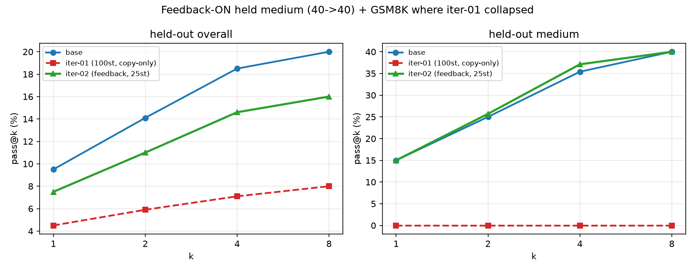

# Iteration 02 — Live judge feedback on the OJBench frontier

**Status: RUN 1 COMPLETE.** Live-feedback mechanism validated; one feedback-ON run + eval done.
Headline: **feedback-ON avoided iteration-01's collapse** (medium pass@k and GSM8K held) but did
**not yet beat base**. Results in §Results.
**Compute:** Modal H100/H200 · prototype on the local GB10 · **W&B:** project `sdpo-gemma-ojbench`

Builds on [iteration 01](../iteration-01/REPORT.md), which proved a real base pass@k frontier,
showed 20-step easy-only SDPO was null, and showed **100 steps overfit / globally regressed**
(mode-collapse to terse outputs; held-out pass@k *and* GSM8K dropped). This iteration targets
the *mechanism* behind that collapse.

---

## Goal
**Make SDPO sharpen the model — lift held-out pass@1 toward the pass@k ceiling — without
collapsing pass@k or regressing GSM8K**, by giving the trainer **live per-rollout judge
feedback** instead of only "imitate successful rollouts."

## Central hypothesis
Iteration 01's only learning signal was `use_successful_as_teacher` → the teacher could only
*copy* successful (short, easy) solutions → the policy collapsed to terse outputs and lost the
diversity pass@k rewards. **Live judge feedback conditions the teacher on *why a rollout failed***
("WA, expected X got Y", runtime errors) → the model learns to **correct failures, not just copy
successes** → richer, more diverse updates that should resist the collapse *and* extend signal to
harder problems. We expect feedback-ON to beat feedback-OFF on the same data/recipe.

## Changes from iteration 01 (and why each should work)
1. **Live judge feedback (the centerpiece).** Attach per-rollout judge text to the SDPO teacher
   reprompt during training (TRL currently reads feedback only from a *static* `privileged_context`
   column — needs a trainer subclass/patch at the rollout→reward step). *Why:* targets the exact
   iteration-01 failure mode (copy-only → collapse) and is SDPO's real edge over GRPO.
2. **Python-only prototype, deterministic well-tested judge.** Run the model's Python solutions
   directly (no security sandbox — ephemeral Modal containers), but **always under a subprocess +
   wall-clock timeout + memory rlimit** for *liveness* (one infinite-loop generation must not stall
   the trainer — the iteration-01 judge-hang lesson). *Why:* Python judge = stdout diff = fast,
   reliable, trivially rich feedback text; no g++ compile / no cpp-judge hang while we validate the
   feedback mechanism.
3. **Full OJBench (NOI + ICPC), filtered.** Use both parts, **filtered to diff-checkable problems**
   (drop special-judge / interactive / float-tolerance — they'd false-negative correct solutions and
   corrupt the reward). Held-out **spans both parts × python & cpp**. *Why:* more frontier problems +
   a broader, more stable held-out; the filter protects reward fidelity.
4. **Train the learnability frontier, regularized.** Select training problems by *measured
   solvability* (base pass@8 in (0,1)), lower LR **1e-4 → 3e-5**, and **early-stop on
   `completions/mean_length`** (kill the run when length starts collapsing). *Why:* the regression
   lived between 20 (null) and 100 (collapsed) steps; length is the live collapse-detector.
5. **Response length in W&B (train + eval).** Already logged during training (`completions/mean_length`);
   **add eval-time mean completion tokens** to `sdpo_passk.py` / `sdpo_eval_vllm.py`. *Why:* length is
   the early-warning for the collapse — watch it live, stop before damage.

## Experiment design
- **De-risk spike — TRL interface DONE.** De-abstracted in [`src/sdpo_prompts.py`](../../src/sdpo_prompts.py),
  validated byte-identical to the library by [`src/validate_sdpo_prompts.py`](../../src/validate_sdpo_prompts.py).
  Findings: the teacher prompt is `reprompt_template = "{prompt}{solution}{feedback}\n\nCorrectly solve the
  original question.\n"`, where `solution` = a successful group-mate rollout and `feedback` = judge text;
  the teacher then sees this reprompt **+ the student's own completion**. **Injection point** =
  `_prepare_training_batch` (`sdpo_trainer.py:878`, `feedbacks=privileged_contexts`); `feedbacks` is already
  **per-rollout length**, so live feedback = subclass to pass per-completion judge text + set
  `include_environment_feedback=True`. **Iteration-01 was "copy-only"** (`include_environment_feedback=False`
  by default → feedback never used) — confirming the collapse mechanism. *Still to do: validate the dataset
  filter (diff-checkable count by part × difficulty).*
- **Solvability probe:** pass@k on the **train pool** (not held-out — avoid leakage) → defines the
  frontier band.
- **Main runs (parallel on Modal):**
  - **Treatment:** frontier-band data + **live feedback ON**, LR 3e-5, length-early-stop.
  - **Control:** same data + recipe, **feedback OFF** (`use_successful_as_teacher` only). Isolates the
    feedback effect.
- **Eval:** base + each adapter on the same H100; **pass@k n=16** (tighter than iter-01's n=8) + GSM8K,
  reported py & cpp × difficulty, with eval-time length.

## Success criteria
- **Primary:** held-out **pass@1 (and pass@4) ↑ vs base**, with **pass@8 within ~5 pts of base** and
  **GSM8K within ~1 pt** — a favorable sharpening trade, no global regression.
- **Mechanism:** **feedback-ON > feedback-OFF** on the same data/recipe, and **no length collapse**.
- **Informative negative:** if even feedback-ON is null/regressing, the implicit→explicit feedback
  upgrade isn't enough here → re-examine data scale / reward fidelity / LoRA capacity.

## Risks & mitigations
| Risk | Likelihood | Mitigation |
|---|---|---|
| TRL feedback insertion harder than expected | Med | De-risk spike *before* committing compute; subclass over monkeypatch |
| Special-judge/interactive problems corrupt reward | High if unfiltered | **Filter to diff-checkable** (hard guard); start Python-only |
| Runaway generation stalls the trainer | Med | Subprocess + wall-clock timeout + memory rlimit (liveness, not security) |
| Feedback still collapses (sharpening costs too much pass@k) | Med | Length early-stop; lower LR; feedback-OFF control to attribute |
| Frontier band still small after filtering | Med | Full dataset widens it; loosen the pass-rate cutoff if needed |
| Budget | — | ~$10–20 (spike + probe + 2 runs + eval); confirm before launch |

---

## Prompt optimization (preliminary, base gemma — `src/prompt_opt.py`)
7 train problems × 4 prompt variants, n=4, temp 0.6, judged on private cases:

| variant | pass@1 | what it adds |
|---|---|---|
| base | 0.464 | the prompt as-is |
| +expert system msg | 0.500 | "expert competitive programmer; reason about complexity, then solve" |
| +worked-example hint | 0.536 | smallest public case injected into an empty Example section |
| **hint + expert** | **0.571** | both (best) |

**Insights:**
- **Prompts only move the *frontier*.** 3 easy problems were 4/4 for every variant (ceiling); 3 medium
  were 0/4 for every variant (floor — TLE/RE from a wrong algorithm, which a prompt can't fix). The
  entire effect came from **one frontier problem (loj-2608): base 1/4 → expert 2/4 → hint 3/4 →
  hint+expert 4/4** — a clean monotonic lift.
- **The worked-example hint is the strongest single lever** (+0.07), the expert system prompt helps
  (+0.036), and **they stack** (+0.11 ≈ +23% relative). Use **hint + expert system prompt** as the
  iteration-02 default — applied consistently to base and treatment (it's prompt-eng, orthogonal to feedback).
- Caveat: tiny sample, effect driven by one problem → confirm at scale. Floors are *capability* limits
  (the live-feedback/curriculum levers), not prompt limits.

## Results (run 1: feedback-ON, easy+medium, 25 steps, LR 3e-5, binary reward, H200)

**Mechanism validated.** `feedback_used_fraction` tracked the all-fail groups exactly (fires when
`success_group_fraction=0`, off when a rollout succeeds) on GB10, Modal smoke, and the full run —
vs **0** in iteration-01. So the judge feedback reaches the teacher and teaches the all-fail
medium groups that iteration-01 left with no teacher. **Length did not collapse** (~4000 tokens,
stable; iteration-01 went 3,500→900).

**Held-out pass@k (python) and GSM8K — three-way:**

| metric | base | iter-01 (100-step, copy-only) | **iter-02 (feedback, 25-step)** |
|---|---|---|---|
| easy pass@8 | 60% | 40% | **40%** |
| **medium pass@8** | 40% | **0% (collapsed)** | **40% (held)** |
| overall pass@8 | 20% | 8% | **16%** |
| **GSM8K** | 90.8% | **87.3% (−3.6, regressed)** | **90.5% (held)** |

**Read:** feedback-ON **stopped iteration-01's two failures** — medium pass@k *held* (40→40 vs →0)
and GSM8K *held* (90.5 vs 87.3). But it **did not beat base**: easy pass@8 still 60→40 and overall
20→16. The mechanism prevents the collapse; it doesn't yet improve generalization.

**Why no improvement (and the next lever):** **7 of 25 steps were degenerate** — with **binary**
reward, an all-fail medium group has *zero reward variance* → no policy-gradient signal (feedback
still drives distillation, but the GRPO advantage is dead on exactly those groups). The
**dense-reward design (#9)** is the fix (partial-credit variance → live gradient on all-fail
groups); it was deferred here only for judge cost on medium's huge test cases. Plus only 25 steps.

**Attribution caveat:** iter-02 changed several things vs iter-01 at once (feedback **+** LR 3e-5
**+** 25 vs 100 steps **+** easy+medium vs easy-only **+** binary reward). So "no collapse" is the
iteration-02 *recipe*, not feedback in isolation. A feedback-OFF control on the same recipe would
isolate it (deferred per the feedback-ON-only focus).

## Next (iteration 02, run 2)
1. **Dense reward** on the frontier band (`data/frontier_band.json`: 35 problems, 28 medium) — fixes
   the degenerate all-fail steps. Cap completions / use H200 to fit the longer judging.
2. **More steps** (with the length-collapse early-stop) now that the recipe doesn't collapse.
3. **feedback-OFF control** on the identical recipe to attribute the no-collapse to feedback.

## Provenance
- Adapter: Modal `sdpo-outputs:/iteration-02/` (r=32). Pull: `modal volume get sdpo-outputs /iteration-02/...`.
- Training: run3 on Modal H200, `runs/iteration-02/` (gitignored logs); W&B project `sdpo-gemma-ojbench`.
- Curated data: [`data/`](./data/) (pass@k, GSM8K, eval summaries); figure regen `python src/generate_slides.py`.
- Frontier band: [`../../data/frontier_band.json`](../../data/frontier_band.json) (probe: base solvability on the train pool).

## Reproduce (planned)
- Spike + filter: `src/` (judge + dataset build).
- Train: `modal run src/modal_sdpo.py --difficulties <frontier> --feedback on|off ...` (flag TBD after the trainer patch).
- Eval: `modal run src/modal_sdpo.py::run_eval`; figures `ITER=iteration-02 python src/generate_slides.py`; cross-iteration `python src/compare_iterations.py`.
- Design source of truth: [`docs/EXPERIMENT.md`](../../docs/EXPERIMENT.md).
