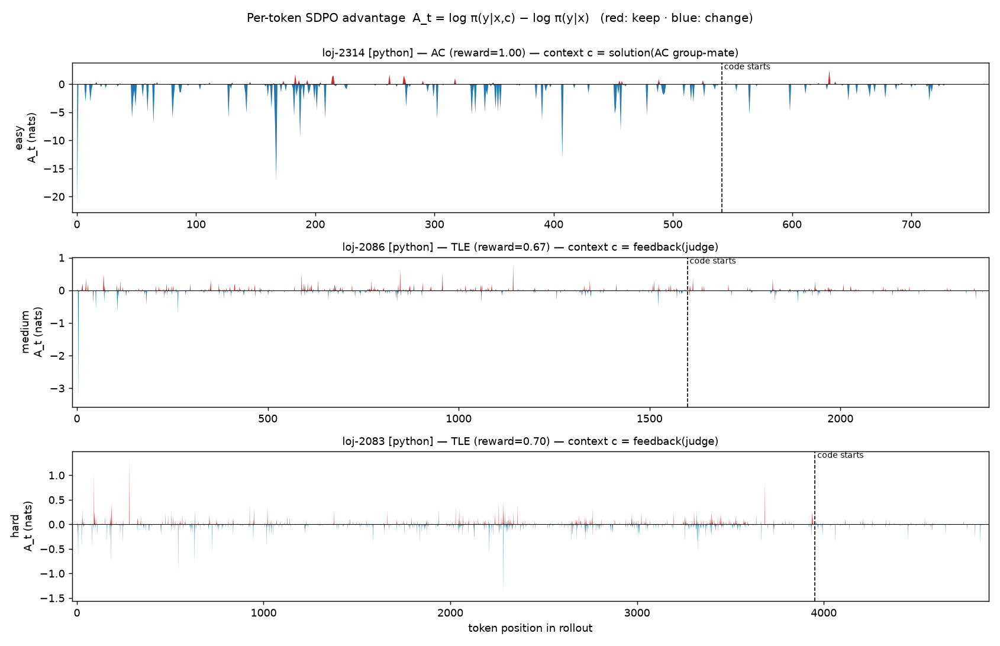

# Iteration 04 — Per-token advantage diagnostic: is our teacher signal localized or diffuse?

**Status: DONE (diagnostic, no training).** A measurement iteration, not a run. It recreates
**Figure 4 of "The Role of Feedback Alignment in Self-Distillation"** (arXiv 2606.11173; deep read:
[`knowledge/summary_feedback_alignment_sd.md`](../../knowledge/summary_feedback_alignment_sd.md))
for **our** base model, to answer a question we'd never actually looked at: *does the context we feed
the SDPO self-teacher produce a **localized** credit signal (StepAlignFB — good) or a **diffuse** one
(RefSol — fights correct code)?* This is **diagnostic #3** from that summary.

**Compute:** local GB10, HF transformers (teacher-forced, no training). **No W&B, no Modal, no spend.**
Builds on [iteration 02](../iteration-02/REPORT.md) (live judge feedback into the teacher) and the
literature read above.

---

## 1. What the paper's graph means (and why we care)

Self-distillation gives dense per-token credit by matching a **student** (sees only the question `x`)
to a **self-teacher** (sees `x` **plus** a privileged context `c`). The per-token advantage is

> **A_t = log π(ŷ_t | x, c, ŷ_<t) − log π(ŷ_t | x, ŷ_<t)**

— the *same model* scoring the *same rollout tokens* `ŷ` twice, with and without the context. A_t is
literally the credit SDPO's loss uses. **Red (A_t>0)** = the context made the model more confident in
the token the student wrote → "keep it." **Blue (A_t<0)** = less confident → "change it." So **the
content and placement of `c` is the entire learning signal.**

The paper's Fig. 4 plots A_t along one rollout for two contexts:
- **(i) StepAlignFB** — a critique that copies the student's correct steps verbatim and rewrites only
  the wrong one → a **sharp, localized blue cliff at the error**, red/zero on the correct prefix. A
  free process-reward model.
- **(ii) RefSol** — an independent correct solution → **diffuse blue across the whole rollout, even on
  correct steps**, because the canonical solution phrases everything differently. It conflates "you
  erred here" with "I'd have written it differently."

**Why us:** iteration-02 wired live judge feedback into the teacher. This paper is the theory of *what
makes that help vs. do nothing* — and we'd never measured which regime our signal is in.

## 2. What we plotted — exactly our latest teacher context

Recreation script: [`src/plot_token_advantage.py`](../../src/plot_token_advantage.py). For each
difficulty we sample a **group of 8 base rollouts** (G=8, temp 1.0, top-p 0.95, **8192-token budget**,
`CP_METHOD_SYS`, `OJB_SPLITS=ojb_splits_full.json` — the iteration-03 universe), judge each, then
build the teacher context with the **exact gating of our latest run** (`sdpo_prompts.decide_inputs`;
`use_successful_as_teacher`, `success_reward_threshold=1.0`, `include_environment_feedback`,
`environment_feedback_only_without_solution`):

- **group has an AC rollout** → `c` = that **AC group-mate's full code** (the `solution` slot).
- **all-fail group** → `c` = our **judge feedback** (`_format_feedback`: `Verdict … Passed X/Y …
  Failing test … Input … Expected … Got …`).
- A **partial-pass attempt is never the context** — only a full AC fills the solution slot (the
  pass-rate `16/20` appears only as *text* inside feedback on all-fail groups).

This makes the difficulty axis sweep the paper's two arms automatically: **easy → solution/RefSol arm**
(base AC'd it), **medium/hard → feedback arm** (all-fail).



*Per-token advantage A_t for base Gemma-4-E2B on one easy / medium / hard problem, using the exact
context our pipeline feeds. Red = keep, blue = change; dashed line = start of the code block. Note the
**y-axis scales differ ~20×** between panels.*

## 3. Results

| difficulty | problem | verdict (reward) | context `c` | n_tok | % neg | mean A_t | **mean \|A_t\|** | min | reasoning \|A\| | code-region \|A\| |
|---|---|---|---|---:|---:|---:|---:|---:|---:|---:|
| easy | loj-2314 | **AC** (1.00) | solution (AC group-mate) | 762 | 45% | **−0.381** | **0.449** | −21.6 | 0.559 | 0.178 |
| medium | loj-2086 | TLE (0.67) | feedback (judge) | 2377 | 34% | −0.000 | **0.022** | −3.4 | 0.027 | 0.013 |
| hard | loj-2083 | TLE (0.70) | feedback (judge) | 4859 | 39% | −0.001 | **0.019** | −1.4 | 0.022 | 0.006 |

(Full per-token arrays: [`data/token_advantage.json`](data/token_advantage.json); stats:
[`data/token_advantage_stats.csv`](data/token_advantage_stats.csv).)

**Corroborate the graph against the actual text.** For each of the three cases,
[`data/token_advantage_cases.md`](data/token_advantage_cases.md) dumps the exact **student prompt**
(question only), **teacher prompt** (question + the inserted context `c`), and the **completion `ŷ`**
that both score — plus the full group of 8 rollouts that determined which context was chosen. The two
prompts differ *only* by `c` (easy: a "Correct solution: …" reprompt carrying the AC group-mate's
code; medium/hard: a "feedback from your unsuccessful earlier attempt: Verdict: TLE …" reprompt). The
figure's x-axis indexes directly into that completion (token 0 = first token after the prompt), so a
blue region at token *t* means *c* lowered the teacher's logprob for the completion's *t*-th token.

**Finding 1 — the solution arm is RefSol-diffuse and *fights correct code*.** On easy, all 8 rollouts
AC'd, so the teacher sees a *different* correct solution. The advantage is **broadly negative (45% of
tokens, mean −0.38, spikes to −21.6) across the entire rollout — even though the scored rollout is
itself fully correct.** This is exactly the paper's RefSol red flag (panel ii): a correct-but-different
reference makes the teacher prefer its own surface form everywhere, so the gradient pushes against
correct code instead of localizing on an error. Our copy-the-AC-solution regime is **diffuse, not
localized.**

**Finding 2 — the feedback arm is ~20× weaker *and* not localized at the bug.** On medium/hard
(all-fail groups → judge feedback), mean |A_t| is **0.022 / 0.019 — roughly 1/20th the solution arm's
0.449** — and mean A_t ≈ 0 (red and blue cancel). The judge feedback barely moves the teacher's
next-token distribution at all. Worse, what little signal there is sits **slightly more in the
reasoning prose than in the code** (reasoning |A| 0.027 vs code 0.013 on medium; 0.022 vs 0.006 on
hard) — the opposite of localizing on the buggy code. So our iteration-02 innovation (the arm that
fires on hard all-fail groups, where we most need signal) is currently **a weak, diffuse nudge**, not a
StepAlignFB-style localized correction.

**Finding 3 — base over-reasons; needs the full budget to even emit code, and TLE is the dominant
failure.** A first pass at a **2048-token** budget produced **NO_CODE on all medium/hard rollouts**
(base ran out of budget mid-reasoning under `CP_METHOD_SYS` — figure
[`figures/token_advantage_2048.png`](figures/token_advantage_2048.png)). Only at the **8192-token**
training budget did medium/hard emit code (rollouts run 2.2k–5.6k tokens). The dominant failure is
**TLE** (correct idea, too slow), not WA — so the "error" is the **whole algorithmic approach**, with
no single error token to localize. This is a real domain gap from the paper's math-step setting and
shapes what "trace alignment" can even mean for code (§5).

## 4. Interpretation

Our two teacher arms are **badly mismatched in strength and both mis-shaped**:
- The **solution arm dominates** the gradient (~20× stronger) and is **RefSol-diffuse** — it
  suppresses correct tokens, the iteration-01 collapse mechanism seen from the token side.
- The **feedback arm is nearly silent** exactly where we need it (hard, all-fail) and **isn't aimed at
  the code**. Outcome/I-O feedback tells the teacher *that* the rollout failed without anchoring *where*
  in the student's program, so it neither localizes nor strongly shifts predictions.

This is the token-level confirmation of why iteration-02 stopped the collapse but **didn't beat base**:
the signal that fires on the hard cases is too weak and too diffuse to teach new capability.

## 5. What to try next (ranked)

1. **Make feedback trace-aligned to the student's code (the headline fix).** Prepend the student's own
   submitted code (anchor via induction-head copy) and point the verdict at it — *anchor the correct
   prefix, describe (don't paste) the buggy tail*. Predicted to convert the feedback arm from diffuse
   to localized. (`_format_feedback`, `src/sdpo_ojbench.py:197`.)
2. **Rebalance the arms.** The solution arm being 20× stronger means solution-copying drives training;
   consider down-weighting it, or only using it when the AC demo is *close* to the student's trace.
3. **TLE needs approach-level, not token-level, feedback.** For "too slow," trace alignment ≈ telling
   the teacher the complexity is wrong and which loop dominates — not a single bad token.
4. **Re-run this diagnostic after a feedback change** — it's a cheap (~35 min, free, local) before/after
   check that doesn't need a training run or pass@k to tell us if the signal localized.
5. Carry-forward from the literature: **fixed (not EMA) teacher** and the **solver-fails/judge-can-AC
   frontier filter** (two independent votes across SD papers; `summary_feedback_alignment_sd.md`).

## 6. Caveats

- **One problem per difficulty, one rollout each** — illustrative, not a distribution. Magnitudes are
  robust (the 20× gap is huge) but per-token placement is anecdotal; a fuller run would average |A_t|
  over many rollouts per band.
- **HF teacher-forced logprobs**, full-precision log-softmax — faithful to the SDPO advantage
  definition, but training uses `topk_logits` distillation (top-100), so absolute magnitudes won't
  match the loss one-to-one; the *shape* (localized vs diffuse) is the signal.
- **Judge uses reward case-caps** (≤1 MB, ≤20 cases, smallest-first) as in training, so the feedback's
  failing-test I/O is from the capped set.
- The easy/medium/hard problems are the first available of each difficulty in the full pool
  (loj-2314 / 2086 / 2083), chosen deterministically, not cherry-picked.

## 7. Reproduce

```bash
mkdir -p runs/iteration-04 && cd runs/iteration-04
S=../../src
PYTHONPATH=$S OJB_SPLITS=ojb_splits_full.json python $S/plot_token_advantage.py \
  --difficulties easy,medium,hard --num-generations 8 --max-new-tokens 8192
# quick wire-test: add --smoke (1 difficulty, G=2, 256 tok)
```
