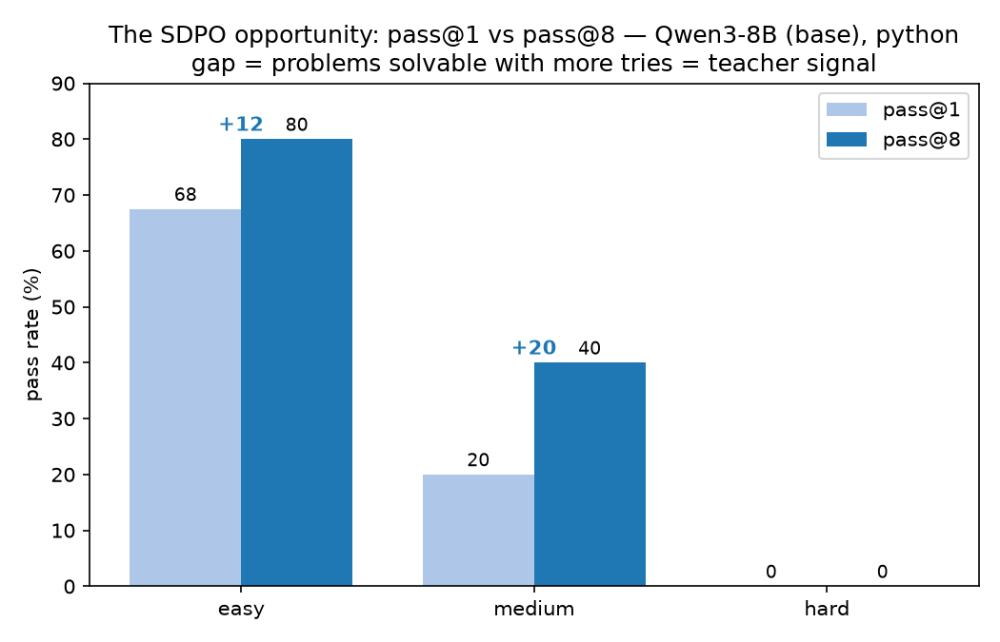

# Iteration 05 — Qwen3-8B SDPO with an LLM trace-aligned critic (logprob-gated, ≤20 steps)

**Status: DONE (clean end-to-end run; expected null on held-out).** The deliverable — one clean
end-to-end SDPO+critic run on an in-regime (~8B) model without collapse/OOM/hang — is met. Training:
Qwen3-8B, 20 steps, W&B run `8281dbd7` **finished**, all checkpoints saved (`ap-oeiw6nb4…`, $10.86).
Eval (ckpt-20 vs base, held-out **easy+medium**, Python, pass@k n=8): **no measurable change** —
overall pass@8 **0.600 → 0.600** (easy 0.80→0.80, medium 0.40→0.40); pass@1 0.425→0.388 is within
base's own ±0.04 run-to-run noise. This is the **expected null for a 20-step / ~32%-of-data
prototype** (epoch 0.3175), and beating base was explicitly **not** the bar. Full numbers, app ids,
the 2h-timeout crash + `sdpo_passk` resilience fix, and spend ($39.74 total) → [PROVENANCE.md](./PROVENANCE.md).
Open follow-up (not run): a **train==eval** probe (seen-train / unseen-train / held-out 3-point
curve, easy+medium, judged private) — a more sensitive test of whether the optimization moved at all.

First run on an **in-regime (~8B) model**, after iterations 01–03 on
Gemma-4-E2B (~2B) showed the small-scale failure the original SDPO paper predicts. This iteration
fuses two things: the **Qwen3-8B de-risk plan** (one clean, interpretable run, gated behind a
logprob check) **and** the single change iteration-04 most predicts will make SDPO teach — replacing
the deterministic feedback with an **LLM trace-aligned critic** (StepAlignFB).

The bar is deliberately low and concrete: **get ONE clean end-to-end run** with interpretable
telemetry, gated behind a check that the self-teacher (conditioned on the critic's feedback) actually
knows something. Beating base is **not** required; proving the method has signal at 8B with
trace-aligned feedback, and that our pipeline runs without collapse/OOM/hang, is the deliverable.

Consolidated recommendations this executes: the **T0 list** distilled from the 10
[`knowledge/`](../../knowledge/) deep reads (fixed teacher, demoted distillation, collapse canaries,
**trace-aligned feedback**) plus iteration-04's per-token diagnosis.

---

## Why the LLM critic (the new central element)

iteration-04's [INSIGHTS.md](../iteration-04/INSIGHTS.md) diagnosed, at the token level, *why* SDPO
has not worked: today's feedback (`_format_feedback`, [sdpo_ojbench.py:197](../../src/sdpo_ojbench.py))
is **outcome-aligned** (verdict + failing I/O) → a per-token advantage that is either
**diffuse/suppressive** (easy, "answer handed over") or **~20× too weak and aimed at the prose, not
the code** (medium/hard). The literature's best recipe, **StepAlignFB**
([summary_feedback_alignment_sd.md](../../knowledge/summary_feedback_alignment_sd.md)), fixes exactly
this: a frozen LLM critic writes a critique that **anchors the student's correct prefix and localizes
the correction at the first wrong step** (+5.27 Avg@12 over RefSol, +16.11 over GRPO). The critic is
an external "teacher-of-the-teacher"; **Qwen3-8B itself stays the self-teacher**, conditioned on
`x + critique`.

**Two rules that decide whether we reproduce the win or the diffuse failure** (from the paper's
induction-head analysis, baked into the critic prompt):
1. **Anchor the correct prefix; localize the first error.** Never hand over a full alternative
   solution (RefSol / mode-b — a capable teacher fighting a correct rollout is *net-harmful*).
2. **Describe — never paste — the buggy tail** (a verbatim quote of the wrong region makes the model
   copy the bug). **TLE** (the dominant hard failure, no local error token) gets **approach-level**
   feedback ("your loop is O(n²); n≤1e6 needs O(n log n)").

**Critic = Claude API (frozen), default `claude-sonnet-4-6`** (closest practical analog to the paper's
32B critic; `claude-haiku-4-5` is the cheap option). `ANTHROPIC_API_KEY` is in `.env`.

### Built & tested already (offline, free)
- **`src/sdpo_critic.py`** — `critique(problem, student_code, verdict, judge_feedback, lang, …)`;
  StepAlignFB rules + verdict branches in the system prompt; skips AC/NO_CODE; **falls back to the
  deterministic feedback on any API error/empty reply** so a critic outage never stalls a step.
- **Wired** into the live path: `make_feedback_reward_func(..., critic=…)`
  ([sdpo_feedback.py:30](../../src/sdpo_feedback.py)) swaps the critique in inside `judge_k` for failed
  rollouts (shared thread-safe client); flows unchanged through `_LiveFeedbackBuilder` → the validated
  teacher reprompt. New flags `--critic` / `--critic-model` / `--critic-thinking` in
  [sdpo_train.py](../../src/sdpo_train.py) (`--critic` implies `--feedback`). **No loss/template edits.**
- **Tests** ([tests/test_critic.py](../../tests/test_critic.py)) — prompt assembly, the StepAlignFB
  rules, fallback-on-error, skip-on-AC, and a judge→critic wiring integration test. Full suite **60 passed**.

---

## Model decision (read first)

| Candidate | Reality | Verdict |
|---|---|---|
| "Qwen3.5-8B" | **Does not exist.** Qwen3.5 Small = 0.8B/2B/4B/**9B**, and **native multimodal** → reintroduces the gemma4 text-tower-only-LoRA + `k_norm` merge-bug hazards | ✗ |
| **Qwen3-8B** | The **SDPO paper's exact model**; **text-only** (clean all-layer LoRA, no towers); mature vLLM/TRL/PEFT support; in-regime by definition | ✅ **use this** |
| Qwen3.5-9B | Newest/strongest, but 9B, brand-new tooling, **multimodal** (LoRA complication) | Downstream upgrade once the pipeline is proven (one-line model swap) |

Picking the paper's own text-only model is what makes "one clean run" achievable; it removes the
biggest infra variable (multimodal LoRA targeting) that has bitten us before.

---

## Goal & definition of "one successful run"

**Success = all of:** (1) the **gate passes** (Phase 0); (2) the 20-step run **completes** without
OOM / kernel hang / judge stall; (3) the **canaries stay clean** (no length/entropy collapse,
TruncRate/RepRate sane); (4) checkpoints are **written and resumable**; (5) eval produces a
**base-vs-adapter delta** (any sign) on held-out pass@k + GSM8K. **Not required:** beating base —
that decision comes next, informed by this run's telemetry.

---

## Base-model opportunity — the premise (measured)

The whole iteration rests on there being a **pass@1 → pass@8 gap** for SDPO to exploit: problems the
base model fails on the first try but solves within a few attempts are exactly what
`use_successful_as_teacher` turns into teacher signal. We measured it for the **Qwen3-8B base** the
same way we did for Gemma in iteration-01 — `sdpo_passk.py`, **n=8** samples/problem, **private**-test
AC, unbiased pass@k — on the 25-problem held-out split (5 easy / 5 medium / 15 hard).

| difficulty | pass@1 | pass@2 | pass@4 | pass@8 | **gap (p@1→p@8)** |
|---|---|---|---|---|---|
| easy   | 0.675 | 0.729 | 0.786 | **0.80** | **+12.5 pp** |
| medium | 0.200 | 0.307 | 0.386 | **0.40** | **+20.0 pp (doubles)** |
| hard   | 0.000 | 0.000 | 0.000 | **0.00** | none |
| overall | 0.175 | 0.207 | 0.234 | **0.24** | +6.5 pp |

**Read:** there is a clear, exploitable gap on **easy and (especially) medium** — medium pass@8 is
**2×** pass@1, the prime "activate-the-gate" band Phase 2 trains on. **Hard is flat 0** even at 8 tries
(same wall Gemma hit) — these contribute no successful rollouts, so SDPO gets no signal from them at
this budget; that's why the training band is *easy + sometimes-solvable medium*, not the full set.
Qwen3-8B's absolute level is far above Gemma-2B (easy p@1 0.675 vs 0.325; medium p@8 0.40 same ceiling
but reached from a higher floor) — in-regime, as intended.

**Regime / caveats** (so this isn't silently mis-compared to the iteration-01 Gemma graph):
- **Thinking-ON, 32k cap, temp 0.8, system `cp_method`** — matches iteration-05's training regime. The
  iteration-01 Gemma graph used no system prompt and an 8k cap; the *shape* (easy>medium≫hard) is
  comparable, the absolute numbers are model+regime-specific.
- The 32k cap matters: at 8k Qwen3 think-ON returns NO_CODE even on easy (the budget goes to `<think>`),
  which would have zeroed the graph. 25-problem split, **Python only** this run (cpp not measured).
- **How:** Modal **H200**, `vllm serve … --enforce-eager` driven by `sdpo_passk` at **16-way
  concurrency × n=8** (vLLM continuous-batched, ~2,000 tok/s, KV ≤46%). Entry point
  `modal_sdpo.py::passk_base`; data in [`data/sdpo_passk_qwen3_base.json`](data/sdpo_passk_qwen3_base.json);
  figures via `src/plot_opportunity.py`. App `ap-HLQgYhaMXBRojgDzfgmhnR`, **$3.32** (H200 $2.83).

---

## Phase 0 — The go/no-go gate (BEFORE any training spend)

Two steps, in order. Pure inference + critic API calls — cheap, no training GPU-hours. We do **not**
compare against the deterministic baseline or the RefSol/answer condition yet — that ablation comes
later, once something works end-to-end. ~15–25 OJBench problems (easy + sometimes-solvable medium +
a couple hard), each with real base-model failed rollouts.

### Step 1 — Find a critic prompt that makes the teacher solve
Iterate on the Claude critic prompt until the **teacher, conditioned on the critic's feedback,
generates a correct solution**. The critic's inputs are **problem + student-generated code + judge
verdict/feedback (WA, TLE, RE, …)** — it does **not** see a reference solution (pure StepAlignFB:
diagnose the flaw from the attempt alone). It must emit *specific* feedback on the flaw — algorithmic
(complexity, missing edge cases, wrong approach) or code-level.
- **Metric:** teacher-with-critic **solve-rate** — Qwen3-8B given `x + critique`, generate, judge AC —
  over the probe set.
- The StepAlignFB prompt rules (anchor the correct prefix, **describe-don't-paste**, approach-level for
  TLE) are precisely what keep solve-rate optimization from degenerating into "hand over the answer."
- The prompt carries a **verdict legend** (AC/WA/TLE/RE/CE/NO_CODE) so the critic interprets the judge
  output correctly. Signature is already `critique(problem, student_code, verdict, judge_feedback, lang)`
  — no new inputs. Tool: extend [`probe_teacher_accuracy.py`](../../src/probe_teacher_accuracy.py) (it
  already generates teacher solutions from feedback) to drive the critic condition.

### Step 2 — Confirm the signal is distillable
With the chosen critic prompt fixed, answer the gate question: **does the self-teacher, conditioned on
the critic's feedback, assign higher probability to the right tokens than the bare student**, and is
that signal *localized*?
- **Δ_correct** = `mean_t [ log q_θ(y*_t | x, f, y*_<t) − log π_θ(y*_t | x, y*_<t) ]` over a correct
  solution `y*` — want **≫ 0**, sign-consistent across most problems.
- **A_t** along the student's *own* failed rollout — want **localized** (negative around the bug, ≈0 on
  the correct prefix), not flat-zero and not diffuse-negative. Reuse
  [`plot_token_advantage.py`](../../src/plot_token_advantage.py); report mean|A_t|, fraction negative,
  code-region vs reasoning |A| ratio (the INSIGHTS table format).

**Decision rule:**
- **GO** → Step 1 lifts solve-rate clearly **AND** Step 2 shows Δ_correct > 0 / A_t localized → train.
- **NO-GO / iterate** → the critic can't lift solve-rate, or the signal is flat/diffuse → iterate the
  prompt, or stop (a publishable null result). **No training spend on a faint or diffuse signal.**

**Also verify here (cheap):** the reprompt does **not** paste the raw student attempt into the *user*
turn (the original paper's footgun: entropy 0.41→0.23). (`sdpo_feedback._LiveFeedbackBuilder`,
`sdpo_prompts.build_teacher_messages`.)

---

## Phase 1 — Infra bring-up & smoke (Qwen3-8B + critic)

- **Model swap.** Point `sdpo_train.py`, the serve scripts, and `modal_sdpo.py` at `Qwen/Qwen3-8B`.
- **LoRA targets get SIMPLER.** Standard text-only decoder → target `q,k,v,o,gate,up,down`_proj across
  **all** layers (no `language_model.*` prefix, no vision/audio towers, no `k_norm` merge bug).
  `max-lora-rank 32`, bf16, as before.
- **Thinking mode — DECIDED: ON.** Qwen3 think-ON for a stronger self-teacher on code reasoning,
  consistent with the no-cap choice below; revisit only if lengths/cost explode.
- **Modal secret.** Plumb `ANTHROPIC_API_KEY` into `modal_sdpo.py` as a Modal Secret so the critic
  works in the cloud container (the local `.env` is not shipped).
- **Smoke** `sdpo_train.py --smoke --feedback --critic --reward-mode fraction` on GB10 — validates
  wiring (loads, LoRA attaches, dense reward + **critic calls fire**, fallback exercised, adapter
  saves). 8B + colocate vLLM + no token cap is **H200 territory** — the smoke proves wiring; the real
  run is **Modal H200**.

---

## Phase 2 — The run (Modal H200), arms sequential & cost-gated

**T0 knobs (distilled from the `knowledge/` deep reads):**
- **T0-2 — Fixed teacher.** `teacher_model_kind` = **fixed/initial**, not EMA (6-paper consensus that
  EMA amplifies collapse). The EMA-α≈0.01 A/B is a deliberate downstream experiment.
- **T0-3 — Demote distillation, verifier-dominant.** **DECIDED: `distillation_weight=0.3`** (constant,
  canary-arbitrated) — down from the "pure" 1.0 that collapsed us at 2B, but not as low as SDPG's 1e-3
  (the paper's 8B win used *strong* distillation). Skip the warmup-decay *schedule* for only 20 steps.
- **T0-4 — Two-sided canaries (kill signals).** Log per step to W&B: completion **length** (natural,
  uncapped), **TruncRate** (`finish_reason=="length"`), **RepRate** (zlib ratio of last 10k chars > 10),
  **policy entropy**. A sharp move in length **either** direction, or an entropy crash, kills the run.

**Constraints:** **No token cap initially** (`--max-completion-length` effectively uncapped — observe
the *natural* length; watch the LM-head OOM on the first steps). **≤20 steps**, **`--save-steps 2`**
(checkpoint cadence < interruption interval).

**Baked-in hazard mitigations (CLAUDE.md, non-negotiable):** decoupled launch
(`setsid nohup … modal run --detach … </dev/null &`), write `RUNNING_APP_ID.txt`, `enforce_eager`
(kernel hang), parallel judge with group-kill timeouts, `--resume`, no-progress watchdog. Critic calls
add per-step latency/cost — keep `SDPO_JUDGE_WORKERS` modest for API rate limits; the fallback keeps a
critic outage from stalling a step.

**Data / reward:** dense reward (`reward_mode=fraction`), **critic-ON**, and a **simple frontier band**
for the 20 steps — easy + sometimes-solvable medium (the "activate-the-gate" band) — not the full
moving-frontier curriculum.

**KL anchor — DECIDED: OUT of run #1** (fewer integration variables; T1 insurance for the longer run).

### Arms (sequential on Modal, cost-gated)
The user runs arms **sequentially after smoke/de-risk**, checking `python src/modal_cost.py --this-run`
+ remaining budget/time between each. Order (most informative first, so we learn early and can stop):
1. **SDPO + LLM-critic** (the headline; `distillation_weight=0.3`, fixed teacher) — does the localized
   signal lift held-out pass@k?
2. **GRPO** (no distillation, scalar reward only) — does training help at all?
3. **SDPO+GRPO hybrid** (`A = λ·A_GRPO + (1-λ)·A_SDPO`, λ≈0.9) — the sub-8B-robust default from the
   original SDPO paper.

> **Cleanest ablation note:** these arms isolate *method* (distillation vs not). The axis that most
> directly proves *the critic's* value is **SDPO+LLM-critic vs SDPO+deterministic-feedback** (same
> method, feedback swapped — a `--critic` on/off flip). If budget allows one more run, prefer that
> contrast over a third method arm.

---

## Phase 3 — Eval & decide

- **Eval** base vs adapter on the held-out split, **pass@k n≥8**, py & cpp × difficulty, on the same
  `vllm --enable-lora` server ([sdpo_passk.py](../../src/sdpo_passk.py)); **GSM8K** regression probe
  ([eval_runner.py](../../src/eval_runner.py)). Read **all canaries** alongside.
- **Then decide downstream:**
  - Gate passed + run clean + signs of life → **longer run**, warmup-decay schedule, EMA-α A/B, KL
    anchor, then **Qwen3.5-9B** / fuller **SDPO+GRPO hybrid**.
  - Canaries collapsed despite 8B → diagnose with the per-token advantage probe (Phase 0 tooling).
  - (Gate failing would have stopped us at Phase 0 — no training spend.)

---

## De-risk ladder (CLAUDE.md budget discipline)
1. **Unit tests** (free) — `pytest tests/` incl. `test_critic.py`. ✅ **60 passed.**
2. **GB10 smoke** (free) — `sdpo_train.py --smoke --feedback --critic --reward-mode fraction`
   (first real Claude calls; small cost).
3. **Modal H200 pre-flight** (~15 min / ~$1) — `--max-steps 3 --save-steps 1` with watchdog: real env,
   concurrent critic+judge timing, checkpoint write + resume, **per-step cost** to project each arm.
4. **The run(s)** — sequential arms above, cost-gated.

## Run order (once Phase 0 passes)
1. Gate: **Step 1** — tune the critic prompt (inputs: problem + student code + verdict/feedback) on
   `Qwen/Qwen3-8B` until teacher-with-critic **solve-rate** lifts (via `probe_teacher_accuracy.py`).
   **Step 2** — with that prompt fixed, measure **Δ_correct + A_t** (`plot_token_advantage.py`) →
   **GO/NO-GO.**
2. `sdpo_train.py --smoke --feedback --critic --reward-mode fraction` (GB10) → wiring green.
3. Watchdog-protected **Modal H200 pre-flight** `--max-steps 3 --save-steps 1`.
4. Arm 1 (SDPO+critic): Modal H200, `Qwen/Qwen3-8B`, fixed teacher, `distillation_weight=0.3`, no
   token cap, `--max-steps 20 --save-steps 2`, **critic-ON**, dense reward, canaries, decoupled +
   watchdog + resume.
5. Eval (held-out pass@k n≥8 + GSM8K) base vs adapter; read canaries; cost-check; → Arm 2/3 or stop.

## Decisions (locked) & open items
**Locked:** critic = **Claude `claude-sonnet-4-6`** (frozen); **Phase 0 is two-step** — (1) tune the
critic prompt to lift teacher-with-critic **solve-rate**, then (2) verify the self-teacher assigns
higher logprob to the right tokens (Δ_correct / A_t); **baseline + RefSol comparison deferred** to a
later iteration; thinking-mode **ON**; `distillation_weight` **0.3** (constant, canary-arbitrated);
**KL anchor OUT** of run #1; teacher **fixed** (not EMA); **no token cap**; **≤20 steps**,
`save-steps 2`; arms **sequential on Modal**, cost-gated. **Open:** Phase-0 probe-set
size/composition + GO thresholds (solve-rate lift in Step 1, `Δ_correct` in Step 2); data band for the
20 steps; confirm Qwen3-8B H200 memory headroom under no-cap generations; critic per-rollout cost
(watch the pre-flight).

## Provenance (to fill on run)
- Model: `Qwen/Qwen3-8B`. Critic: `claude-sonnet-4-6` (frozen), `ANTHROPIC_API_KEY` via Modal Secret.
- Gate: `data/phase0_critic_gate.json` (Step-1 solve-rate, Step-2 Δ_correct + A_t). Adapters: Modal
  `sdpo-outputs:/iteration-05/<arm>/`. Code: `src/sdpo_critic.py` (+ `tests/test_critic.py`),
  `src/sdpo_feedback.py` (critic wiring), `src/sdpo_train.py` (`--critic`). Design source of truth:
  [`docs/EXPERIMENT.md`](../../docs/EXPERIMENT.md), [`docs/design/JUDGE.md`](../../docs/design/JUDGE.md).
