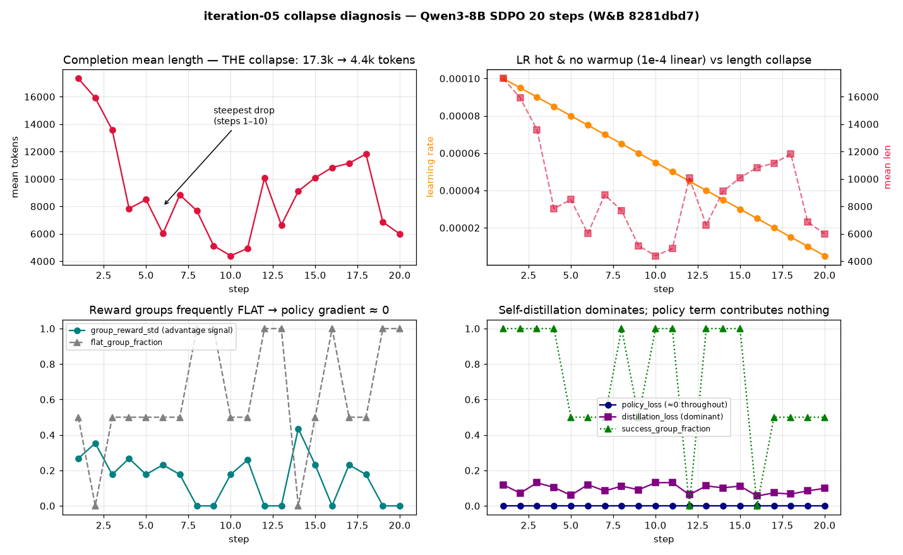
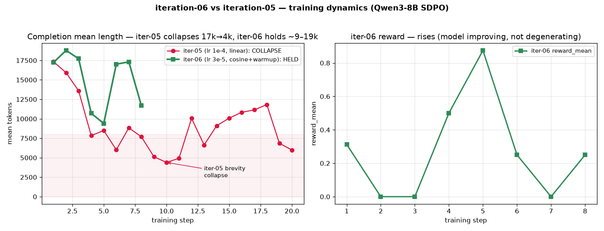
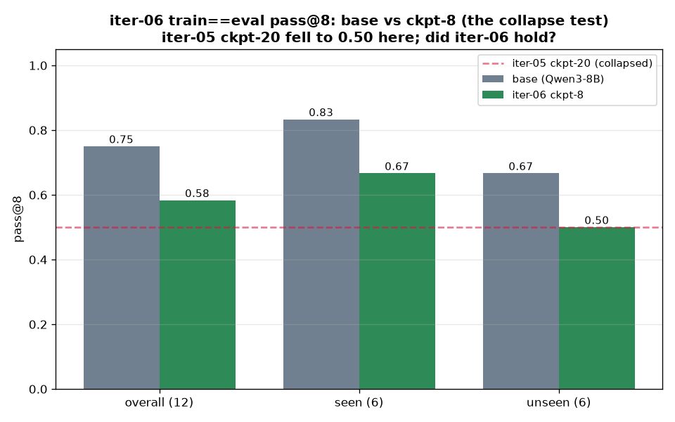

# Iteration-06 — stop the iter-05 mode collapse (fast signal run)

> **Status: FAST RUN DONE (2026-06-30).** 8-step Qwen3-8B run on Modal H200 (W&B `ds1kqb6v`),
> 8 checkpoints. **Headline (honest): PARTIAL mitigation, not a fix.** Training length held ~9–19k
> (no brevity collapse in 8 steps, vs iter-05's 17k→4k) — but the **train==eval pass@8 still regressed
> 0.75→0.58 (Δ−0.167)**, ~half of iter-05's Δ−0.33, with the same diversity signature (pass@1 −0.02,
> pass@8 −0.167). **So lower-LR+warmup attenuated but did not eliminate the diversity loss** (confounded
> by 8 vs 20 steps). **Key correction:** `--beta` is **inert** in TRL's SDPOTrainer (no KL/ref model —
> memory `sdpo-beta-inert`), so the effect is **lr 3e-5 + cosine-warmup + python-only**, not KL.
> Design SoT: [`docs/EXPERIMENT.md`](../../docs/EXPERIMENT.md). Observability:
> [`docs/design/OBSERVABILITY.md`](../../docs/design/OBSERVABILITY.md). Root cause: `sdpo-iter05-collapse-rootcause`.

## 1. What we're fixing

iteration-05 (Qwen3-8B SDPO, 20 steps, W&B `8281dbd7`) **mode-collapsed**: completion length fell
**17,331 → 4,396 tokens**, and the train==eval pass@8 dropped **0.83 → 0.50** (diversity loss). Greedy
success held — it's a **diversity/exploration collapse, not a capability loss**.

**Root cause (from the train-history trace):** a **self-distillation brevity spiral**. Reward groups
were FLAT (`flat_group_fraction ≥ 0.5` on **18/20 steps** — binary reward on easy = all-pass/all-fail =
no advantage variance) → `policy_loss ≈ 0` every step → training became **~100% SDPO self-distillation**
toward the model's OWN successful rollouts, which kept shortening → distill-toward-shorter spiral. A
**hot, un-warmed LR (1e-4 linear)** lit it in steps 1–10 (`corr(lr, mean_len)=+0.35`). No counter-pressure
(beta=0, no entropy/length reg).

## 2. Hypothesis & arms

- **Arm 1 (this run):** stop the brevity drift with **lower LR + warmup-decay**. *(Planned to also use
  a KL anchor, but `--beta` proved **inert** in TRL's SDPOTrainer — no KL term, no ref model, see memory
  `sdpo-beta-inert`. So Arm 1 is effectively `lr 1e-4→3e-5` + `linear→cosine+warmup` + python-only,
  reward design held identical to iter-05.)*
- **Arm 2 (deferred, §9):** if it still collapses, attack the **flat groups** (revive the policy
  gradient) — frontier-band data and/or fractional GRPO reward, ± entropy bonus / length floor. A real
  KL anchor would need a code change (ref-forward + `beta·KL`) or vanilla `GRPOTrainer`.

## 2.5 Results — fast run

**① Length held — no brevity collapse.** Completion mean length oscillated **9–19k** over 8 steps with
no downward trend; iter-05 fell **monotonically 17k→4k** (collapsed by step ~6). Caveat: per-step length
is partly **problem-sampling noise** (16 rollouts/step, python-only ≠ iter-05's py+cpp), and this run is
**8 steps vs iter-05's 20** — so the claim is *no collapse in 8 steps, where iter-05 had already
collapsed*. **② Reward rose** (0.31→0.875 peak), success healthy, `NO_CODE→0` in later steps — the model
is improving, not degenerating. **③ LR schedule** executed as designed (cosine warmup 0→3e-5→decay).

| rollout step | s0 | s1 | s2 | s3 | s4 | s5 | s6 | s7 |
|---|---|---|---|---|---|---|---|---|
| **iter-06 len** | 17,242 | 18,779 | 17,719 | 10,707 | 9,397 | 17,011 | 17,312 | 11,686 |
| iter-05 len | 17,331 | 15,917 | 13,584 | 7,837 | 8,496 | 6,013 | 8,841 | 7,689 |

**④ The decisive test — train==eval pass@8** (12 problems = 6 seen + 6 unseen). **This is where the
length-held story meets reality: the pass@k diversity STILL eroded.**

| subset | base | iter-06 ckpt-8 | Δ | iter-05 ckpt-20 |
|---|---|---|---|---|
| overall (12) | 0.750 | 0.583 | **−0.167** | 0.83→0.50 (Δ−0.33) |
| seen (6) | 0.833 | 0.667 | −0.167 | — |
| unseen (6) | 0.667 | 0.500 | −0.167 | — |

**per-k (overall):** pass@1 0.531→0.510 (**−0.02**) · pass@2 −0.05 · pass@4 −0.11 · **pass@8 −0.167**.

**Read:** ckpt-8 **regressed** on pass@8, with the **diversity signature** (pass@1 ~flat, pass@k drops)
— the *same* failure mode as iter-05, but **~half the magnitude** (Δ−0.167 vs −0.33), and ckpt-8 stays
**above** iter-05's 0.50 collapse floor. **So lower-LR + warmup-decay *attenuated* the diversity loss
but did not eliminate it.** **Honest confounds:** (a) **8 steps vs iter-05's 20** — fewer updates ⇒ a
smaller drop is partly expected; (b) the 12-problem probe is **noisy** (base re-eval 0.75 vs iter-05's
0.83 on the same set, ±~0.08); (c) **`--beta` was inert**, so this is *not* a KL result.

**Crucial lesson:** **training length held but pass@k diversity didn't** — "no brevity collapse" in the
training rollouts is **necessary but not sufficient**. The diversity loss can proceed without a dramatic
length collapse. The defining metric is pass@k, not length.

**Caveat — `--beta` inert (correction):** the run set `--beta 0.04`, but TRL's experimental SDPOTrainer
assigns `self.beta` and never uses it (no KL, no ref model — verified in source). So the result is
attributable to **lower LR + warmup-decay + python-only data**, *not* a KL anchor. This also corrects the
GB10-OOM story (beta adds no ref-forward). See memory `sdpo-beta-inert`.

## 2.6 Conclusion & next steps

**lr 3e-5 + cosine-warmup roughly halved the diversity loss but did not fix it.** The pass@k erosion has
the same mechanism as iter-05 and is still present. Given the root cause (flat reward groups → dead
policy gradient → self-distillation dominates), the highest-value next levers — now *motivated*, not
just deferred:
1. **Revive the policy gradient (the real root cause):** train the **learnable frontier band**
   (`--frontier-band`) and/or **`--grpo-reward fraction`** so groups have within-group reward variance.
   This attacks *why* self-distillation dominates, rather than just slowing it (Arm 2, §9).
2. **A real KL anchor** — since `--beta` is inert, this needs a code change (ref-forward + `β·KL` in
   SDPO's `_compute_policy_loss`) or vanilla `GRPOTrainer`. Anchoring to base directly opposes drift.
3. **Entropy bonus / earlier stop:** the regression grows with `pass@k` and with steps — an entropy
   term or stopping at fewer steps both cap it. (iter-06's smaller Δ is partly *because* it ran 8 steps.)
4. **Tighten the eval:** the 12-probe is noisy (base 0.75 vs 0.83); for the deep run use a larger probe
   + report per-k with error bars, and compare iter-05 **at matched step counts**.

## 3. Speed-for-signal framing — pay only until signal

iter-06 is a **fast run to get signal**, not the definitive run. The key fact: **iter-05's collapse was
already obvious by step 4** — length `17.3k → 15.9k → 13.6k → 7.8k` over steps 1–4, ~6k by step 6. So we
do **not** need 20 steps to know whether KL+low-LR is taming it.

**Fast-run scoping (this run):**
- **~8 steps, watched per-step, with early-kill / resume-to-extend.** Watch `completions/mean_length`
  (+ native `kl`, + offline entropy): **length diving by step 4–6 → kill + adjust** (don't pay for 20);
  **length holding through step 8 → `--resume` to extend** toward the deep 20-step run. Fast and deep
  runs are *contiguous* (resume from the checkpoint) → commit to 8, buy more only once earned.
- **`--save-steps 1`** on the fast run (8 cheap LoRA checkpoints → finest early-stop + offline-regen
  granularity).
- **Critic ON** (held = iter-05 — your call; it's not the dominant cost, generation is).
- **Python-only**, **GSM8K 20%**, **only the 12-problem train==eval probe as pass@k**, on the **final
  (fast-run) checkpoint** — the 53-problem held-out sweep was *insensitive* in iter-05 (its null hid the
  regression) and the per-checkpoint curve is deep-run work.

**Not cut** (would corrupt the signal or save nothing): the **20k cap** (truncating the ~17k early
completions changes the very thing we measure; clip ratio was ~6%→0 so it saves ~nothing), **G=8**
(smaller groups *worsen* the flat-group root cause), and **multi-GPU** (generation-bound → no
proportional speedup).

## 4. Platform & infra

| | |
|---|---|
| Training | **Modal H200** (≥141 GB; the GB10 OOM-cascades this regime — see memory `sdpo-gb10-8b-training-viable`) |
| Cheap work | GB10 (review tooling, plotting, probe build) |
| Launch | decoupled `setsid nohup modal run --detach`, `RUNNING_APP_ID.txt`, no-progress watchdog, `--resume` |
| Secrets | `ANTHROPIC_API_KEY` (critic), `WANDB_API_KEY` |

## 5. The collapse-fix delta (only four knobs change from iter-05)

| Knob | iter-06 | iter-05 | Why |
|---|---|---|---|
| `--lr` | **3e-5** | 1e-4 | lower peak — kills the steps-1–10 hot-LR fuse |
| `--beta` | **0.04** | 0 (off) | **KL anchor to base** — direct brake on brevity drift (free on H200) |
| `--lr-scheduler` | **cosine** | linear | warmup-decay |
| `--warmup-ratio` | **0.1** | 0 | ≈2 warmup steps; don't slam hot LR cold |

Plus one speed tweak: **`--languages python`** (was `python,cpp`). Sampling (`temperature 1.0`,
`top_p 0.95`) is held **identical to iter-05** so the four knobs above are the only training-dynamics
change.

## 6. Full config (every parameter)

**Model & LoRA:** `Qwen/Qwen3-8B`, thinking ON · LoRA `r=32, α=64 (α/r=2), dropout=0.0`, targets
`q,k,v,o,gate,up,down_proj` (Qwen3 text tower). *(rank/dropout deliberately unchanged — not an
anti-collapse lever; optional `r=16,α=32` ablation lives in Arm 2.)*

**Data:** `--difficulties easy,medium`, `--languages python`, `--system cp_method`,
`--frontier-band None`. ~63 python rows.

**Training flags (`sdpo_train.py`):**
| Flag | Value | | Flag | Value |
|---|---|---|---|---|
| `--max-steps` | **8 (fast) → 20 (deep via `--resume`)** | | `--reward-mode` | `fraction` |
| `--num-generations` | 8 | | `--grpo-reward` | `binary` *(Arm-1 constant)* |
| `--lr` | **3e-5** | | `--sdpo-threshold` | 0.5 |
| `--beta` | **0.04** | | `--critic` | ON (`--feedback` implied) |
| `--lr-scheduler` | **cosine** | | `--critic-model` | `claude-sonnet-4-6` |
| `--warmup-ratio` | **0.1** | | `--critic-thinking` | off |
| `--distillation-weight` | 0.1 | | `--per-device-batch` | 1 |
| `--teacher-kind` | `base` | | `--grad-checkpointing` | on |
| `--max-completion-length` | 20480 | | `--vllm-gpu-util` | **0.20** (iter-05 value; lower = more room for the beta backward) |
| `--max-prompt-length` | 3072 | | `--save-steps` | **1 (fast)** / 2 (deep) |
| `--enforce-eager` | on | | `--resume` | on |

**SDPOConfig internals:** `distillation_mode=topk_logits`, `distillation_topk=100`, `temperature=1.0`,
`top_p=0.95` (held = iter-05), `gradient_accumulation_steps=16` (=2·G/per_device_batch),
`max_reprompt_len=8192`, `bf16=True`.

## 7. Observability — status (`docs/design/OBSERVABILITY.md`)

- **P0-1 ✅** every rollout → `rollouts.jsonl` (text, verdict, dense/binary reward, n_tokens, success,
  teacher_eligible, step). Volume-committed every 120 s → readable by the concurrent GB10 regen.
- **P0-2** length-split / diversity computed **offline from `rollouts.jsonl`**; **`kl` logged natively by
  TRL** (beta>0). No loss-path override.
- **P0-3 ✅** eval saves completion text → `sdpo_passk_<tag>_samples.jsonl`.
- **P0-4 (mandatory, deep-run blocker)** preserve **every** `checkpoint-N` (+ seed) per iteration —
  the offline logprob regen is impossible without the full trajectory. (Run-time durability already
  works via the 120 s volume commit + `save_total_limit=None`; per-iteration copy to `/iteration-06/`
  still to wire.)
- **P1-6** per-token logprobs/entropy/A_t — **regenerated OFFLINE from `checkpoint-*` + `rollouts.jsonl`,
  concurrently on the GB10** (live capture dropped: 2–3 extra forwards/step unaffordable). Pure helpers
  in `src/sdpo_logprobs.py`.

## 8. Eval plan (fast run)

| Eval | Config | Role |
|---|---|---|
| **train==eval probe** | 12 problems · pass@k n=8 (k=1/2/4/8) · python · temp 0.8 · max_tok 32768 · **final fast-run ckpt** | **primary** — the sensitive collapse test |
| GSM8K | **`--sample-frac 0.2`** (~264 q) | capability-regression canary |
| *(per-checkpoint probe curve)* | *deep run — collapse-onset curve over ckpt-2…20* | — |
| *(held-out 53-problem sweep)* | *deferred to deep run (insensitive + costly)* | — |

**Decision gate (live, during the 8 steps):** watch `completions/mean_length` + native `kl` + offline
entropy. **Length diving by step 4–6 → kill + adjust** (regularization failed); **holding through step 8
→ `--resume`-extend** + run the probe. Win = train==eval pass@8 holds (no 0.83→0.50). Then → deep run / Arm 2.

## 9. Arm 2 — deferred (only if Arm 1 still collapses)

Revive the dead policy gradient: `--frontier-band` (learnable band) and/or `--grpo-reward fraction`
(within-group variance), ± entropy bonus / length floor (need wiring). Optional LoRA `r=16, α=32`.

## 10. Deep-run deltas (after signal)

Restore fidelity: **+cpp** (`--languages python,cpp`), **GSM8K `--sample-frac 1.0`**, **add the
53-problem held-out pass@k sweep**, consider more steps / warmup-decay tuning, and the full per-token
logprob capture (P1-6) for the A_t trajectory.

## 11. De-risk ladder & cost

unit tests (61 ✅) → **GB10 smoke** (P0 wiring + new flags ✅) → **Modal H200 pre-flight**
(`--max-steps 2 --save-steps 1`, full 20k cap, critic on) → **fast run (8 steps, watched)** →
deep run.

The **pre-flight's job is to measure per-step $ and confirm 20k + `beta=0.04` fits the H200** (the KL
ref-forward eats into iter-05's ~14 GB headroom at `vllm_util 0.20`) — *and* it emits real
`checkpoint-*` + `rollouts.jsonl` to develop the offline regen against. Pre-flight ≈ 2 steps; **the
fast run is ~8 steps but early-killable at ~4–6**, so the committed spend before any go/no-go is small —
exact figure comes from the pre-flight's measured per-step cost, not a guess.

## 12. Provenance

- **Model** `Qwen/Qwen3-8B`; **critic** `claude-sonnet-4-6`. **Fast run** W&B `ds1kqb6v`
  (`sdpo-qwen3-8b-critic-d0.1-grpobin-sdpo0.5-base-s8`), 8 steps, ~13–15 min/step on H200, `1:44:10`.
- **Pre-flight** (2 steps) W&B `k739e818` — confirmed 20k cap fits H200 (~15 min/step). *(Note: it also
  "tested" beta+20k fit, but beta is inert — §2.5.)*
- **Adapters + `rollouts.jsonl`**: `sdpo-outputs:/iter06-fast/checkpoint-1…8`. Run isolated in its own
  per-iteration subdir (a parametrized `--output-dir`); leftover `/`-root checkpoints untouched.
- **Eval** (train==eval pass@8, 12 problems): `eval_checkpoint --checkpoint iter06-fast/checkpoint-8
  --ids <fast_combined> --tag-suffix _iter06probe`. Probe ids from
  `reports/iteration-05/data/train_eval_split.json` (`fast_combined`).
- **Hazards hit & fixed:** (1) Modal subprocess **stdout buffering** false-fired the no-progress
  watchdog on a healthy ~15-min step → fixed with `python -u` + watchdog 1200s→2400s. (2) eval tag with
  a `/` (from the checkpoint subpath) crashed the json write → fixed by sanitizing the tag.
- **Data:** `reports/iteration-06/data/` — `iter06_train_history_ds1kqb6v.csv`, `iter06_rollouts.jsonl`,
  `iter05_train_history_8281dbd7.csv`. **Figures:** `iter05_collapse_diagnosis.png`,
  `iter06_vs_iter05_dynamics.png`, `iter06_passk_verdict.png`.
- **Spend (Modal, measured):** **~$19** total — fast run `$9.40` + eval `$4.14`; **~$5.6 wasted on the
  two bugs** (watchdog false-kill `$1.53`, eval tag-crash `$4.03`) + pre-flight (~$3, separate window).
  All H200. Both bugs are now fixed in `modal_sdpo.py`, so a re-run would be ~$13.
