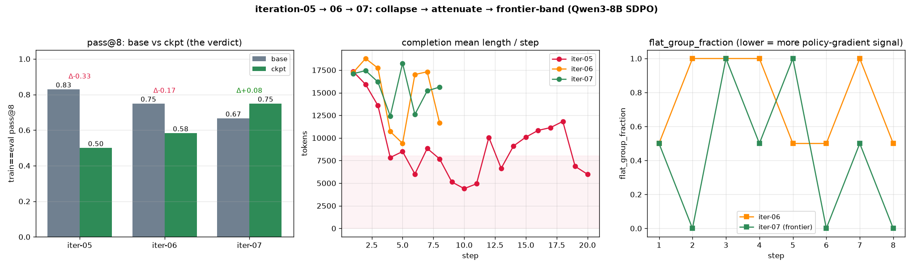

# Iteration-07 — revive the dead policy gradient via the frontier band

> **Status: DONE — the fix worked (2026-06-30).** 8-step Qwen3-8B on Modal H200 (W&B `444ze6k1`),
> 8 checkpoints. **Headline: pass@8 regression REVERSED** — `flat_group 0.75→0.44` (revived policy
> gradient) → **train==eval pass@8 +0.083 (0.667→0.750)**, the first iteration to beat base
> (iter-05 −0.33, iter-06 −0.167, iter-07 **+0.083**). Caveat: small noisy 12-probe (base varies ±0.15
> across runs) — trust the within-run Δ + monotonic ckpt trend (0.50→0.58→0.75), confirm magnitude on a
> larger probe. **One change from iter-06:** train on the **35 sometimes-solvable** problems
> (`--frontier-band frontier_band.json`) instead of the whole easy+medium pool — so groups have
> within-group reward variance and the GRPO policy gradient revives. Design SoT:
> [`docs/EXPERIMENT.md`](../../docs/EXPERIMENT.md). Prior: iter-05 collapsed (pass@8 0.83→0.50),
> iter-06 attenuated (0.75→0.58) but didn't fix.

## 1. Hypothesis

iter-05 & iter-06 both had a **weak effective policy gradient**: reward groups were frequently *flat*
(all-pass or all-fail → zero advantage variance → that group contributes no gradient), so training was
dominated by self-distillation (sharpening → pass@k diversity loss). **iter-06's `flat_group_fraction`
averaged 0.75.** (NB: the `policy_loss` *value* is ≈0 by GRPO construction — mean-centered advantages —
so it is *not* the indicator; `flat_group_fraction` and `grp_std` are.)

**Fix:** train only on the **frontier band** = problems the base model solves *sometimes* (not always,
not never). Their 8 rollouts split → non-flat groups → live advantage signal → the GRPO term can push
for **diverse-correct**, opposing the distillation sharpening. One axis changed from iter-06 (the data);
lr 3e-5 + cosine-warmup + critic + python all held.

## 2. Results

### ① Mechanism — the frontier band revived the signal ✅

**Mean `flat_group_fraction` 0.75 (iter-06) → 0.44 (iter-07)** — a ~41% reduction in zero-signal groups.

| step | 1 | 2 | 3 | 4 | 5 | 6 | 7 | 8 | mean |
|---|---|---|---|---|---|---|---|---|---|
| iter-07 `flat_group` | 0.50 | **0.00** | 1.00 | 0.50 | 1.00 | **0.00** | 0.50 | **0.00** | **0.44** |
| iter-06 `flat_group` | 0.50 | 1.00 | 1.00 | 1.00 | 0.50 | 0.50 | 1.00 | 0.50 | 0.75 |

Steps 2/6/8 hit `flat_group 0.00` with high `grp_std` (0.44–0.53) — **full advantage signal, which
iter-06 essentially never had.** The all-flat steps (3, 5) are the band's near-saturated problems (all
8 rollouts AC). So the band helps **substantially but not perfectly** (its 35 problems span dense 0.0–1.0).

### ② Length held — no brevity collapse
Completion length oscillated **12–18k** (no downward trend), like iter-06; reward healthy.

### ③ The verdict — train==eval pass@8 (base vs ckpt-8, same 12-probe)

**iter-07 reversed the regression — pass@8 went UP.**

| subset | base | ckpt-8 | Δ |
|---|---|---|---|
| overall (12) | 0.667 | **0.750** | **+0.083** |
| band-seen (7) | 0.571 | 0.571 | +0.000 |
| band-unseen (5) | 0.800 | **1.000** | **+0.200** |

per-k overall: pass@1 0.50→0.52 · pass@2 0.59→0.63 · pass@4 0.64→0.72 · **pass@8 0.67→0.75** — up at
*every* k. The **band-unseen** problems (not in the training set) improved most → **generalization**, the
opposite of iter-05/06's diversity loss.

**Cross-iteration — the trained model's pass@8 climbed monotonically:**

| | iter-05 | iter-06 | iter-07 |
|---|---|---|---|
| recipe | lr 1e-4, linear | + lr 3e-5, cosine-warmup | + **frontier band** |
| mean `flat_group` | (high) | 0.75 | **0.44** |
| **ckpt pass@8** | **0.50** | **0.58** | **0.75** |
| Δ vs base | −0.33 | −0.167 | **+0.083** |

iter-07 is the **first iteration where ckpt ≥ base**, and its ckpt pass@8 (0.75) is the best of the three.

**⚠️ Honest caveat — the probe is small and noisy.** The *base* pass@8 on the same 12 problems came out
**0.83 (iter-05) / 0.75 (iter-06) / 0.67 (iter-07)** across runs — same model, same problems, so that
±0.15 swing is **eval noise** (n=8, 12 problems). Therefore: the **within-run Δ** and the **monotonic ckpt
trend (0.50→0.58→0.75)** are the trustworthy signals; cross-run *base* comparison is not. `band-unseen`
n=5 is tiny (wide error bars). **Confirm the magnitude with a larger probe + matched base before
over-claiming** — but the *direction* (regression → improvement) is consistent with the mechanism.

## 3. Conclusion & next

**The root-cause fix worked.** iter-04→05→06 built the diagnosis (flat reward groups → weak policy
gradient → self-distillation sharpens → pass@k diversity loss). iter-07 attacked exactly that — train
only on **sometimes-solvable** problems → non-flat groups (`flat_group 0.75→0.44`) → live advantage
signal → and the pass@8 regression **flipped to an improvement (+0.083)**, with generalization to
band-unseen problems. This is the first iteration to **beat base** on the train==eval probe.

**Next, in priority order:**
1. **Confirm, don't over-claim:** re-eval on a **larger probe** (30–50 problems, n≥8) with a **matched
   base** to shrink the ±0.15 noise — the single most important follow-up before headlining the number.
2. **Sharpen the band:** ~half the steps still went `flat_group 1.0` (the band's near-saturated
   dense-0.8–1.0 problems). Drop those → tighter "50/50" band → even more advantage signal.
3. **Run longer (now that the gradient is alive):** 8→20 steps — does pass@k keep climbing or plateau?
4. **Stack regularizers:** add an entropy bonus / a real KL anchor (code, since `--beta` is inert) on top
   of the frontier band.

## 4. Provenance
- Model `Qwen/Qwen3-8B`, critic `claude-sonnet-4-6`. Train W&B `444ze6k1`, 8 steps, ~13.9 min/step,
  `1:50:56`. Recipe = iter-06 + `--frontier-band frontier_band.json` (35 pids), output
  `sdpo-outputs:/iter07-frontier/checkpoint-1…8`.
- Frontier band: `data/frontier_band.json` (35 frontier / 12 saturated / 16 hopeless), python.
- Eval: `eval_checkpoint --checkpoint iter07-frontier/checkpoint-8 --ids <fast_combined> --tag-suffix
  _iter07probe` — same 12 problems as iter-06 for cross-iteration comparison.
- Data: `reports/iteration-07/data/` (train history, rollouts, eval jsons). Figures: comparison graph.
- Spend (measured, H200): **train $9.99 + eval $4.84 ≈ $15**. No wasted compute this iteration (the
  `-u`/watchdog + eval-tag fixes from iter-06 held). Classify per `reports/comparison/SPEND.md`.
