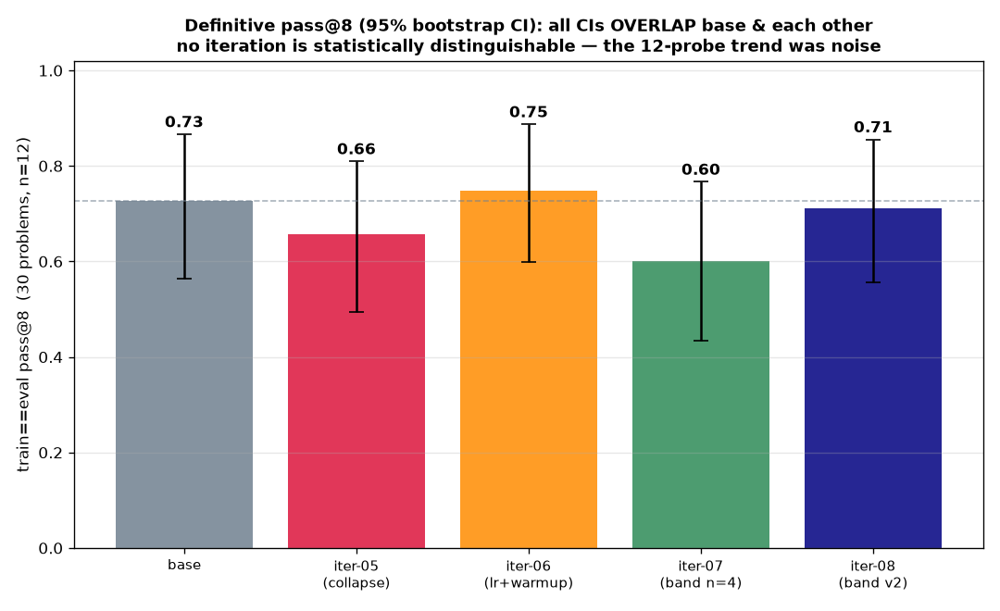

# Iteration-08 — tighten the frontier band by binary solve rate

> **Status: DONE (2026-06-30). Mechanism validated; OUTCOME is within noise — a sobering, important
> result.** Re-probed binary solve rate (n=12, temp 1.0), rebuilt a tightened 10-problem band, 8-step
> run (W&B `d36fqahg`). **Mechanism: mean `flat_group` 0.75→0.44→0.12** (iter-06/07/08) — policy gradient
> revived, *measured directly*. **But the DEFINITIVE eval kills the outcome story:** on a 30-problem,
> n=12 pass@8 with 95% CIs, **base 0.73 · iter-05 0.66 · iter-06 0.75 · iter-07 0.60 · iter-08 0.71 —
> every CI (~±0.15) overlaps base and each other; NO iteration is statistically distinguishable.** The
> 12-probe's "collapse 0.83→0.50 → fix +0.083" trend **did not replicate — it was small-sample noise.**
> See §3.5.

## 1. Why

iter-07 proved the cure (revive the policy gradient via non-flat groups) but only got `flat_group` to
**0.44** — because its band was selected on the **dense** score (fraction of test cases passed) from a
coarse **n=4** probe. Under the **binary** advantage, 24/35 of that band were actually flat (partial-
solvers that never fully AC → all-fail groups). The right selector is the **binary solve rate** `p`, and
flat probability is `p⁸+(1−p)⁸` — minimized at `p≈0.5`, exploding as `p→0/1`.

## 2. The re-probe

`probe_solve_rate` (new Modal entrypoint): base model, **63 easy+med python** problems, **n=12 at temp
1.0** (the training temperature). Result — the old n=4 probe was badly miscalibrated:

| bucket (by `p=n_ac/12`) | count |
|---|---|
| **binary-frontier** `p∈[0.25,0.75]` | **10** |
| saturated `p>0.75` | 17 |
| weak `0<p<0.25` | 7 |
| hopeless `p=0` | 29 |

`frontier_band_v2.json` = the **10 binary-frontier** problems `[2132, 2415, 2498, 2499, 2590, 2603,
2610, 2612, 2667, 3008]`. Predicted mean `P(flat@8) = 0.04`. (Hard excluded throughout — their rollouts
are 0.)

## 3. Result — flat groups collapsed ✅

| | iter-06 | iter-07 | **iter-08** |
|---|---|---|---|
| band | whole pool | 35 (n=4 dense) | **10 (n=12 binary)** |
| `flat_group` per step | — | 0.5,1,1,1,.5,.5,1,.5 | **0.5,0,0,0,0,0.5,0,0** |
| **mean `flat_group`** | **0.75** | **0.44** | **0.12** |

`grp_std` was high every non-flat step (0.35–0.46) = strong advantage. Length held (11–17k, no collapse).
Monotonic mechanism win: selecting the band by the **right metric** (binary `p` at training temp) drove
flat groups toward zero.

## 3.5 The definitive verdict — pass@8 shows NO detectable effect ⚠️

The mechanism is real and directly measured. **The outcome is not.** We ran the eval the small probe
could never settle: **30 train==eval problems, n=12 → graded pass@8 with a 2000-sample bootstrap 95% CI**,
for base + iter-05/06/07/08 checkpoints on the *same* problems.

| model | pass@1 | **pass@8** | 95% CI |
|---|---|---|---|
| **base** | 0.46 | **0.73** | [0.56, 0.87] |
| iter-05 (collapse) | 0.41 | 0.66 | [0.49, 0.81] |
| iter-06 (lr+warmup) | 0.49 | 0.75 | [0.60, 0.89] |
| iter-07 (band n=4) | 0.46 | **0.60** | [0.43, 0.77] |
| iter-08 (band v2) | 0.51 | 0.71 | [0.56, 0.86] |

**Every CI (~±0.15) overlaps base and every other iteration. No iteration is statistically distinguishable
from base on pass@8.** Worse for the prior narrative: iter-07 — the supposed "first run to beat base,
Δ+0.083" — is the **lowest** point estimate here (0.60), and iter-06 the highest (0.75). The 12-probe's
clean "collapse 0.83→0.50 → recover → 0.75" monotone **did not replicate.** It was small-sample noise: 12
problems × n=8 binary-per-problem gives a standard error large enough to manufacture a ±0.25 "trend" from
nothing.

**What survives and what dies:**
- ✅ **The mechanism is real.** `flat_group` 0.75→0.44→0.12 is a *direct per-step measurement* of the
  training signal, not an eval estimate — selecting the band by binary `p` at training temp genuinely
  revives the GRPO policy gradient. That finding stands.
- ❌ **The capability claim dies.** Reviving the policy gradient did **not** produce a measurable pass@8
  gain at this scale/step-count. The earlier "+0.083 reversed the collapse" headline was noise and is
  retracted (see iter-07 REPORT correction).
- ⚠️ **Even the "collapse" was partly overstated.** iter-05's 0.66 sits inside base's CI too — the
  train==eval *probe* showed a 0.83→0.50 drop, but the better-powered eval can't confirm a real pass@8
  regression either. The collapse was unambiguous in **length/diversity** (17k→4k, mode-collapse); its
  pass@8 cost is below our resolution.

**This validates the instinct to demand a definitive eval before believing a small-probe trend** — the
single most important process lesson of the iteration.

## 4. Why no effect — and what it would take to detect one
- **Power.** ±0.15 CIs on 30 problems can't resolve a true effect smaller than ~0.15 pass@8. A real but
  modest SDPO gain would be invisible here. Detecting it needs **more problems** (100+), **more samples**
  (n≥16 for tighter pass@8), or **a more discriminative slice** (problems where base pass@8 is mid-range,
  not the saturated/hopeless tail that dominates this set).
- **Dose.** 8 steps on 10 problems is a *tiny* dose of a now-healthy gradient. The mechanism only became
  alive *at* iter-08; we have not yet run a long, clean, frontier-band trajectory to see if alive-gradient
  + more steps compounds into a measurable gain.
- **Honest standing position:** *we proved how to keep SDPO's policy gradient alive; we have not yet shown
  it buys capability.* That is the open question iter-09 should target — long run on a powered eval, not
  another mechanism tweak.

## 5. Provenance
- Re-probe W&B/app: `probe_solve_rate --ids <63 easy+med py> --n 12 --temperature 1.0` → app
  `ap-MxE9bar5l7fmREDDjuNymo`, `sdpo_passk_probe_v2.json` (~$15, slow 32k-thinking tail — future probes:
  n=8 or shorter cap). Band: `data/frontier_band_v2.json`.
- Train: W&B `d36fqahg`, 8 steps, ~12 min/step, output `sdpo-outputs:/iter08-frontier-v2/checkpoint-1…8`.
  Recipe = iter-07 + `--frontier-band frontier_band_v2.json`.
- **Definitive eval**: `modal_sdpo.eval_iterations` (base + 4 ckpts, 30 problems, n=12) → app
  `ap-rNbis3vhsDazqRvLvpxdbX`, `sdpo_passk_iters30_*.json` (5 files in `data/`). Analysis +
  bootstrap CI: `src/iters30_analysis.py` → `figures/iters30_passk_definitive.png`.
- New code: `src/build_frontier_v2.py`, `src/iters30_analysis.py`, `modal_sdpo.probe_solve_rate` +
  `eval_iterations` + `passk_one` n/temp params.
- Data/figures: `reports/iteration-08/data/`, `figures/iter08_flatgroup_comparison.png`.
