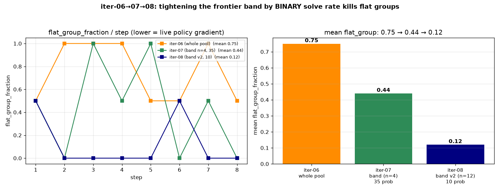

# Iteration-08 — tighten the frontier band by binary solve rate

> **Status: TRAIN DONE, eval pending (2026-06-30).** Re-probed the base model's per-problem **binary
> solve rate** (n=12, temp 1.0) and rebuilt a tightened band; 8-step Qwen3-8B run on Modal H200 (W&B
> `d36fqahg`), 8 checkpoints. **Result: mean `flat_group` 0.44 (iter-07) → 0.12** — the policy gradient
> is now alive on ~every step. The defining `pass@8` verdict is the next step.

## 1. Why

iter-07 proved the cure (revive the policy gradient via non-flat groups) but only got `flat_group` to
**0.44** — because its band was selected on the **dense** score (fraction of test cases passed) from a
coarse **n=4** probe. Under the **binary** advantage, 24/35 of that band were actually flat (partial-
solvers that never fully AC → all-fail groups). The right selector is the **binary solve rate** `p`, and
flat probability is `p⁸+(1−p)⁸` — minimized at `p≈0.5`, exploding as `p→0/1`.

## 2. The re-probe

`probe_solve_rate` (new Modal entrypoint): base model, **63 easy+med python** problems, **n=12 at temp
1.0** (the training temperature). Result — the old n=4 probe was badly miscalibrated:

| bucket (by `p=n_ac/12`) | count |
|---|---|
| **binary-frontier** `p∈[0.25,0.75]` | **10** |
| saturated `p>0.75` | 17 |
| weak `0<p<0.25` | 7 |
| hopeless `p=0` | 29 |

`frontier_band_v2.json` = the **10 binary-frontier** problems `[2132, 2415, 2498, 2499, 2590, 2603,
2610, 2612, 2667, 3008]`. Predicted mean `P(flat@8) = 0.04`. (Hard excluded throughout — their rollouts
are 0.)

## 3. Result — flat groups collapsed ✅

| | iter-06 | iter-07 | **iter-08** |
|---|---|---|---|
| band | whole pool | 35 (n=4 dense) | **10 (n=12 binary)** |
| `flat_group` per step | — | 0.5,1,1,1,.5,.5,1,.5 | **0.5,0,0,0,0,0.5,0,0** |
| **mean `flat_group`** | **0.75** | **0.44** | **0.12** |

`grp_std` was high every non-flat step (0.35–0.46) = strong advantage. Length held (11–17k, no collapse).
Monotonic mechanism win: selecting the band by the **right metric** (binary `p` at training temp) drove
flat groups toward zero.

## 4. Caveat & next
- **10 problems is a small training set** (repetition over 8 steps) — watch for overfitting in the eval.
- **The verdict is still `pass@8`** (not flat_group). Next: eval base vs ckpt-8 on the same 12-probe
  → does flat 0.12 beat iter-07's +0.083? **And use a *larger* eval probe** (the 12-probe's ±0.15 noise
  is the standing limiter on every conclusion).

## 5. Provenance
- Re-probe W&B/app: `probe_solve_rate --ids <63 easy+med py> --n 12 --temperature 1.0` → app
  `ap-MxE9bar5l7fmREDDjuNymo`, `sdpo_passk_probe_v2.json` (~$15, slow 32k-thinking tail — future probes:
  n=8 or shorter cap). Band: `data/frontier_band_v2.json`.
- Train: W&B `d36fqahg`, 8 steps, ~12 min/step, output `sdpo-outputs:/iter08-frontier-v2/checkpoint-1…8`.
  Recipe = iter-07 + `--frontier-band frontier_band_v2.json`.
- New code: `src/build_frontier_v2.py`, `modal_sdpo.probe_solve_rate` + `passk_one` n/temp params.
- Data/figures: `reports/iteration-08/data/`, `figures/iter08_flatgroup_comparison.png`.
