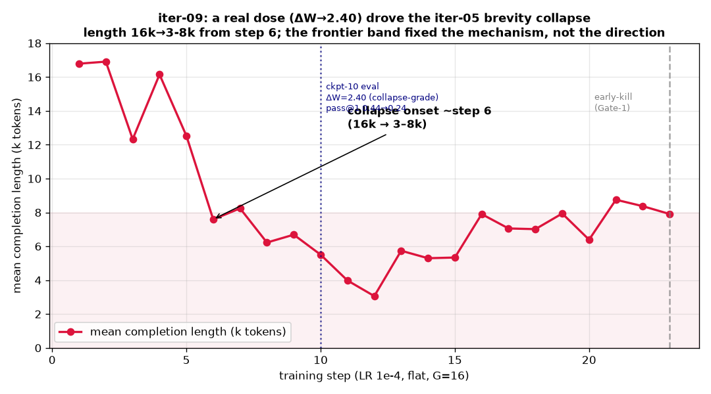
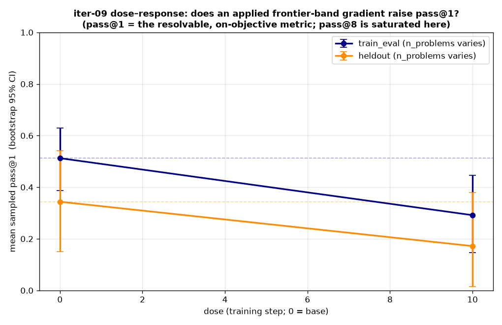

# Iteration-09 — apply a real dose: the frontier-band gradient COLLAPSES, it doesn't improve

> **Status: DONE (2026-07-01). Decisive NEGATIVE result — and the experiment worked perfectly.**
> iter-08 left one question: was its null *under-training* or *no real effect*? iter-09 un-throttled the
> dose (flat LR 1e-4, 30 steps, G=16, same frontier band) and got a clear answer. **The dose landed hard**
> — ΔW reached **2.40 by step 10** (collapse-grade; 5× iter-08's entire run) — **and drove the iter-05
> brevity collapse, not improvement.** Completion length fell 16k→3–8k from step 6; on the same 18
> problems, **paired pass@1 Δ −0.199 [−0.37, −0.04]** and **paired pass@8 Δ −0.289 [−0.47, −0.12]** (both
> CIs exclude 0), on *both* trained and held-out problems. The canary + pipeline-eval + early-kill caught
> it at step 10 and killed the run at step 23. **Verdict: the frontier band fixes the mechanism, not the
> collapse-prone direction — a weak dose (iter-08) does nothing; a real dose collapses.**

## 1. The question iter-09 answered
iter-08's null had two readings: **H1 under-training** (a healthy gradient applied in homeopathic doses —
ΔW 0.46 over 8 steps, LR decaying to ~0) vs **H2 no real effect**. iter-09 removed the throttle to force a
real dose and measure a dose–response. Recipe change vs iter-08: **LR 3e-5→1e-4, cosine→constant_with_warmup,
G 8→16, 8→30 steps**; mechanism held fixed (frontier_band_v2, binary reward, critic, python).

## 2. The dose landed — massively (Gate-0 PASS, then some)
| | iter-08 (8 steps) | **iter-09** |
|---|---|---|
| ΔW per step (early) | 0.058 | **0.091 during warmup → ~0.24 by ckpt-10** |
| ΔW cumulative | 0.46 (final) | **2.40 at step 10** (≈ iter-05's collapse-grade 2.62) |

The un-throttled LR moved the model **~5× more by step 10 than iter-08 moved in its entire run.** H1 is
confirmed on the *mechanics*: iter-08 genuinely under-trained. But moving the model turned out to be
*harmful*.

## 3. …and drove a textbook collapse (canary FIRED)

Completion length: **16.8k, 16.9k, 12.3k, 16.1k, 12.5k → 7.6k (step 6) → 3.1k (step 12) → 5–8k** — the
iter-05 brevity-spiral signature (self-distillation sharpening toward terse outputs), now triggered by the
higher LR *despite* the frontier band keeping `flat_group`≈0 (the gradient stayed alive the whole time —
it just pointed at brevity). The length canary flagged this at ~step 6, exactly as designed.

## 4. The collapse is HARMFUL — pass@1 and pass@8 both regress (Gate-1)

Base vs ckpt-10 on the same 18-problem discriminative set (`data/eval_iter09.json`), n=24, **paired**
bootstrap 95% CI (the correct test — same problems):

| metric | base | ckpt-10 | paired Δ (95% CI) |
|---|---|---|---|
| **pass@1** (primary) | 0.438 | 0.238 | **−0.199 [−0.37, −0.04]** ❌ |
| pass@8 | 0.863 | 0.574 | **−0.289 [−0.47, −0.12]** ❌ |
| pass@1 train_eval (10) | 0.512 | 0.292 | down |
| pass@1 heldout (8) | 0.344 | 0.172 | down |

Both paired CIs **exclude zero** → a statistically significant regression, not noise (contrast iter-08,
where every CI overlapped base). It regressed on **both trained and held-out** problems — this is capability
loss, not overfitting or an eval artifact. (ckpt-10's collapsed short outputs also generated ~3× faster
than base's 16k-thinking completions — the collapse is visible even in eval wall-clock.)

## 5. What iter-09 establishes
Putting iter-08 and iter-09 together bounds the problem cleanly:
- **Weak dose (iter-08, ΔW 0.46):** null — the model barely moved.
- **Strong dose (iter-09, ΔW 2.40):** collapse — pass@1 −0.20, pass@8 −0.29, length 16k→3–8k.

**The frontier band revived the GRPO policy gradient (mechanism, confirmed iter-06→09: `flat_group`→0),
but reviving and *applying* that gradient at LR 1e-4 reproduces the iter-05 self-distillation collapse.**
The band fixed *whether* there's a gradient; it did not fix *where the gradient points* — and at a real
dose it points at brevity/mode-collapse. So on this recipe there is no free lunch between "too weak to
matter" and "strong enough to collapse."

## 6. Next (iter-10 candidates — NOT run)
The canary's prescription is to **back off to LR 5e-5** — the untested middle between iter-08's
underdosing-3e-5 and iter-09's collapsing-1e-4 — to see whether a *goldilocks* dose moves without
collapsing. But the deeper hypothesis is that the collapse is about **direction, not magnitude**: SDPO
self-distillation on this setup drives brevity at any dose large enough to matter, so the real fix is a
**direction lever**, not an LR: an entropy bonus, a length/diversity regularizer, or a KL anchor (note:
`--beta` is inert in SDPOTrainer — needs code). iter-10 should test 5e-5 **and** an entropy/length guard,
gated on the same sampled-pass@1 dose–response.

## 7. Process — the instrumentation earned its keep (every gate fired correctly)
This run is the case study for the iter-09 execution design:
- **Preflight caught a run-losing bug**: `--output-dir iter09-dose` wrote OFF the volume mount; fixed to
  `sdpo_out/iter09-dose` before the real run (would have lost a ~10h run's checkpoints).
- **Watchdog false-fire surfaced**: G=16 + 32 critic API calls made step-1 exceed the 2400s threshold →
  added `--watchdog-stall-secs 4200`.
- **Gate-0 (ΔW)** confirmed the dose was landing (corrected from grad_norm, which is LR-independent).
- **Length canary** flagged collapse at step 6; **pipeline-eval** (concurrent with training) + **Gate-1**
  confirmed it was *harmful* by step 10; **early-kill** stopped at step 23 (saved ~7 steps / ~1.3h).
- **Lean eval path** worked end-to-end: generate on H200 (`--no-judge`) → durable samples on
  `sdpo-outputs:/evals/iter09dose/` → judged free on the GB10.

## 8. Provenance
- Train: app `ap-TyfPzPbX5lB2E7QN8FkCBo`, W&B in `runs/iteration-09/train.log`, killed at step 23 (Gate-1).
  Recipe: `main --frontier-band frontier_band_v2.json --grpo-reward binary --critic --lr 1e-4
  --lr-scheduler constant_with_warmup --warmup-ratio 0.1 --num-generations 16 --max-steps 30 --save-steps 2
  --output-dir sdpo_out/iter09-dose --max-completion-length 20480 --watchdog-stall-secs 4200 --resume`.
  Checkpoints preserved at `sdpo-outputs:/iter09-dose/checkpoint-{2..22}`.
- Eval: `eval_dose --no-judge --steps 4,10 --n 24` (base + ckpt-10 completed; ckpt-4 container did not
  persist). Samples: `sdpo-outputs:/evals/iter09dose/`. Judged locally (`judge_local.py`).
- Data/figures: `reports/iteration-09/data/` (eval jsons + `iter09_train_trace.json`), `figures/`.
  Analysis: `src/iter09_analysis.py` (pass@1 dose-response), `src/adapter_delta.py` (ΔW).
