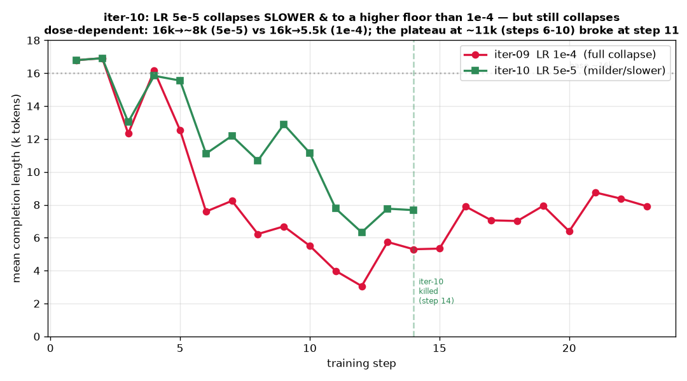
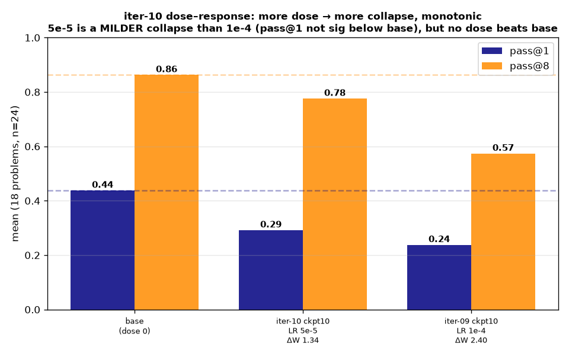

# Iteration-10 — the goldilocks dose: LR 5e-5 collapses SLOWER, but still collapses

> **Status: DONE (2026-07-01). Result: the collapse is DOSE-DEPENDENT, not a threshold — and there is no
> goldilocks LR.** iter-08 (3e-5) under-dosed → null; iter-09 (1e-4) → full collapse. iter-10 tested the
> middle (**5e-5**) and got a **milder, slower collapse**: length 16k→~8k (vs iter-09's 16k→5.5k),
> ckpt-10 **pass@1 0.292 / pass@8 0.776** (vs iter-09 0.238/0.574, base 0.438/0.863) — **ΔW 1.34** (56% of
> iter-09's 2.40). pass@1 is no longer *significantly* below base (paired Δ −0.146 **[−0.30, +0.01]**), but
> it is **not above base either, and the length was still declining when we killed it at step 14.** Higher
> LR → more ΔW → more collapse → lower pass@1, **monotonically; no dose beats base.** The collapse is the
> SDPO self-distillation *direction*; LR only sets its *speed and floor*. **iter-11's lever must be a
> direction guard (entropy/length), not LR.**
>
> **NB on the cap:** true 32k is **memory-infeasible at G=16 on one H200** (three OOMs — a ~14 GiB peak
> roughly cap-independent 24–32k, wedged between loss-step OOM at high util and vLLM-init starvation; G
> doesn't help). The two clean paths are a **bigger GPU** or trainer logits-chunking. This report's
> *goldilocks* verdict comes from the **20k run** (H200) — the cleanest LR-isolation (same cap as iter-09,
> only LR differs). **A true 32k run was then launched on a B200 (178 GiB) as the cap control** (app
> `ap-dgr9uqgiCHmEbXjiqgXgtI`, LR 5e-5); at 32k **clipped_ratio=0%** (vs 20k's 25–31%) — full thinking
> room, and the model tops out ~24k so it never *needs* 32k. See §5b for its result. See CLAUDE.md gotcha.

## 1. The three-dose picture
| run | LR | ΔW @ ckpt-10 | length trajectory | ckpt-10 pass@1 | pass@8 | verdict |
|---|---|---|---|---|---|---|
| iter-08 | 3e-5 | ~0.46 (8 steps) | **held ~16k** | (null vs base) | — | under-dosed |
| **iter-10** | **5e-5** | **1.34** | 16k → ~11k → **~8k** | **0.292** | **0.776** | **mild collapse** |
| iter-09 | 1e-4 | 2.40 | 16k → **5.5k** | 0.238 | 0.574 | full collapse |

The lever that moves everything is the **dose** (LR × steps → ΔW), and its effect is monotonic and one-signed:
a bigger dose collapses the model faster and further. The only dose that *doesn't* collapse (3e-5) is too
small to change anything (iter-08's null).

## 2. Length: a slower collapse with a higher floor

Same 20k cap as iter-09 (both clip 25–31% early — the cap is *not* the variable). At 5e-5 the length
**plateaued ~11k for steps 6–10** — briefly looking like a stable, healthy-ish reduction — but the plateau
**broke at step 11** (7.8k → 6.3k → ~8k) and was trending down when we killed it at step 14. So 5e-5 buys a
slower descent to a higher floor (~8k vs 5.5k), not a stable operating point. Projected to step 30 (ΔW
would reach ~3.8, past iter-09's collapse-grade), it would most likely deepen toward iter-09 levels.

## 3. Outcome: a milder collapse, but still no gain

Base vs ckpt-10 on the same 18-problem set (`data/eval_iter09.json`), n=24, paired bootstrap 95% CI. Base
is reused from iter-09 (identical model).

| comparison | paired Δ pass@1 (95% CI) | reading |
|---|---|---|
| iter-10 (5e-5) vs base | **−0.146 [−0.30, +0.01]** | not *significantly* below base (CI touches 0) |
| iter-10 (5e-5) vs iter-09 (1e-4) | **+0.053 [−0.05, +0.15]** | milder than 1e-4 (point est.), not significantly |

pass@8 tells the same story more cleanly: **0.776** (5e-5) sits between base 0.863 and iter-09 0.574 — a
partial collapse. **The honest summary: 5e-5 does less damage than 1e-4, but there is no evidence it helps,
and the trajectory says it was still degrading.**

## 4. What iter-08→10 together establish
- **The collapse is the SDPO self-distillation *direction* (toward brevity), and it is dose-dependent in
  *magnitude*.** LR/steps control how fast and how far you collapse; they do not turn collapse into a gain.
- **There is no goldilocks LR on this recipe.** The window is a false one: too little dose (3e-5) = null;
  enough dose to matter (5e-5, 1e-4) = collapse. Nothing is above base.
- **So the next lever is not LR — it's direction.** iter-11: add a **direction guard** — an entropy bonus
  or an explicit length/diversity regularizer (or a KL anchor, which needs code since `--beta` is inert) —
  and re-run the dose at 5e-5 with the guard, gated on the same sampled-pass@1 dose–response.

## 5. Process — the memory saga (and the gates that held)
- **32k infeasible (3 OOMs):** 32k/0.20 → loss-step OOM; 32k/0.15 → vLLM init starved; 24k/0.18 → OOM at
  step 2 (the ~14 GiB peak is roughly cap-independent). Reducing G doesn't help (per-microbatch=1). Fell
  back to the proven 20k/0.20. Now a CLAUDE.md gotcha — don't re-test >20k here.
- **Gate-0 (ΔW 0.77 @ ckpt-6)** confirmed the dose was landing (~half iter-09's rate). **Canary** flagged
  the length was declining (softer than iter-09). **Pipeline-eval** gave the pass@1 verdict; **early-kill**
  stopped at step 14 once the eval + the resuming length-decline showed a milder-but-real collapse (saved
  ~4 h / the remaining 16 steps).

## 5b. The 32k cap control (B200) — the cap is an ACCELERANT, not just a confound (SURPRISE)
True 32k on a **B200 (178 GiB)** (LR 5e-5, `--vllm-gpu-util 0.15`, `sdpo_out/iter10-32k`). **My prediction
was wrong.** I expected 32k to collapse identically (cap "inactive during collapse" per iter-09). Instead:

| | length @ ckpt-6 | pass@1 | pass@8 |
|---|---|---|---|
| base | ~16k | 0.438 | 0.863 |
| **32k ckpt-6** | **~16k (held)** | **0.368** | **0.837** |
| 20k ckpt-10 (5e-5) | ~8k | 0.292 | 0.776 |

**At 32k the model HOLDS ~16k reasoning through step 6 — even pushing to 19k (it *wants* to think past 20k)
— exactly where the 20k runs had already collapsed. And capability is preserved:** ckpt-6 pass@1 0.368 is
**statistically indistinguishable from base** (paired Δ −0.069 [−0.17, +0.03]); pass@8 0.837 ≈ base 0.863.
**Mechanism:** at 20k, 25–31% of long traces are truncated → scored as failures → SDPO's teacher-selection
skews toward the shorter completions that finished → brevity pressure. **The cap *seeds/accelerates* the
collapse.** Remove it and that pressure is gone for the problems the model wants to reason long on.

**BUT — a delay, not a cure.** The 32k length holds ~16k to step 6, oscillates ~11–13k (steps 7–10), then
**declines: 10.0k → 8.0k → 6.1k by step 13** — the underlying self-distillation brevity direction still
wins, just ~6 steps later. **The cap is an accelerant; the root cause is still the SDPO direction.**
Figure: `reports/comparison/sdpo_cap_accelerant_story.png`. Untruncated rollouts (512, n_tokens→32768)
preserved at `sdpo-outputs:/iter10-32k/rollouts.jsonl` for study.

**Implication for iter-11:** two levers now, not one — (a) **fix the reward artifact** (don't score a
cap-truncated completion as a hard failure), and (b) the **direction guard** (entropy/length). The cap
finding is the more presentable half: a concrete, fixable artifact that was silently feeding the collapse.

## 6. Provenance
- Train: app `ap-BEfF2w6lynIcmI6sYdI0dc`, killed at step 14 (Gate-1). Recipe: iter-09 with **`--lr 5e-5`**
  and `--vllm-gpu-util 0.20` (20k cap; 32k infeasible). Prior OOM attempts: `ap-pUCKjjgssYwfJp850AoSh9`
  (32k/0.20), `ap-50tqf0gxW9GoGXZrPbUEPj` (32k/0.15), `ap-oGZwrFaZsynBSTVF13KNdX` (24k/0.18). Checkpoints:
  `sdpo-outputs:/iter10-dose/checkpoint-{2..14}`.
- Eval: `eval_dose --no-judge --no-base --steps 6,10 --n 24` (base reused from iter-09). Judged on GB10.
  **ckpt-6 not captured** — its eval stalled ~2.5 h on ~6 pathological looping completions (degenerate
  collapse outputs) and was killed near-done to cap cost; verdict rests on base + ckpt-10 + the trajectory.
- Data/figures: `reports/iteration-10/data/` (eval jsons + `iter10_train_trace.json`), `figures/`.
  ΔW via `src/adapter_delta.py`.
