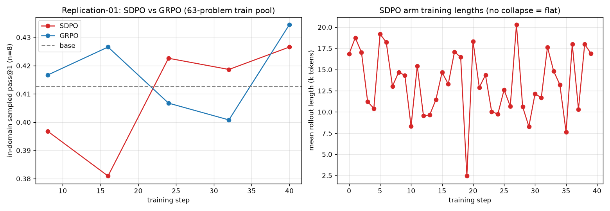

# Replication-01 — SDPO vs GRPO under the paper's protocol (OJBench, Qwen3-8B)

**Question.** After fixing the teacher-context truncation bug (iters 01–10 trained against a
teacher that never saw the problem), does our TRL/OJBench stack reproduce the SDPO paper's
behavior — (a) healthy training dynamics, (b) the headline **SDPO > GRPO** separation
(arXiv 2601.20802: 48.8% vs 41.2% on LCBv6)?

**Design.** Paper-protocol, both arms matched on everything except the loss:
in-domain train==eval (the paper evaluates the pool it trains on — our first in-domain run),
63-problem easy+medium python pool, G=8, temp 1.0 / top_p 1.0, binary reward, 40 steps,
LR 3e-5 constant warmup-0 (LoRA translation of their 1e-6 full-FT), 20,480 completion cap
(their 8,192 clips 69% of Qwen3-8B's OJBench rollouts — measured in preflight — so we sized
the cap to keep `clipped_ratio` ≈ 0.1, matching their low-clip regime).
Paper-faithful knobs from the LCBv6 **run script** (which overrides the paper's prose):
`teacher_update_rate=0.01` (EMA), `distillation_alpha=1.0` (reverse KL — NOT the JSD in the
prose), `K=20` + tail bucket, `is_clip=2.0`, think-stripped sibling demos, solution+feedback
combined. **SDPO arm** = `distillation_weight 1.0` + live judge feedback; **GRPO arm** =
`distillation_weight 0.0` (audited to be exactly TRL's GRPO path — group mean/std advantage,
PPO clip, no distillation term).

**Eval.** In-domain sampled pass@1 (avg@8, the paper's avg@4 with more power) at ckpts
8..40 + base, judged on public+private tests locally; paired bootstrap over problems
(B=10k, 95% CI).

## Results

| step | SDPO | Δ vs base [95% CI] | GRPO | Δ vs base [95% CI] | SDPO−GRPO [95% CI] |
|---|---|---|---|---|---|
| base | 0.413 | — | 0.413 | — | — |
| 8  | 0.397 | −0.016 [−0.050,+0.018] | 0.417 | +0.004 [−0.032,+0.042] | −0.020 [−0.048,+0.006] |
| 16 | 0.381 | −0.032 [−0.065,+0.004] | 0.427 | +0.014 [−0.024,+0.056] | **−0.046 [−0.089,−0.006]** |
| 24 | 0.423 | +0.010 [−0.022,+0.046] | 0.407 | −0.006 [−0.042,+0.030] | +0.016 [−0.024,+0.058] |
| 32 | 0.419 | +0.006 [−0.028,+0.040] | 0.401 | −0.012 [−0.058,+0.034] | +0.018 [−0.024,+0.060] |
| 40 | 0.427 | +0.014 [−0.028,+0.058] | 0.435 | +0.022 [−0.014,+0.062] | −0.008 [−0.040,+0.024] |

**pass@8:** SDPO 0.571→0.603, GRPO similar band (see `data/`).

## Verdict — split

**1. Training dynamics: REPLICATED (the big change).** For the first time in 11 runs, SDPO
did **not** collapse: mean rollout length drifted 15.4k→14.0k tokens (−9%) over 40 steps,
vs iter-09's 16k→5.5k (−66%) at the same LR-class; per-step lengths track the GRPO arm's
almost exactly (batch-driven variance, no divergent trend). `reprompt_truncated_frac = 0`
and `feedback_used = 1.0` throughout. End-point pass@1 is *at/above* base, where every prior
real-dose run degraded (iter-09 0.24, iter-10 0.29 vs base 0.44). The teacher-context fix +
paper-faithful knobs qualitatively changed the trainer's behavior.

**2. Headline SDPO > GRPO: NOT OBSERVED at this dose — parity.** Final Δ(SDPO−GRPO) =
−0.008 [−0.040,+0.024]; the only CI-excluding-zero point is a transient GRPO advantage at
step 16 that washes out. Neither arm separates from base (both ≈ +0.02 at step 40, CIs
include 0).

**3. The dose caveat (why "not observed" ≠ "refuted").** Our total budget was
**640 rollouts/arm** (40 steps × 16). The paper's LCBv6 headline used 256 rollouts/step ×
~150 steps ≈ **38,400** — our whole run equals their **first ~2.5 steps**. Their curves need
tens of their steps to separate. This experiment validates the *mechanics* (no collapse,
correct wiring, live gradients) but is underpowered for the *separation* claim.

## What this buys us

- The stack is no longer self-sabotaging: iters 01–10's collapse is explained (malformed
  teacher) and cured. Any future SDPO result on this repo is now interpretable.
- The remaining question is purely **dose/scale**, with two escalation paths:
  (a) **extend these arms** (resume to 120+ steps ≈ 2k rollouts ≈ the paper's step ~8, where
  their curves begin separating; ~$80–90/arm), or (b) **the user-directed fallback**: swap in
  the paper's own dataset + prompt (LCBv6 pool, their CODE_PROMPT + LeetCode-style feedback)
  to eliminate env/prompt as variables. (a) is cheaper and keeps the environment we care
  about; (b) is the cleaner apples-to-apples if (a) still shows nothing.

## Caveats

- In-domain avg@8 on 63 problems has ±0.03–0.04 CI half-width; effects smaller than that are
  invisible at n=8. (Deliberate: matched the paper's protocol rather than our older 30-problem
  held-out CI eval.)
- LR translation (LoRA 3e-5 vs full-FT 1e-6) is judgment, not derivation; ΔW-based dose
  matching across regimes is unsolved here.
- Single seed per arm (the paper averages 3); same seed shared across arms for pairing.
- Mid-run both arms were preempted at ~step 27/29 (workspace spend limit + H200 capacity) and
  resumed from checkpoints — a real test of the resume path, but a ~5h wall-clock gap between
  segments.
