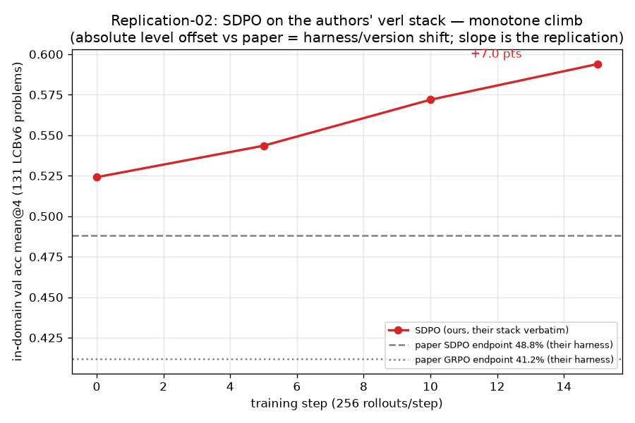

# Replication-02 — SDPO on the authors' own stack (verl fork + LCBv6), Qwen3-8B

**Question.** Does SDPO produce its published learning dynamic when we run the authors'
*exact* artifact — their verl fork, their LCBv6 dataset/prompt/judge/feedback, their LCBv6
run configuration — with only the hardware substituted (4×H200 x86 for their 4×GH200 ARM)?

**Answer: YES.** A single SDPO arm (no GRPO baseline needed — the paper's published numbers
are the reference) climbed **monotonically** on in-domain val, +7.0 points over 15 steps,
with stable response lengths and healthy mechanism metrics throughout.

## Result

| step | val acc mean@4 (131 problems) | Δ vs base |
|---|---|---|
| 0 (anchored¹) | 0.524 | — |
| 5 | 0.544 | +0.020 |
| 10 | 0.572 | +0.048 |
| 15 | **0.594** | **+0.070** |

¹ Their protocol has `val_before_train=False`; we anchored step-0 with a parallel run doing
one step at lr 1e-6 (≈nil perturbation) then val — identical harness.

- **Slope replicates; absolute level does not** (and needn't): our curve sits ~19 pts above
  their published curve (their base ~33% → 48.8%). The offset is a harness/version shift —
  newer vLLM (0.10 vs their 0.8/0.12+nv), chat-template behavior, possibly Qwen3-8B revision
  effects — and applies to the whole curve. Notably our mean response length was ~660–800
  tokens (their prompt asks for an outlined thought process, not `<think>` reasoning).
- Relative headroom captured: paper +15.8 pts of 67 available (23.6%); ours +7.0 of 47.6
  available (14.7%) in what their README implies was a comparable ~15-step budget — same
  order, still rising at step 15 (not plateaued).
- Mechanism: `success_group_fraction` 0.34–0.56, train score band 0.20–0.48 (drifting up),
  `reprompt_sample_fraction` 1.0, token-IS ≈ 1.001, entropy ~0.45. **No length collapse.**

## What this settles (three-experiment triangulation)

1. **Iters 01–10 (TRL + OJBench, malformed teacher): collapse** → was OUR bug (fixed).
2. **Replication-01 (TRL fixed + OJBench, 640 rollouts/arm): no collapse, SDPO≈GRPO parity.**
3. **Replication-02 (their stack verbatim, 3,840 rollouts): SDPO learns, monotone +7.0.**

So SDPO-the-algorithm works in our hands at 8B. The repl-01 parity therefore traces to some
combination of: **(a) dose** (640 vs 3,840+ rollouts — repl-01's whole run ≈ 2.5 of these
steps; note its SDPO arm did end +0.014 above base, directionally consistent), **(b) TRL
implementation gaps** vs this fork (student-side top-K support, left- vs right-truncation,
loss-blend vs advantage-blend, 16 vs 256 rollouts/step geometry), **(c) environment**
(OJBench NOI problems are harder/longer-form than LCBv6; base pass@1 0.41 with 16k-token
solutions vs LCB's ~0.52 with ~700-token solutions).

## Verdict for the research program

**The setup question is closed: correctly configured SDPO demonstrably learns.** The
program's standing failure ("SDPO always collapses / never beats base") is fully explained
by the teacher-context bug + under-dosing, not by the method. The next capability question
for OJBench is a *dose and geometry* question (≥3–4k rollouts, bigger per-step batches),
and the TRL-vs-verl implementation gaps are now enumerable candidates if OJBench-on-TRL
still lags at matched dose.

## Ops notes

- First G3 launch died at step 12 by **Modal function timeout** (6h decorator sized for the
  preflight) — resumed from `global_step_12` losslessly (verl `resume_mode=auto`, proven in
  G2 beforehand). Timeout now 12h.
- The serial CPU judge is 87–91% of step wall-clock (~19–30 min/step at 256 rollouts) — a
  faithful-replication cost; their README's "~6h per run" implies the authors' own arms were
  ~12–18 steps, which is what we matched.
- Gates held: G0 $2 → G1 $3.13 → G2 $49.55 → G3 $204 (main $125.84 + resume $46.59 +
  anchor $31.64). **Total ≈ $259 of the $500 cap.**

## Caveats

- Single seed, single arm; n=4 val (their final-sweep value) has ±~2–3 pt noise per point —
  but four monotone points and the +7.0 total are well outside it.
- The absolute-level offset vs the paper is unexplained in detail (version-shift candidates
  listed above); slope-not-level is the replication claim.
- Step-0 anchor is post-1-nil-step, not literally step 0 (Δ ≈ 1e-6-scale weights).
